# Boost.Coroutine to C++20 Standard Coroutines Migration Plan

**Project**: rippled (XRP Ledger node)
**Branch**: `pratik/Switch-to-std-coroutines`
**Date**: 2026-02-25
**Status**: Planning

---

## Table of Contents

1. [Research & Analysis](#1-research--analysis)
2. [Current State Assessment](#2-current-state-assessment)
3. [Migration Strategy](#3-migration-strategy)
4. [Implementation Plan](#4-implementation-plan)
5. [Testing & Validation Strategy](#5-testing--validation-strategy)
6. [Risks & Mitigation](#6-risks--mitigation)
7. [Timeline & Milestones](#7-timeline--milestones)
8. [Standards & Guidelines](#8-standards--guidelines)
9. [Task List](#9-task-list)

---

## 1. Research & Analysis

### 1.1 Stackful (Boost.Coroutine) vs Stackless (C++20) Architecture

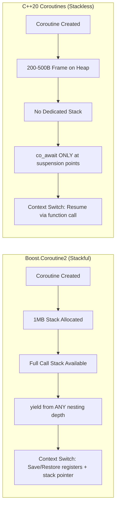

### 1.2 API & Programming Model Comparison

| Aspect | Boost.Coroutine2 (Current) | C++20 Coroutines (Target) |
|--------|---------------------------|--------------------------|
| **Type** | Stackful, asymmetric | Stackless, asymmetric |
| **Stack Model** | Dedicated 1MB stack per coroutine | Coroutine frame on heap (~200-500 bytes) |
| **Suspension** | `(*yield_)()` — can yield from any call depth | `co_await expr` — only at explicit suspension points |
| **Resumption** | `coro_()` — resumes from last yield | `handle.resume()` — resumes from last co_await |
| **Creation** | `pull_type` constructor (runs to first yield) | Calling a coroutine function returns a handle |
| **Completion Check** | `static_cast<bool>(coro_)` | `handle.done()` |
| **Value Passing** | Typed via `pull_type<T>` / `push_type<T>` | Via `promise_type::return_value()` |
| **Exception Handling** | Natural stack-based propagation | `promise_type::unhandled_exception()` — explicit |
| **Cancellation** | Application-managed (poll a flag) | Via `await_ready()` / cancellation tokens |
| **Keywords** | None (library-only) | `co_await`, `co_yield`, `co_return` |
| **Standard** | Boost library (not ISO C++) | ISO C++20 standard |

### 1.3 Performance Characteristics

| Metric | Boost.Coroutine2 | C++20 Coroutines |
|--------|------------------|------------------|
| **Memory per coroutine** | ~1MB (fixed stack) | ~200-500 bytes (frame only) |
| **1000 concurrent coroutines** | ~1 GB | ~0.5 MB |
| **Context switch cost** | ~40-100 CPU cycles (fcontext save/restore) | ~20-50 CPU cycles (function call) |
| **Allocation** | Stack allocated at creation | Heap allocation (compiler may elide) |
| **Cache behavior** | Poor (large stack rarely fully used) | Good (small frame, hot data close) |
| **Compiler optimization** | Opaque to compiler | Inlinable, optimizable |

### 1.4 Feature Parity Analysis

#### Suspension Points

- **Boost**: Can yield from any nesting level — `fn_a()` calls `fn_b()` calls `yield()`. The entire call stack is preserved.
- **C++20**: Suspension only at `co_await` expressions in the immediate coroutine function. Nested functions that need to suspend must themselves be coroutines returning awaitables.
- **Impact**: rippled's usage is **shallow** — `yield()` is called directly from the RPC handler lambda, never from deeply nested code. This makes migration straightforward.

#### Exception Handling

- **Boost**: Exceptions propagate naturally up the call stack across yield points.
- **C++20**: Exceptions in coroutine body are caught by `promise_type::unhandled_exception()`. Must be explicitly stored and rethrown.
- **Impact**: Need to implement `unhandled_exception()` in promise type. Pattern is well-established.

#### Cancellation

- **Boost**: rippled uses `expectEarlyExit()` for graceful shutdown — not a general cancellation mechanism.
- **C++20**: Can check cancellation in `await_ready()` before suspension, or via `stop_token` patterns.
- **Impact**: C++20 provides strictly better cancellation support.

### 1.5 Compiler Support

| Compiler | rippled Minimum | C++20 Coroutine Support | Status |
|----------|----------------|------------------------|--------|
| **GCC** | 12.0+ | Full (since GCC 11) | Ready |
| **Clang** | 16.0+ | Full (since Clang 14) | Ready |
| **MSVC** | 19.28+ | Full (since VS2019 16.8) | Ready |

rippled already requires C++20 (`CMAKE_CXX_STANDARD 20` in `CMakeLists.txt`). All supported compilers have mature C++20 coroutine support. **No compiler upgrades required.**

### 1.6 Viability Analysis — Addressing Stackless Concerns

C++20 stackless coroutines have well-known limitations compared to stackful coroutines. This section analyzes each concern against rippled's **actual codebase** to determine viability.

#### Concern 1: Cannot Suspend from Nested Call Stacks

**Claim**: Stackless coroutines cannot yield from arbitrary stack depths. If `fn_a()` calls `fn_b()` calls `yield()`, only stackful coroutines can suspend the entire chain.

**Analysis**: An exhaustive codebase audit found:
- **1 production yield() call**: `RipplePathFind.cpp:131` — directly in the handler function body
- **All test yield() calls**: directly in `postCoro` lambda bodies (Coroutine_test.cpp, JobQueue_test.cpp)
- **The `push_type*` architecture** makes deep-nested yield() structurally impossible — the `yield_` pointer is only available inside the `postCoro` lambda via the `shared_ptr<Coro>`, and handlers call `context.coro->yield()` at the top level

**Verdict**: This concern does NOT apply. All suspension is shallow.

#### Concern 2: Colored Function Problem (Viral co_await)

**Claim**: Once a function needs to suspend, every caller up the chain must also be a coroutine. This "infects" the call chain.

**Analysis**: In rippled's case, the coloring is minimal:
- `postCoroTask()` launches a coroutine — this is the "root" colored function
- The `postCoro` lambda itself becomes the coroutine function (returns `CoroTask<void>`)
- `doRipplePathFind()` is the only handler that calls `co_await`
- No other handler in the chain needs to become a coroutine — they continue to be regular functions dispatched through `doCommand()`

The "coloring" stops at the entry point lambda and the one handler that suspends. No deep infection.

**Verdict**: Minimal impact. Only 4 lambdas (3 entry points + 1 handler) need `co_await`.

#### Concern 3: No Standard Library Support for Common Patterns

**Claim**: C++20 provides the language primitives but no standard task type, executor integration, or composition utilities.

**Analysis**: This is accurate — we need to write custom types:
- `CoroTask<T>` (task/return type) — well-established pattern, ~80 lines
- `JobQueueAwaiter` (executor integration) — ~20 lines
- `FinalAwaiter` (continuation chaining) — ~10 lines

However, these types are small, well-understood, and have extensive reference implementations (cppcoro, folly::coro, libunifex). The total boilerplate is approximately 150-200 lines of header code.

**Verdict**: Manageable. Custom types are small and well-documented in C++ community.

#### Concern 4: Stack Overflow from Synchronous Resumption Chains

**Claim**: If coroutine A `co_await`s coroutine B, and B completes synchronously, B's `final_suspend` resumes A on the same stack, potentially building up unbounded stack depth.

**Analysis**: This is addressed by **symmetric transfer** via `FinalAwaiter::await_suspend()` returning a `coroutine_handle<>` instead of `void`. The compiler transforms this into a tail-call, preventing stack growth. This is the standard solution used by all major coroutine libraries and is implemented in our `FinalAwaiter` design (Section 4.1).

**Verdict**: Solved by symmetric transfer (already in our design).

#### Concern 5: Dangling Reference Risk

**Claim**: Coroutine frames are heap-allocated and outlive the calling scope, making references to locals dangerous.

**Analysis**: This is a real concern that requires engineering discipline:
- Coroutine parameters are copied into the frame (safe by default)
- References passed to coroutine functions can dangle if the referent's scope ends before the coroutine completes
- Our design mitigates this: `RPC::Context` is passed by reference but its lifetime is managed by `shared_ptr<Coro>` / the entry point lambda's scope, which outlives the coroutine

**Verdict**: Real risk, but manageable with RAII patterns and ASAN testing.

#### Concern 6: yield_to.h / boost::asio::spawn

**Claim**: `yield_to.h:111` uses `boost::asio::spawn`, suggesting broader coroutine usage.

**Analysis**: `yield_to.h` uses `boost::asio::spawn` with `boost::context::fixedsize_stack(2 * 1024 * 1024)` — this is a **completely separate** coroutine system:
- Different type: `boost::asio::yield_context` (not `push_type*`)
- Different purpose: test infrastructure for async I/O tests
- Different mechanism: Boost.Asio stackful coroutines (not Boost.Coroutine2)
- **Not part of this migration scope** — used only in tests and unrelated to `JobQueue::Coro`

**Verdict**: Separate system. Out of scope for this migration.

#### Overall Viability Conclusion

The migration IS viable because:
1. rippled's coroutine usage is **shallow** (no deep-nested yield)
2. The **colored function infection** is limited to 4 call sites
3. Custom types are **small and well-understood**
4. **Symmetric transfer** solves the stack overflow concern
5. **ASAN/TSAN** testing catches lifetime and race bugs
6. The alternative (ASAN annotations for Boost.Context) only addresses sanitizer false positives — it does not provide memory savings, standard compliance, or the dependency elimination that C++20 migration delivers

### 1.7 Merits & Demerits Summary

#### Merits of C++20 Migration

1. **2000x memory reduction** per coroutine (1MB → ~500 bytes)
2. **Faster context switching** (~2x improvement)
3. **Remove external dependency** on Boost.Coroutine (and transitively Boost.Context)
4. **Language-native** — better tooling, debugger support, static analysis
5. **Future-proof** — ISO standard, not a deprecated library
6. **Compiler-optimizable** — suspension points can be inlined/elided
7. **ASAN compatibility** — eliminates Boost context-switching false positives (see `docs/build/sanitizers.md`)

#### Demerits / Challenges

1. **Stackless limitation** — cannot yield from nested calls (verified: not an issue for rippled's shallow usage)
2. **Explicit lifetime management** — `coroutine_handle::destroy()` must be called (mitigated by RAII CoroTask)
3. **Verbose boilerplate** — promise_type, awaiter interfaces (~150-200 lines of infrastructure code)
4. **Debugging** — no visible coroutine stack in debugger (improving with tooling)
5. **Learning curve** — team needs familiarity with C++20 coroutine machinery
6. **Dangling reference risk** — coroutine frames outlive calling scope (mitigated by ASAN + careful design)
7. **No standard library task type** — must write custom CoroTask, awaiters (well-established patterns exist)

#### Alternative Considered: ASAN Annotations Only

Instead of full migration, one could keep Boost.Coroutine and add `__sanitizer_start_switch_fiber` / `__sanitizer_finish_switch_fiber` annotations to Coro.ipp to suppress ASAN false positives. This was evaluated and rejected because:
- It only fixes sanitizer false positives — does NOT reduce 1MB/coroutine memory usage
- Does NOT remove the deprecated Boost.Coroutine dependency
- Does NOT provide standard compliance or future-proofing
- The full migration is feasible given shallow yield usage and delivers all the above benefits

---

## 2. Current State Assessment

### 2.1 Architecture Overview

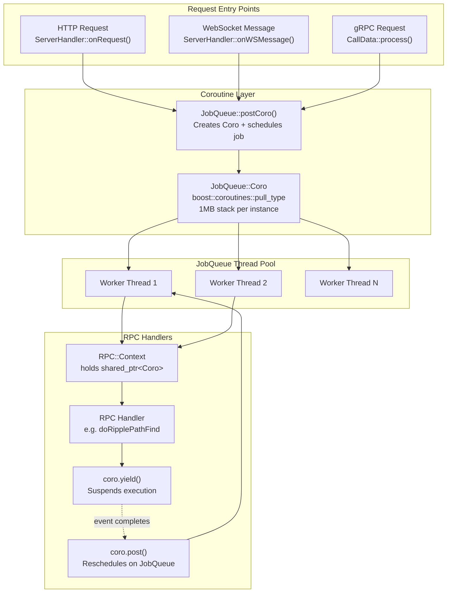

### 2.2 `JobQueue::Coro` Implementation Audit

**File**: `include/xrpl/core/JobQueue.h` (lines 40-120) + `include/xrpl/core/Coro.ipp`

#### Class Members

```cpp
class Coro : public std::enable_shared_from_this<Coro> {
    detail::LocalValues lvs_;                                         // Per-coroutine thread-local storage
    JobQueue& jq_;                                                    // Parent JobQueue reference
    JobType type_;                                                    // Job type (jtCLIENT_RPC, etc.)
    std::string name_;                                                // Name for logging
    bool running_;                                                    // Is currently executing
    std::mutex mutex_;                                                // Prevents concurrent resume
    std::mutex mutex_run_;                                            // Guards running_ flag
    std::condition_variable cv_;                                      // For join() blocking
    boost::coroutines::asymmetric_coroutine<void>::pull_type coro_;   // THE BOOST COROUTINE
    boost::coroutines::asymmetric_coroutine<void>::push_type* yield_; // Yield function pointer
    bool finished_;                                                   // Debug assertion flag
};
```

#### Boost.Coroutine APIs Used

| API | Location | Purpose |
|-----|----------|---------|
| `asymmetric_coroutine<void>::pull_type` | `JobQueue.h:51` | The coroutine object itself |
| `asymmetric_coroutine<void>::push_type` | `JobQueue.h:52` | Yield function type |
| `boost::coroutines::attributes(megabytes(1))` | `Coro.ipp:23` | Stack size configuration |
| `#include <boost/coroutine/all.hpp>` | `JobQueue.h:10` | Header inclusion |

#### Method Behaviors

| Method | Behavior |
|--------|----------|
| **Constructor** | Creates `pull_type` with 1MB stack. Lambda captures user function. Auto-runs to first `yield()`. |
| **`yield()`** | Increments `jq_.nSuspend_`, calls `(*yield_)()` to suspend. Returns control to caller. |
| **`post()`** | Sets `running_=true`, calls `jq_.addJob()` with a lambda that calls `resume()`. Returns false if JobQueue is stopping. |
| **`resume()`** | Swaps `LocalValues`, acquires `mutex_`, calls `coro_()` to resume. Restores `LocalValues`. Sets `running_=false`, notifies `cv_`. |
| **`runnable()`** | Returns `static_cast<bool>(coro_)` — true if coroutine hasn't returned. |
| **`expectEarlyExit()`** | Decrements `nSuspend_`, sets `finished_=true`. Used during shutdown. |
| **`join()`** | Blocks on `cv_` until `running_==false`. |

### 2.3 Coroutine Execution Lifecycle

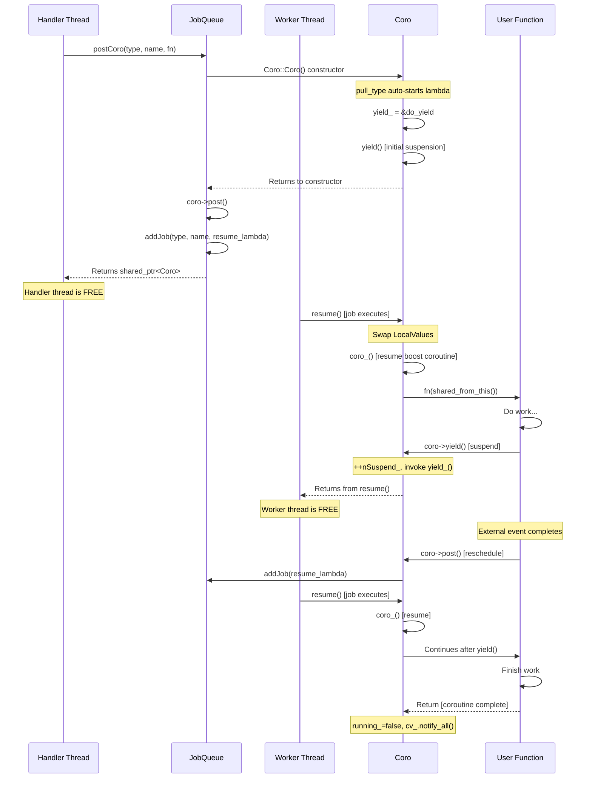

### 2.4 All Coroutine Touchpoints

#### Core Infrastructure (Must Change)

| File | Role | Lines of Interest |
|------|------|-------------------|
| `include/xrpl/core/JobQueue.h` | Coro class definition, postCoro template | Lines 10, 40-120, 385-402 |
| `include/xrpl/core/Coro.ipp` | Coro method implementations | All (122 lines) |
| `include/xrpl/basics/LocalValue.h` | Per-coroutine thread-local storage | Lines 12-59 (LocalValues) |
| `cmake/deps/Boost.cmake` | Boost.Coroutine dependency | Lines 7, 24 |

#### Entry Points (postCoro Callers)

| File | Entry Point | Job Type |
|------|-------------|----------|
| `src/xrpld/rpc/detail/ServerHandler.cpp:287` | `onRequest()` — HTTP RPC | `jtCLIENT_RPC` |
| `src/xrpld/rpc/detail/ServerHandler.cpp:325` | `onWSMessage()` — WebSocket | `jtCLIENT_WEBSOCKET` |
| `src/xrpld/app/main/GRPCServer.cpp:102` | `CallData::process()` — gRPC | `jtRPC` |

#### Context Propagation

| File | Role |
|------|------|
| `src/xrpld/rpc/Context.h:27` | `RPC::Context` holds `shared_ptr<JobQueue::Coro> coro` |
| `src/xrpld/rpc/ServerHandler.h:174-188` | `processSession/processRequest` pass coro through |

#### Active Coroutine Consumer (yield/post)

| File | Usage |
|------|-------|
| `src/xrpld/rpc/handlers/RipplePathFind.cpp:131` | `context.coro->yield()` — suspends for path-finding |
| `src/xrpld/rpc/handlers/RipplePathFind.cpp:116-123` | Continuation calls `coro->post()` or `coro->resume()` |

#### Test Files

| File | Tests |
|------|-------|
| `src/test/core/Coroutine_test.cpp` | `correct_order`, `incorrect_order`, `thread_specific_storage` |
| `src/test/core/JobQueue_test.cpp` | `testPostCoro` (post/resume cycles, shutdown behavior) |
| `src/test/app/Path_test.cpp` | Path-finding RPC via postCoro |
| `src/test/jtx/impl/AMMTest.cpp` | AMM RPC via postCoro |

### 2.5 Suspension/Continuation Model

The current model documented in `src/xrpld/rpc/README.md` defines four functional types:

```
Callback     = std::function<void()>           — generic 0-arg function
Continuation = std::function<void(Callback)>   — calls Callback later
Suspend      = std::function<void(Continuation)> — runs Continuation, suspends
Coroutine    = std::function<void(Suspend)>    — given a Suspend, starts work
```

In practice, `JobQueue::Coro` simplifies this to:
- **Suspend** = `coro->yield()`
- **Continue** = `coro->post()` (async on JobQueue) or `coro->resume()` (sync on current thread)

### 2.6 CMake Dependency

In `cmake/deps/Boost.cmake`:
```cmake
find_package(Boost REQUIRED COMPONENTS ... coroutine ...)
target_link_libraries(xrpl_boost INTERFACE ... Boost::coroutine ...)
```

Additionally in `cmake/XrplInterface.cmake`:
```cpp
BOOST_COROUTINES_NO_DEPRECATION_WARNING  // Suppresses Boost.Coroutine deprecation warnings
```

### 2.7 Existing C++20 Coroutine Usage

rippled **already uses C++20 coroutines** in test code:

- `src/tests/libxrpl/net/HTTPClient.cpp` uses `co_await` with `boost::asio::use_awaitable`
- Demonstrates team familiarity with C++20 coroutine syntax
- Proves compiler toolchain supports C++20 coroutines

---

## 3. Migration Strategy

### 3.1 Incremental vs Atomic Migration

**Decision: Incremental (multi-phase) migration.**

Rationale:
- Only **one RPC handler** (`RipplePathFind`) actively uses `yield()/post()` suspension
- The **three entry points** (HTTP, WS, gRPC) all funnel through `postCoro()`
- The `RPC::Context.coro` field is the sole propagation mechanism
- We can introduce a new C++20 coroutine system alongside the existing one and migrate callsites incrementally

### 3.2 Migration Phases

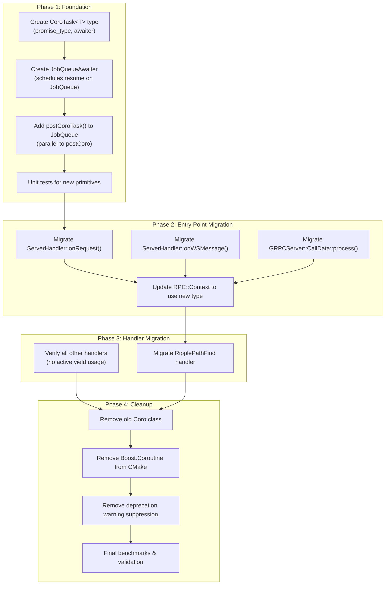

### 3.3 Coexistence Strategy

During migration, both implementations will coexist:

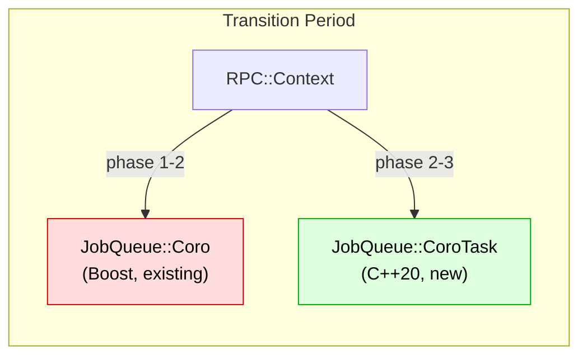

- `RPC::Context` will temporarily hold both `shared_ptr<Coro>` (old) and the new coroutine handle
- Entry points will be migrated one at a time
- Each migration is independently testable
- Once all entry points and handlers are migrated, old code is removed

### 3.4 Breaking Changes & Compatibility

| Concern | Impact | Mitigation |
|---------|--------|------------|
| `RPC::Context::coro` type change | All RPC handlers receive context | Migrate context field last, after all consumers updated |
| `postCoro()` removal | 3 callers | Replace with `postCoroTask()`, remove old API in Phase 4 |
| `LocalValue` integration | Thread-local storage must work | New implementation must swap LocalValues identically |
| Shutdown behavior | `expectEarlyExit()`, `nSuspend_` tracking | Replicate in new CoroTask |

---

## 4. Implementation Plan

### 4.1 New Type Design

#### `CoroTask<T>` — Coroutine Return Type

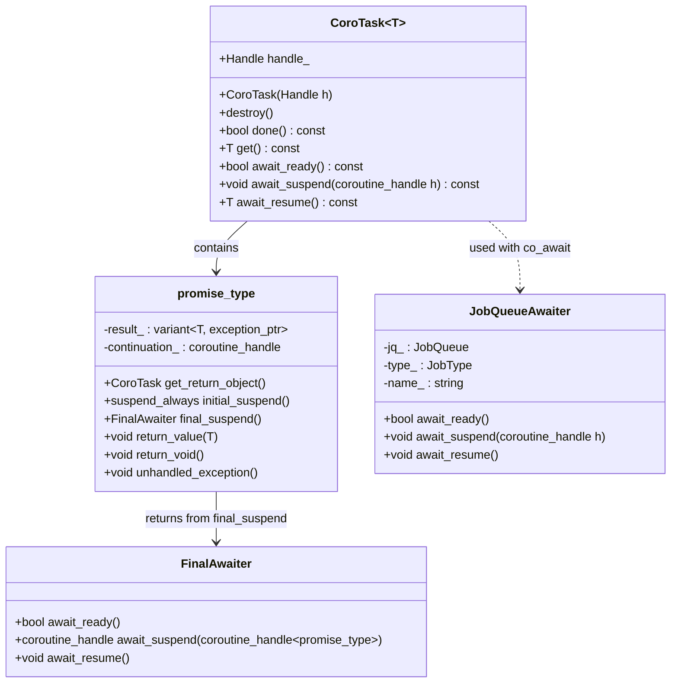

#### `JobQueueAwaiter` — Schedules Resumption on JobQueue

```cpp
// Conceptual design — actual implementation may vary
struct JobQueueAwaiter {
    JobQueue& jq;
    JobType type;
    std::string name;

    bool await_ready() { return false; }  // Always suspend

    void await_suspend(std::coroutine_handle<> h) {
        // Schedule coroutine resumption as a job
        jq.addJob(type, name, [h]() { h.resume(); });
    }

    void await_resume() {}
};
```

### 4.2 Mapping: Old API → New API

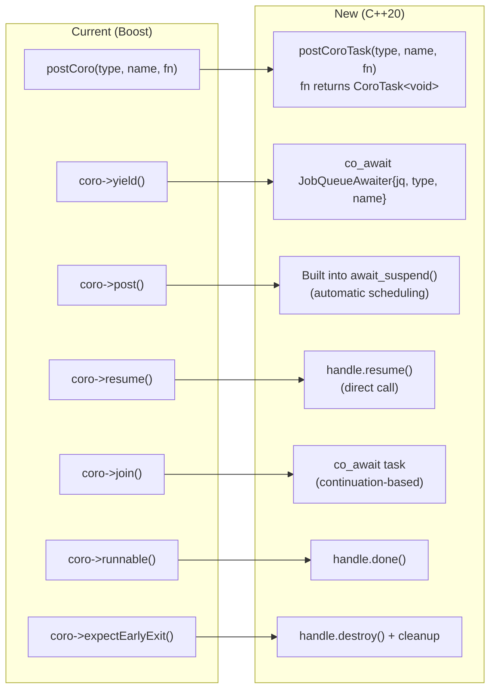

### 4.3 File Changes Required

#### Phase 1: New Coroutine Primitives

| File | Action | Description |
|------|--------|-------------|
| `include/xrpl/core/CoroTask.h` | **CREATE** | `CoroTask<T>` return type with `promise_type`, `FinalAwaiter` |
| `include/xrpl/core/JobQueueAwaiter.h` | **CREATE** | Awaiter that schedules resume on JobQueue |
| `include/xrpl/core/JobQueue.h` | **MODIFY** | Add `postCoroTask()` template alongside existing `postCoro()` |
| `src/test/core/CoroTask_test.cpp` | **CREATE** | Unit tests for `CoroTask<T>` and `JobQueueAwaiter` |

#### Phase 2: Entry Point Migration

| File | Action | Description |
|------|--------|-------------|
| `src/xrpld/rpc/detail/ServerHandler.cpp` | **MODIFY** | `onRequest()` and `onWSMessage()`: replace `postCoro` → `postCoroTask` |
| `src/xrpld/rpc/ServerHandler.h` | **MODIFY** | Update `processSession`/`processRequest` signatures |
| `src/xrpld/app/main/GRPCServer.cpp` | **MODIFY** | `CallData::process()`: replace `postCoro` → `postCoroTask` |
| `src/xrpld/app/main/GRPCServer.h` | **MODIFY** | Update `process()` method signature |
| `src/xrpld/rpc/Context.h` | **MODIFY** | Change `shared_ptr<JobQueue::Coro>` to new coroutine handle type |

#### Phase 3: Handler Migration

| File | Action | Description |
|------|--------|-------------|
| `src/xrpld/rpc/handlers/RipplePathFind.cpp` | **MODIFY** | Replace `context.coro->yield()` / `coro->post()` with `co_await` |
| `src/test/app/Path_test.cpp` | **MODIFY** | Update test to use new coroutine API |
| `src/test/jtx/impl/AMMTest.cpp` | **MODIFY** | Update test to use new coroutine API |

#### Phase 4: Cleanup

| File | Action | Description |
|------|--------|-------------|
| `include/xrpl/core/Coro.ipp` | **DELETE** | Remove old Boost.Coroutine implementation |
| `include/xrpl/core/JobQueue.h` | **MODIFY** | Remove `Coro` class, `postCoro()`, `Coro_create_t`, Boost includes |
| `cmake/deps/Boost.cmake` | **MODIFY** | Remove `coroutine` from `find_package` and `target_link_libraries` |
| `cmake/XrplInterface.cmake` | **MODIFY** | Remove `BOOST_COROUTINES_NO_DEPRECATION_WARNING` |
| `src/test/core/Coroutine_test.cpp` | **MODIFY** | Rewrite tests for new CoroTask |
| `src/test/core/JobQueue_test.cpp` | **MODIFY** | Update `testPostCoro` to use new API |
| `include/xrpl/basics/LocalValue.h` | **MODIFY** | Update LocalValues integration for C++20 coroutines |

### 4.4 LocalValue Integration Design

The current `LocalValue` system swaps per-coroutine storage on resume/yield:

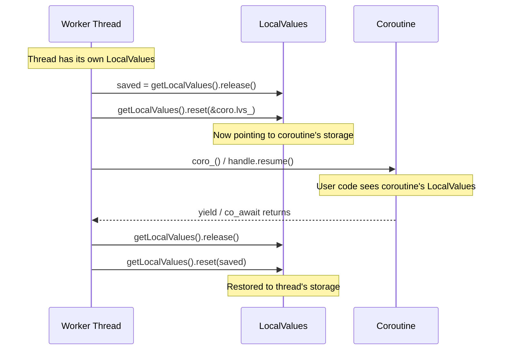

**For C++20**: The same swap pattern must be implemented in the awaiter's `await_suspend()` and `await_resume()`, or in a wrapper that calls `handle.resume()`.

### 4.5 RipplePathFind Migration Design

Current pattern:
```cpp
// Continuation callback
auto callback = [&context]() {
    std::shared_ptr<JobQueue::Coro> coroCopy{context.coro};
    if (!coroCopy->post()) {
        coroCopy->resume();  // Fallback: run on current thread
    }
};

// Start async work, then suspend
jvResult = makeLegacyPathRequest(request, callback, ...);
if (request) {
    context.coro->yield();       // ← SUSPEND HERE
    jvResult = request->doStatus(context.params);  // ← RESUME HERE
}
```

Target pattern:
```cpp
// Start async work, suspend via co_await
jvResult = makeLegacyPathRequest(request, /* awaiter-based callback */, ...);
if (request) {
    co_await PathFindAwaiter{context};  // ← SUSPEND + RESUME via awaiter
    jvResult = request->doStatus(context.params);
}
```

The `PathFindAwaiter` will encapsulate the scheduling logic currently in the lambda continuation.

---

## 5. Testing & Validation Strategy

### 5.1 Test Architecture

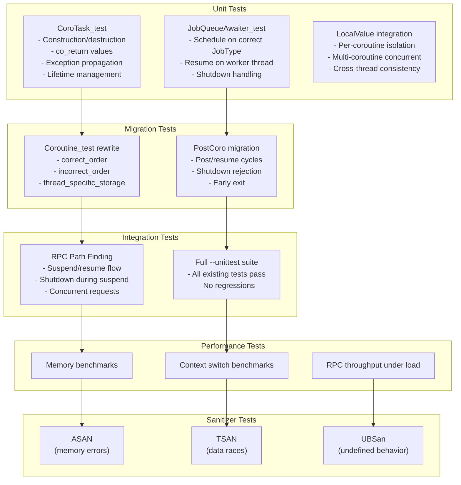

### 5.2 Benchmarking Tests

#### Memory Usage Benchmark

```
Test: Create N coroutines, measure RSS
- N = 100, 1000, 10000
- Measure: peak RSS, per-coroutine overhead
- Compare: Boost (N * 1MB + overhead) vs C++20 (N * ~500B + overhead)
- Tool: /proc/self/status (VmRSS), or getrusage()
```

#### Context Switch Benchmark

```
Test: Yield/resume M times across N coroutines
- M = 100,000 iterations
- N = 1, 10, 100 concurrent coroutines
- Measure: total time, per-switch latency (ns)
- Compare: Boost yield/resume cycle vs C++20 co_await/resume cycle
- Tool: std::chrono::high_resolution_clock
```

#### RPC Throughput Benchmark

```
Test: Concurrent ripple_path_find requests
- Load: 10, 50, 100 concurrent requests
- Measure: requests/second, p50/p95/p99 latency
- Compare: before vs after migration
- Tool: Custom load generator or existing perf infrastructure
```

### 5.3 Unit Test Coverage

| Test | What It Validates |
|------|-------------------|
| `CoroTask<void>` basic | Coroutine runs to completion, handle cleanup |
| `CoroTask<int>` with value | `co_return` value correctly retrieved |
| `CoroTask` exception | `unhandled_exception()` captures and rethrows |
| `CoroTask` cancellation | Destruction before completion cleans up |
| `JobQueueAwaiter` basic | `co_await` suspends, resumes on worker thread |
| `JobQueueAwaiter` shutdown | Returns false / throws when JobQueue stopping |
| `PostCoroTask` lifecycle | Create → suspend → resume → complete |
| `PostCoroTask` multiple yields | Multiple co_await points in sequence |
| `LocalValue` isolation | 4 coroutines, each sees own LocalValue |
| `LocalValue` cross-thread | Resume on different thread, values preserved |

### 5.4 Integration Testing

- **All existing `--unittest` tests must pass unchanged** (except coroutine-specific tests that are rewritten)
- **Path_test** must pass with identical behavior
- **AMMTest** RPC tests must pass
- **ServerHandler** HTTP/WS handling must work end-to-end

### 5.5 Sanitizer Testing

Per `docs/build/sanitizers.md`:

```bash
# ASAN (memory errors — especially important for coroutine frame lifetime)
export SANITIZERS=address,undefinedbehavior
# Build + test

# TSAN (data races — critical for concurrent coroutine resume)
export SANITIZERS=thread
# Build + test (separate build — cannot mix with ASAN)
```

**Key benefit**: Removing Boost.Coroutine eliminates the `__asan_handle_no_return` false positives caused by Boost context switching (documented in `docs/build/sanitizers.md` line 184).

### 5.6 Regression Testing Methodology

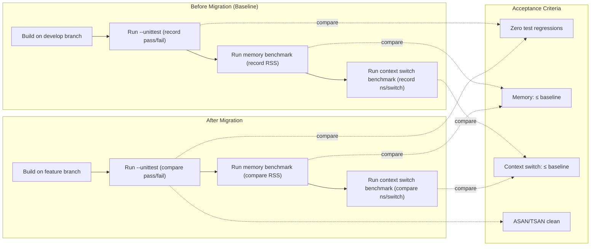

---

## 6. Risks & Mitigation

### 6.1 Risk Matrix

| Risk | Probability | Impact | Mitigation |
|------|-------------|--------|------------|
| **Performance regression** in context switching | Low | High | Benchmark before/after; C++20 should be faster |
| **Coroutine frame lifetime bugs** (use-after-destroy) | Medium | High | ASAN testing, RAII wrapper for handle, code review |
| **Data races on resume** | Medium | High | TSAN testing, careful await_suspend() implementation |
| **LocalValue corruption** across threads | Low | High | Dedicated test with 4+ concurrent coroutines |
| **Shutdown race conditions** | Medium | Medium | Replicate existing mutex/cv pattern in new design |
| **Missed coroutine consumer** during migration | Low | Medium | Exhaustive grep audit (Section 2.4 is complete) |
| **Compiler bugs** in coroutine codegen | Low | Medium | Test on all three compilers (GCC, Clang, MSVC) |
| **Exception loss** across suspension points | Medium | Medium | Test exception propagation in every phase |
| **Third-party code depending on Boost.Coroutine** | Very Low | Low | Grep confirms only internal usage |
| **Dangling references in coroutine frames** | Medium | High | ASAN testing, avoid reference params in coroutine functions, use shared_ptr |
| **Colored function infection spreading** | Low | Medium | Only 4 call sites need co_await; no nested handlers suspend |
| **Symmetric transfer not available** | Very Low | High | All target compilers (GCC 12+, Clang 16+) support symmetric transfer |
| **Future handler adding deep yield** | Low | Medium | Code review + CI: static analysis flag any yield from nested depth |

### 6.2 Rollback Strategy

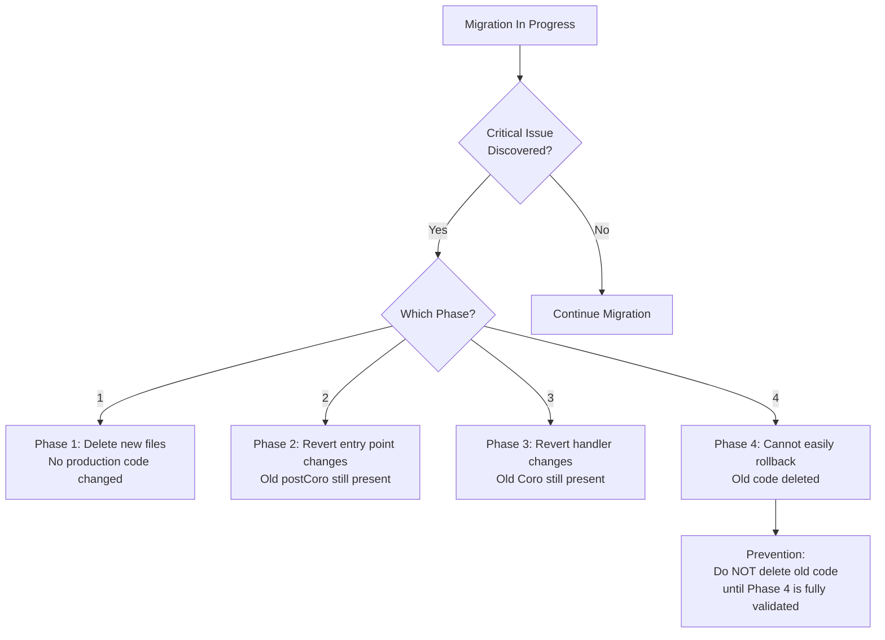

**Key principle**: Old `Coro` class and `postCoro()` remain in the codebase through Phases 1-3. They are only removed in Phase 4, after all migration is validated. Each phase is independently revertible via `git revert`.

### 6.3 Specific Risk: Stackful → Stackless Limitation

**The Big Question**: Can all current `yield()` call sites work with stackless `co_await`?

**Analysis**:

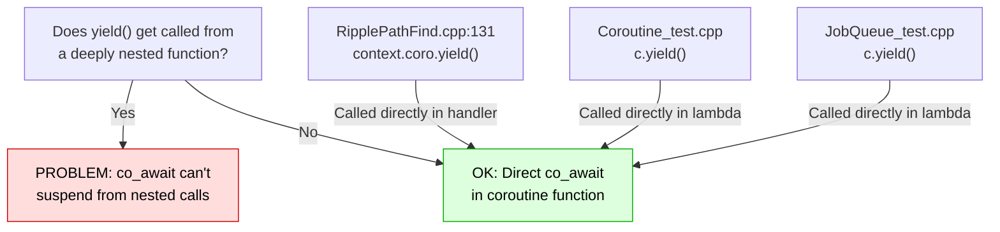

**Result**: All `yield()` calls are in the direct body of the postCoro lambda or RPC handler function. **No deep nesting exists.** Migration to stackless `co_await` is fully feasible without architectural redesign.

---

## 7. Timeline & Milestones

### 7.1 Milestone Overview

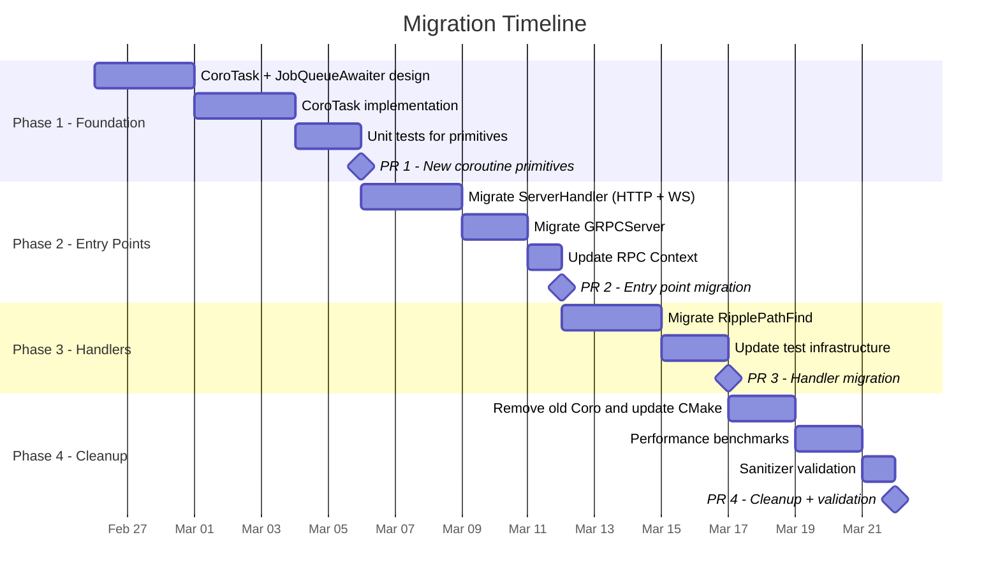

### 7.2 Milestone Details

#### Milestone 1: New Coroutine Primitives (PR #1)

**Deliverables**:
- `CoroTask<T>` with `promise_type`, `FinalAwaiter`
- `CoroTask<void>` specialization
- `JobQueueAwaiter` for scheduling on JobQueue
- `postCoroTask()` on `JobQueue`
- LocalValue integration in new coroutine type
- Unit test suite: `CoroTask_test.cpp`

**Acceptance Criteria**:
- All new unit tests pass
- Existing `--unittest` suite passes (no regressions from new code)
- ASAN + TSAN clean on new tests
- Code compiles on GCC 12+, Clang 16+

#### Milestone 2: Entry Point Migration (PR #2)

**Deliverables**:
- `ServerHandler::onRequest()` uses `postCoroTask()`
- `ServerHandler::onWSMessage()` uses `postCoroTask()`
- `GRPCServer::CallData::process()` uses `postCoroTask()`
- `RPC::Context` updated to carry new coroutine type
- `processSession`/`processRequest` signatures updated

**Acceptance Criteria**:
- HTTP, WebSocket, and gRPC RPC requests work end-to-end
- Full `--unittest` suite passes
- Manual smoke test: `ripple_path_find` via HTTP/WS

#### Milestone 3: Handler Migration (PR #3)

**Deliverables**:
- `RipplePathFind` uses `co_await` instead of `yield()/post()`
- Path_test and AMMTest updated
- Coroutine_test and JobQueue_test updated for new API

**Acceptance Criteria**:
- Path-finding suspension/continuation works correctly
- All `--unittest` tests pass
- Shutdown-during-pathfind scenario tested

#### Milestone 4: Cleanup & Validation (PR #4)

**Deliverables**:
- Old `Coro` class and `Coro.ipp` removed
- `postCoro()` removed from `JobQueue`
- `Boost::coroutine` removed from CMake
- `BOOST_COROUTINES_NO_DEPRECATION_WARNING` removed
- Performance benchmark results documented
- Sanitizer test results documented

**Acceptance Criteria**:
- Build succeeds without Boost.Coroutine
- Full `--unittest` suite passes
- Memory per coroutine ≤ 10KB (down from 1MB)
- Context switch time ≤ baseline
- ASAN, TSAN, UBSan all clean

---

## 8. Standards & Guidelines

### 8.1 Coroutine Design Standards

#### Rule 1: All coroutine return types must use RAII for handle lifetime

```cpp
// GOOD: Handle destroyed in destructor
~CoroTask() {
    if (handle_) handle_.destroy();
}

// BAD: Manual destroy calls scattered in code
void cleanup() { handle_.destroy(); } // Easy to forget
```

#### Rule 2: Never resume a coroutine from within `await_suspend()`

```cpp
// GOOD: Schedule resume on executor
void await_suspend(std::coroutine_handle<> h) {
    jq_.addJob(type_, name_, [h]() { h.resume(); });
}

// BAD: Direct resume in await_suspend (blocks caller)
void await_suspend(std::coroutine_handle<> h) {
    h.resume(); // Defeats the purpose of suspension
}
```

#### Rule 3: Use `suspend_always` for `initial_suspend()` (lazy start)

```cpp
// GOOD: Lazy start — coroutine doesn't run until explicitly resumed
std::suspend_always initial_suspend() { return {}; }

// BAD for our use case: Eager start — runs immediately on creation
std::suspend_never initial_suspend() { return {}; }
```

Rationale: Matches existing Boost behavior where `postCoro()` schedules execution, not the constructor.

#### Rule 4: Always handle `unhandled_exception()` explicitly

```cpp
void unhandled_exception() {
    exception_ = std::current_exception();
    // NEVER: just swallow the exception
    // NEVER: std::terminate() without logging
}
```

#### Rule 5: Use `suspend_always` for `final_suspend()` to enable continuation

```cpp
// GOOD: Suspend at end to allow cleanup and value retrieval
auto final_suspend() noexcept {
    struct FinalAwaiter {
        bool await_ready() noexcept { return false; }
        std::coroutine_handle<> await_suspend(
            std::coroutine_handle<promise_type> h) noexcept {
            if (h.promise().continuation_)
                return h.promise().continuation_;  // Resume waiter
            return std::noop_coroutine();
        }
        void await_resume() noexcept {}
    };
    return FinalAwaiter{};
}
```

#### Rule 6: Coroutine functions must be clearly marked

```cpp
// GOOD: Return type makes it obvious this is a coroutine
CoroTask<Json::Value> doRipplePathFind(RPC::JsonContext& context) {
    co_await ...;
    co_return result;
}

// BAD: Coroutine hidden behind auto or unclear return type
auto doSomething() { co_return; }
```

### 8.2 Coding Guidelines

#### Thread Safety

1. **Never resume a coroutine concurrently from two threads.** Use the same mutex pattern as existing `Coro::mutex_` to prevent races.
2. **`await_suspend()` is the synchronization point.** All state visible before `await_suspend()` must be visible after `await_resume()`.
3. **Use `std::atomic` or mutexes for shared state** between coroutine and continuation callback.

#### Memory Management

1. **`CoroTask<T>` owns its `coroutine_handle`**. It is move-only, non-copyable.
2. **Never store raw `coroutine_handle<>`** in long-lived data structures without clear ownership.
3. **Prefer `shared_ptr<CoroTask<T>>`** when multiple parties need to observe/wait on a coroutine, mirroring the existing `shared_ptr<Coro>` pattern.

#### Error Handling

1. **Exceptions thrown in coroutine body** are captured by `promise_type::unhandled_exception()` and rethrown in `await_resume()`.
2. **Never let exceptions escape `final_suspend()`** — it's `noexcept`.
3. **Shutdown path**: When `JobQueue` is stopping and `addJob()` returns false, the awaiter must resume the coroutine with an error (throw or return error state) rather than leaving it suspended forever.

#### Naming Conventions

| Entity | Convention | Example |
|--------|-----------|---------|
| Coroutine return type | `CoroTask<T>` | `CoroTask<void>`, `CoroTask<Json::Value>` |
| Awaiter types | `*Awaiter` suffix | `JobQueueAwaiter`, `PathFindAwaiter` |
| Coroutine functions | Same as regular functions | `doRipplePathFind(...)` |
| Promise types | Nested `promise_type` | `CoroTask<T>::promise_type` |
| JobQueue method | `postCoroTask()` | `jq.postCoroTask(jtCLIENT, "name", fn)` |

#### Code Organization

1. **Coroutine primitives** go in `include/xrpl/core/` (header-only where possible)
2. **Application-specific awaiters** go alongside their consumers
3. **Tests** mirror source structure: `src/test/core/CoroTask_test.cpp`
4. **No conditional compilation** (`#ifdef`) for old vs new coroutine code — migration is clean phases

#### Documentation

1. **Each awaiter must document**: what it waits for, which thread resumes, and what `await_resume()` returns.
2. **Promise type must document**: exception handling behavior and suspension points.
3. **Migration commits must reference this plan** in commit messages.

### 8.3 Branch Strategy

Each milestone is developed on a **sub-branch** of the main feature branch. This keeps PRs focused and independently reviewable.

```
develop
  └── pratik/Switch-to-std-coroutines          (main feature branch)
        ├── pratik/std-coro/milestone-1         (Phase 1: New primitives)
        ├── pratik/std-coro/milestone-2         (Phase 2: Entry point migration)
        ├── pratik/std-coro/milestone-3         (Phase 3: Handler migration)
        └── pratik/std-coro/milestone-4         (Phase 4: Cleanup + validation)
```

**Workflow**:
1. Create sub-branch from `pratik/Switch-to-std-coroutines` for each milestone
2. Develop and test on the sub-branch
3. Create PR from sub-branch → `pratik/Switch-to-std-coroutines`
4. After review + merge, start next milestone sub-branch from the updated feature branch
5. Final PR from `pratik/Switch-to-std-coroutines` → `develop`

**Rules**:
- Never push directly to the main feature branch — always via sub-branch PR
- Each sub-branch must pass `--unittest` and sanitizers before PR
- Sub-branch names follow the pattern: `pratik/std-coro/milestone-N`
- Milestone PRs must reference this plan document in the description

### 8.4 Code Review Checklist

For every PR in this migration:

- [ ] `coroutine_handle::destroy()` called exactly once per coroutine
- [ ] No concurrent `handle.resume()` calls possible
- [ ] `unhandled_exception()` stores the exception (doesn't discard it)
- [ ] `final_suspend()` is `noexcept`
- [ ] Awaiter `await_suspend()` doesn't block (schedules, not runs)
- [ ] `LocalValues` correctly swapped on suspend/resume boundaries
- [ ] Shutdown path tested (JobQueue stopping during coroutine execution)
- [ ] ASAN clean (no use-after-free on coroutine frame)
- [ ] TSAN clean (no data races on resume)
- [ ] All existing `--unittest` tests still pass

---

## 9. Task List

### Milestone 1: New Coroutine Primitives

- [ ] **1.1** Design `CoroTask<T>` class with `promise_type`
  - Define `promise_type` with `initial_suspend`, `final_suspend`, `unhandled_exception`, `return_value`/`return_void`
  - Implement `FinalAwaiter` for continuation support
  - Implement move-only RAII handle wrapper
  - Support both `CoroTask<T>` and `CoroTask<void>`

- [ ] **1.2** Design and implement `JobQueueAwaiter`
  - `await_suspend()` calls `jq_.addJob(type, name, [h]{ h.resume(); })`
  - Handle `addJob()` failure (shutdown) — resume with error flag or throw
  - Integrate `nSuspend_` counter increment/decrement

- [ ] **1.3** Implement `LocalValues` swap in new coroutine resume path
  - Before `handle.resume()`: save thread-local, install coroutine-local
  - After `handle.resume()` returns: restore thread-local
  - Ensure this works when coroutine migrates between threads

- [ ] **1.4** Add `postCoroTask()` template to `JobQueue`
  - Accept callable returning `CoroTask<void>`
  - Schedule initial execution on JobQueue (mirror `postCoro()` behavior)
  - Return a handle/shared_ptr for join/cancel

- [ ] **1.5** Write unit tests (`src/test/core/CoroTask_test.cpp`)
  - Test `CoroTask<void>` runs to completion
  - Test `CoroTask<int>` returns value
  - Test exception propagation across co_await
  - Test coroutine destruction before completion
  - Test `JobQueueAwaiter` schedules on correct thread
  - Test `LocalValue` isolation across 4+ coroutines
  - Test shutdown rejection (addJob returns false)
  - Test `correct_order` equivalent (yield → join → post → complete)
  - Test `incorrect_order` equivalent (post → yield → complete)
  - Test multiple sequential co_await points

- [ ] **1.6** Verify build on GCC 12+, Clang 16+
- [ ] **1.7** Run ASAN + TSAN on new tests
- [ ] **1.8** Run full `--unittest` suite (no regressions)
- [ ] **1.9** Self-review and create PR #1

### Milestone 2: Entry Point Migration

- [ ] **2.1** Migrate `ServerHandler::onRequest()` (`ServerHandler.cpp:287`)
  - Replace `m_jobQueue.postCoro(jtCLIENT_RPC, ...)` with `postCoroTask()`
  - Update lambda to return `CoroTask<void>` (add `co_return`)
  - Update `processSession` to accept new coroutine type

- [ ] **2.2** Migrate `ServerHandler::onWSMessage()` (`ServerHandler.cpp:325`)
  - Replace `m_jobQueue.postCoro(jtCLIENT_WEBSOCKET, ...)` with `postCoroTask()`
  - Update lambda signature

- [ ] **2.3** Migrate `GRPCServer::CallData::process()` (`GRPCServer.cpp:102`)
  - Replace `app_.getJobQueue().postCoro(JobType::jtRPC, ...)` with `postCoroTask()`
  - Update `process(shared_ptr<Coro> coro)` overload signature

- [ ] **2.4** Update `RPC::Context` (`Context.h:27`)
  - Replace `std::shared_ptr<JobQueue::Coro> coro{}` with new coroutine wrapper type
  - Ensure all code that accesses `context.coro` compiles

- [ ] **2.5** Update `ServerHandler.h` signatures
  - `processSession()` and `processRequest()` parameter types

- [ ] **2.6** Update `GRPCServer.h` signatures
  - `process()` method parameter types

- [ ] **2.7** Run full `--unittest` suite
- [ ] **2.8** Manual smoke test: HTTP + WS + gRPC RPC requests
- [ ] **2.9** Run ASAN + TSAN
- [ ] **2.10** Self-review and create PR #2

### Milestone 3: Handler Migration

- [ ] **3.1** Migrate `doRipplePathFind()` (`RipplePathFind.cpp`)
  - Replace `context.coro->yield()` with `co_await PathFindAwaiter{...}`
  - Replace continuation lambda's `coro->post()` / `coro->resume()` with awaiter scheduling
  - Handle shutdown case (post failure) in awaiter

- [ ] **3.2** Create `PathFindAwaiter` (or use generic `JobQueueAwaiter`)
  - Encapsulate the continuation + yield pattern from `RipplePathFind.cpp` lines 108-132

- [ ] **3.3** Update `Path_test.cpp`
  - Replace `postCoro` usage with `postCoroTask`
  - Ensure `context.coro` usage matches new type

- [ ] **3.4** Update `AMMTest.cpp`
  - Replace `postCoro` usage with `postCoroTask`

- [ ] **3.5** Rewrite `Coroutine_test.cpp` for new API
  - `correct_order`: postCoroTask → co_await → join → resume → complete
  - `incorrect_order`: post before yield equivalent
  - `thread_specific_storage`: 4 coroutines with LocalValue isolation

- [ ] **3.6** Update `JobQueue_test.cpp` `testPostCoro`
  - Migrate to `postCoroTask` API

- [ ] **3.7** Verify `ripple_path_find` works end-to-end with new coroutines
- [ ] **3.8** Test shutdown-during-pathfind scenario
- [ ] **3.9** Run full `--unittest` suite
- [ ] **3.10** Run ASAN + TSAN
- [ ] **3.11** Self-review and create PR #3

### Milestone 4: Cleanup & Validation

- [ ] **4.1** Delete `include/xrpl/core/Coro.ipp`
- [ ] **4.2** Remove from `JobQueue.h`:
  - `#include <boost/coroutine/all.hpp>`
  - `struct Coro_create_t`
  - `class Coro` (entire class)
  - `postCoro()` template
  - Comment block (lines 322-377) describing old race condition
- [ ] **4.3** Update `cmake/deps/Boost.cmake`:
  - Remove `coroutine` from `find_package(Boost REQUIRED COMPONENTS ...)`
  - Remove `Boost::coroutine` from `target_link_libraries`
- [ ] **4.4** Update `cmake/XrplInterface.cmake`:
  - Remove `BOOST_COROUTINES_NO_DEPRECATION_WARNING`
- [ ] **4.5** Run memory benchmark
  - Create N=1000 coroutines, compare RSS: before vs after
  - Document results
- [ ] **4.6** Run context switch benchmark
  - 100K yield/resume cycles, compare latency: before vs after
  - Document results
- [ ] **4.7** Run RPC throughput benchmark
  - Concurrent `ripple_path_find` requests, compare throughput
  - Document results
- [ ] **4.8** Run full `--unittest` suite
- [ ] **4.9** Run ASAN, TSAN, UBSan
  - Confirm `__asan_handle_no_return` warnings are gone
- [ ] **4.10** Verify build on all supported compilers
- [ ] **4.11** Self-review and create PR #4
- [ ] **4.12** Document final benchmark results in PR description

---

## Appendix A: File Inventory

Complete list of files that reference coroutines (for audit tracking):

| # | File | Must Change | Phase |
|---|------|-------------|-------|
| 1 | `include/xrpl/core/JobQueue.h` | Yes | 1 (add), 4 (remove old) |
| 2 | `include/xrpl/core/Coro.ipp` | Yes | 4 (delete) |
| 3 | `include/xrpl/basics/LocalValue.h` | Maybe | 1 (if integration changes) |
| 4 | `cmake/deps/Boost.cmake` | Yes | 4 |
| 5 | `cmake/XrplInterface.cmake` | Yes | 4 |
| 6 | `src/xrpld/rpc/Context.h` | Yes | 2 |
| 7 | `src/xrpld/rpc/detail/ServerHandler.cpp` | Yes | 2 |
| 8 | `src/xrpld/rpc/ServerHandler.h` | Yes | 2 |
| 9 | `src/xrpld/app/main/GRPCServer.cpp` | Yes | 2 |
| 10 | `src/xrpld/app/main/GRPCServer.h` | Yes | 2 |
| 11 | `src/xrpld/rpc/handlers/RipplePathFind.cpp` | Yes | 3 |
| 12 | `src/test/core/Coroutine_test.cpp` | Yes | 3 |
| 13 | `src/test/core/JobQueue_test.cpp` | Yes | 3 |
| 14 | `src/test/app/Path_test.cpp` | Yes | 3 |
| 15 | `src/test/jtx/impl/AMMTest.cpp` | Yes | 3 |
| 16 | `src/xrpld/rpc/README.md` | Yes | 4 (update docs) |

## Appendix B: New Files to Create

| # | File | Phase | Purpose |
|---|------|-------|---------|
| 1 | `include/xrpl/core/CoroTask.h` | 1 | `CoroTask<T>` return type + promise_type |
| 2 | `include/xrpl/core/JobQueueAwaiter.h` | 1 | Awaiter for scheduling on JobQueue |
| 3 | `src/test/core/CoroTask_test.cpp` | 1 | Unit tests for new primitives |
