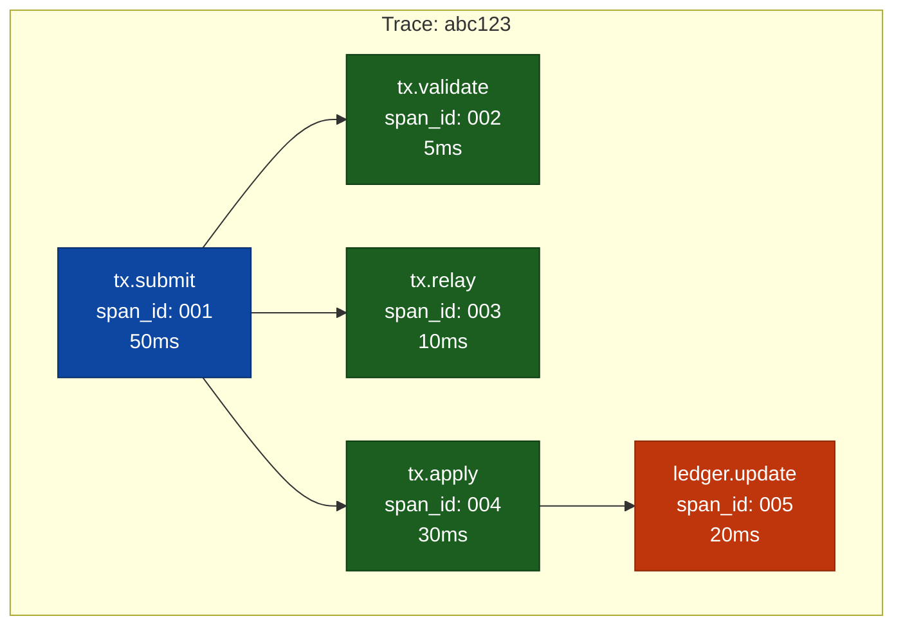
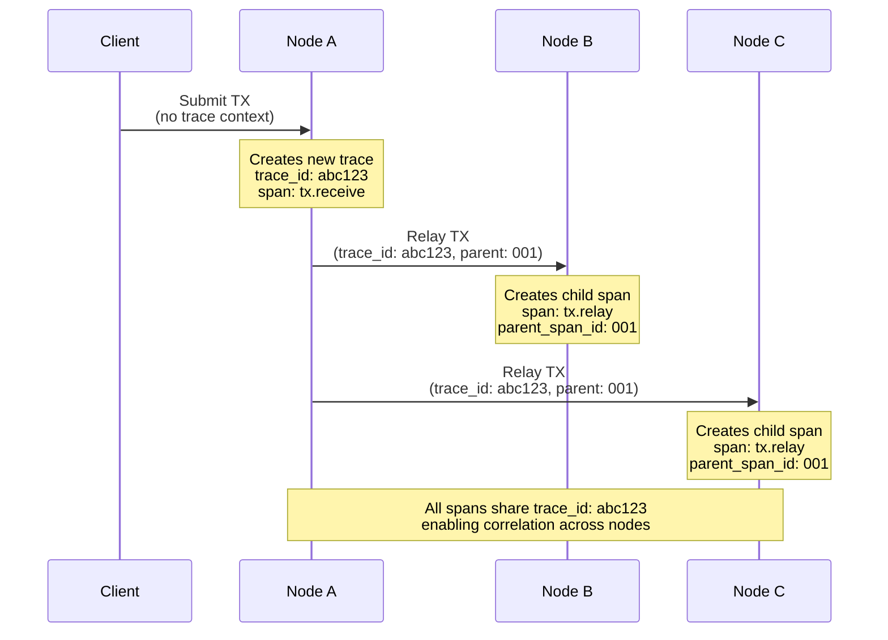

# Distributed Tracing Fundamentals

> **Parent Document**: [OpenTelemetryPlan.md](./OpenTelemetryPlan.md)
> **Next**: [Architecture Analysis](./01-architecture-analysis.md)

---

## What is Distributed Tracing?

Distributed tracing is a method for tracking data objects as they flow through distributed systems. In a network like XRP Ledger, a single transaction touches multiple independent nodes—each with no shared memory or logging. Distributed tracing connects these dots.

**Without tracing:** You see isolated logs on each node with no way to correlate them.

**With tracing:** You see the complete journey of a transaction or an event across all nodes it touched.

---

## Core Concepts

### 1. Trace

A **trace** represents the entire journey of a request through the system. It has a unique `trace_id` that stays constant across all nodes.

```
Trace ID: abc123
├── Node A: received transaction
├── Node B: relayed transaction
├── Node C: included in consensus
└── Node D: applied to ledger
```

### 2. Span

A **span** represents a single unit of work within a trace. Each span has:

| Attribute        | Description           | Example                    |
| ---------------- | --------------------- | -------------------------- |
| `trace_id`       | Links to parent trace | `abc123`                   |
| `span_id`        | Unique identifier     | `span456`                  |
| `parent_span_id` | Parent span (if any)  | `p_span123`                |
| `name`           | Operation name        | `rpc.submit`               |
| `start_time`     | When work began       | `2024-01-15T10:30:00Z`     |
| `end_time`       | When work completed   | `2024-01-15T10:30:00.050Z` |
| `attributes`     | Key-value metadata    | `tx.hash=ABC...`           |
| `status`         | OK, ERROR MSG         | `OK`                       |

### 3. Trace Context

**Trace context** is the data that propagates between services to link spans together. It contains:

- `trace_id` - The trace this span belongs to
- `span_id` - The current span (becomes parent for child spans)
- `trace_flags` - Sampling decisions

---

## How Spans Form a Trace

Spans have parent-child relationships forming a tree structure:



The same trace visualized as a **timeline (Gantt chart)**:

```
Time →   0ms    10ms    20ms    30ms    40ms    50ms
         ├───────────────────────────────────────────┤
tx.submit│▓▓▓▓▓▓▓▓▓▓▓▓▓▓▓▓▓▓▓▓▓▓▓▓▓▓▓▓▓▓▓▓▓▓▓▓▓▓▓▓▓▓│
         ├─────┤
tx.valid │▓▓▓▓▓│
         │     ├──────────┤
tx.relay │     │▓▓▓▓▓▓▓▓▓▓│
         │               ├────────────────────────────┤
tx.apply │               │▓▓▓▓▓▓▓▓▓▓▓▓▓▓▓▓▓▓▓▓▓▓▓▓▓▓▓▓│
         │                         ├──────────────────┤
ledger   │                         │▓▓▓▓▓▓▓▓▓▓▓▓▓▓▓▓▓▓│
```

---

## Distributed Traces Across Nodes

In distributed systems like rippled, traces span **multiple independent nodes**. The trace context must be propagated in network messages:



---

## Context Propagation

For traces to work across nodes, **trace context must be propagated** in messages.

### What's in the Context (32 bytes)

| Field         | Size       | Description                                             |
| ------------- | ---------- | ------------------------------------------------------- |
| `trace_id`    | 16 bytes   | Identifies the entire trace (constant across all nodes) |
| `span_id`     | 8 bytes    | The sender's current span (becomes parent on receiver)  |
| `trace_flags` | 4 bytes    | Sampling decision flags                                 |
| `trace_state` | ~0-4 bytes | Optional vendor-specific data                           |

### How span_id Changes at Each Hop

Only **one** `span_id` travels in the context - the sender's current span. Each node:
1. Extracts the received `span_id` and uses it as the `parent_span_id`
2. Creates a **new** `span_id` for its own span
3. Sends its own `span_id` as the parent when forwarding

```
Node A                      Node B                      Node C
──────                      ──────                      ──────

Span AAA                    Span BBB                    Span CCC
   │                           │                           │
   ▼                           ▼                           ▼
Context out:                Context out:                Context out:
├─ trace_id: abc123         ├─ trace_id: abc123         ├─ trace_id: abc123
├─ span_id: AAA ──────────► ├─ span_id: BBB ──────────► ├─ span_id: CCC ──────►
└─ flags: 01                └─ flags: 01                └─ flags: 01
                               │                           │
                          parent = AAA               parent = BBB
```

The `trace_id` stays constant, but `span_id` **changes at every hop** to maintain the parent-child chain.

### Propagation Formats

There are two patterns:

### HTTP/RPC Headers (W3C Trace Context)

```
traceparent: 00-abc123def456-span789-01
             │  │             │      │
             │  │             │      └── Flags (sampled)
             │  │             └── Parent span ID
             │  └── Trace ID
             └── Version
```

### Protocol Buffers (rippled P2P messages)

```protobuf
message TMTransaction {
    bytes rawTransaction = 1;
    // ... existing fields ...

    // Trace context extension
    bytes trace_parent = 100;  // W3C traceparent
    bytes trace_state = 101;   // W3C tracestate
}
```

---

## Sampling

Not every trace needs to be recorded. **Sampling** reduces overhead:

### Head Sampling (at trace start)
```
Request arrives → Random 10% chance → Record or skip entire trace
```
- ✅ Low overhead
- ❌ May miss interesting traces

### Tail Sampling (after trace completes)
```
Trace completes → Collector evaluates:
                  - Error? → KEEP
                  - Slow? → KEEP
                  - Normal? → Sample 10%
```
- ✅ Never loses important traces
- ❌ Higher memory usage at collector

---

## Key Benefits for rippled

| Challenge                          | How Tracing Helps                        |
| ---------------------------------- | ---------------------------------------- |
| "Where is my transaction?"         | Follow trace across all nodes it touched |
| "Why was consensus slow?"          | See timing breakdown of each phase       |
| "Which node is the bottleneck?"    | Compare span durations across nodes      |
| "What happened during the outage?" | Correlate errors across the network      |

---

## Glossary

| Term                | Definition                                                      |
| ------------------- | --------------------------------------------------------------- |
| **Trace**           | Complete journey of a request, identified by `trace_id`         |
| **Span**            | Single operation within a trace                                 |
| **Context**         | Data propagated between services (`trace_id`, `span_id`, flags) |
| **Instrumentation** | Code that creates spans and propagates context                  |
| **Collector**       | Service that receives, processes, and exports traces            |
| **Backend**         | Storage/visualization system (Jaeger, Tempo, etc.)              |
| **Head Sampling**   | Sampling decision at trace start                                |
| **Tail Sampling**   | Sampling decision after trace completes                         |

---

*Next: [Architecture Analysis](./01-architecture-analysis.md)* | *Back to: [Overview](./OpenTelemetryPlan.md)*
