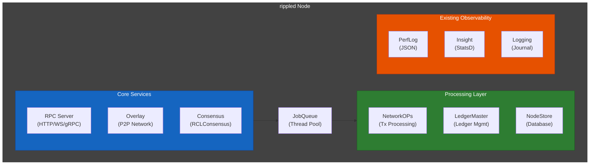
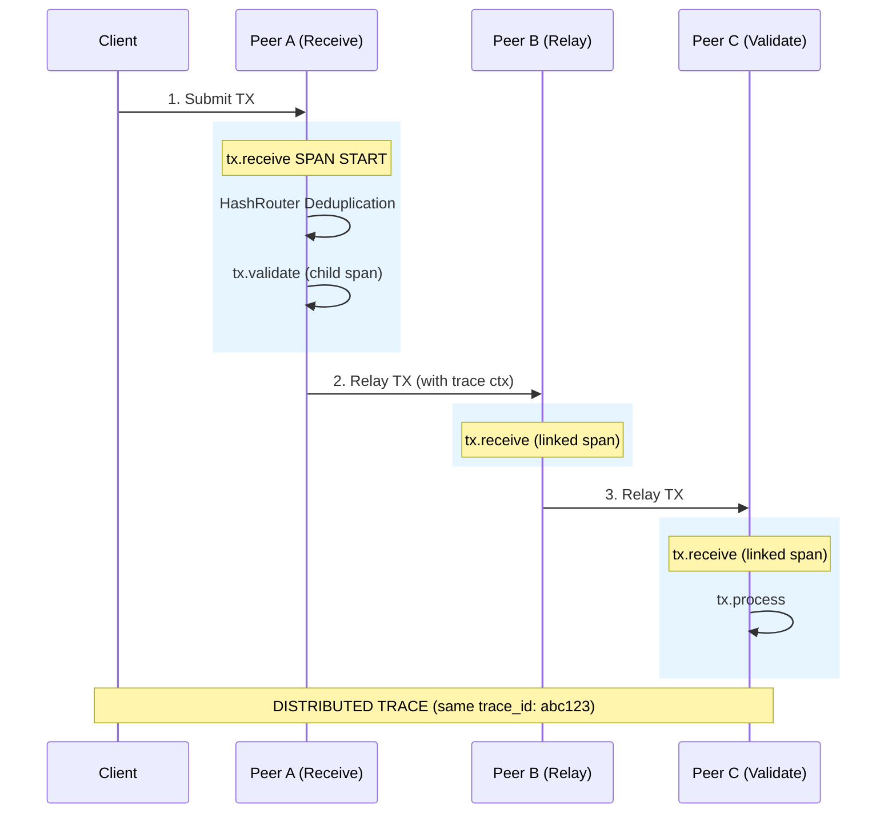
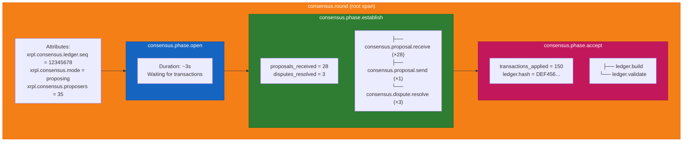
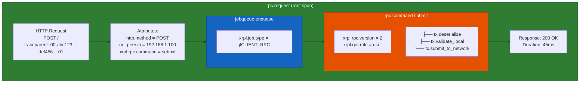
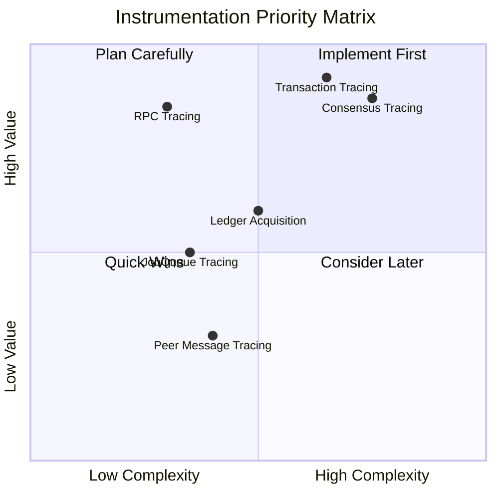
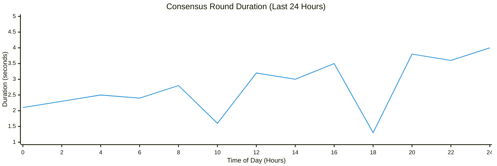

# Architecture Analysis

> **Parent Document**: [OpenTelemetryPlan.md](./OpenTelemetryPlan.md)
> **Related**: [Design Decisions](./02-design-decisions.md) | [Implementation Strategy](./03-implementation-strategy.md)

---

## 1.1 Current rippled Architecture Overview

The rippled node software consists of several interconnected components that need instrumentation for distributed tracing:



---

## 1.2 Key Components for Instrumentation

| Component         | Location                                   | Purpose                  | Trace Value                  |
| ----------------- | ------------------------------------------ | ------------------------ | ---------------------------- |
| **Overlay**       | `src/xrpld/overlay/`                       | P2P communication        | Message propagation timing   |
| **PeerImp**       | `src/xrpld/overlay/detail/PeerImp.cpp`     | Individual peer handling | Per-peer latency             |
| **RCLConsensus**  | `src/xrpld/app/consensus/RCLConsensus.cpp` | Consensus algorithm      | Round timing, phase analysis |
| **NetworkOPs**    | `src/xrpld/app/misc/NetworkOPs.cpp`        | Transaction processing   | Tx lifecycle tracking        |
| **ServerHandler** | `src/xrpld/rpc/detail/ServerHandler.cpp`   | RPC entry point          | Request latency              |
| **RPCHandler**    | `src/xrpld/rpc/detail/RPCHandler.cpp`      | Command execution        | Per-command timing           |
| **JobQueue**      | `src/xrpl/core/JobQueue.h`                 | Async task execution     | Queue wait times             |

---

## 1.3 Transaction Flow Diagram

Transaction flow spans multiple nodes in the network. Each node creates linked spans to form a distributed trace:



### Trace Structure

```
trace_id: abc123
├── span: tx.receive (Peer A)
│   ├── span: tx.validate
│   └── span: tx.relay
├── span: tx.receive (Peer B) [parent: Peer A]
│   └── span: tx.relay
└── span: tx.receive (Peer C) [parent: Peer B]
    └── span: tx.process
```

---

## 1.4 Consensus Round Flow

Consensus rounds are multi-phase operations that benefit significantly from tracing:



---

## 1.5 RPC Request Flow

RPC requests support W3C Trace Context headers for distributed tracing across services:



---

## 1.6 Key Trace Points

The following table identifies priority instrumentation points across the codebase:

| Category        | Span Name              | File                 | Method                 | Priority |
| --------------- | ---------------------- | -------------------- | ---------------------- | -------- |
| **Transaction** | `tx.receive`           | `PeerImp.cpp`        | `handleTransaction()`  | High     |
| **Transaction** | `tx.validate`          | `NetworkOPs.cpp`     | `processTransaction()` | High     |
| **Transaction** | `tx.process`           | `NetworkOPs.cpp`     | `doTransactionSync()`  | High     |
| **Transaction** | `tx.relay`             | `OverlayImpl.cpp`    | `relay()`              | Medium   |
| **Consensus**   | `consensus.round`      | `RCLConsensus.cpp`   | `startRound()`         | High     |
| **Consensus**   | `consensus.phase.*`    | `Consensus.h`        | `timerEntry()`         | High     |
| **Consensus**   | `consensus.proposal.*` | `RCLConsensus.cpp`   | `peerProposal()`       | Medium   |
| **RPC**         | `rpc.request`          | `ServerHandler.cpp`  | `onRequest()`          | High     |
| **RPC**         | `rpc.command.*`        | `RPCHandler.cpp`     | `doCommand()`          | High     |
| **Peer**        | `peer.connect`         | `OverlayImpl.cpp`    | `onHandoff()`          | Low      |
| **Peer**        | `peer.message.*`       | `PeerImp.cpp`        | `onMessage()`          | Low      |
| **Ledger**      | `ledger.acquire`       | `InboundLedgers.cpp` | `acquire()`            | Medium   |
| **Ledger**      | `ledger.build`         | `RCLConsensus.cpp`   | `buildLCL()`           | High     |

---

## 1.7 Instrumentation Priority



---

## 1.8 Observable Outcomes

After implementing OpenTelemetry, operators and developers will gain visibility into the following:

### 1.8.1 What You Will See: Traces

| Trace Type                 | Description                                                                                 | Example Query in Grafana/Tempo                         |
| -------------------------- | ------------------------------------------------------------------------------------------- | ------------------------------------------------------ |
| **Transaction Lifecycle**  | Full journey from RPC submission through validation, relay, consensus, and ledger inclusion | `{service.name="rippled" && xrpl.tx.hash="ABC123..."}` |
| **Cross-Node Propagation** | Transaction path across multiple rippled nodes with timing                                  | `{xrpl.tx.relay_count > 0}`                            |
| **Consensus Rounds**       | Complete round with all phases (open, establish, accept)                                    | `{span.name=~"consensus.round.*"}`                     |
| **RPC Request Processing** | Individual command execution with timing breakdown                                          | `{xrpl.rpc.command="account_info"}`                    |
| **Ledger Acquisition**     | Peer-to-peer ledger data requests and responses                                             | `{span.name="ledger.acquire"}`                         |

### 1.8.2 What You Will See: Metrics (Derived from Traces)

| Metric                        | Description                            | Dashboard Panel             |
| ----------------------------- | -------------------------------------- | --------------------------- |
| **RPC Latency (p50/p95/p99)** | Response time distribution per command | Heatmap by command          |
| **Transaction Throughput**    | Transactions processed per second      | Time series graph           |
| **Consensus Round Duration**  | Time to complete consensus phases      | Histogram                   |
| **Cross-Node Latency**        | Time for transaction to reach N nodes  | Line chart with percentiles |
| **Error Rate**                | Failed transactions/RPC calls by type  | Stacked bar chart           |

### 1.8.3 Concrete Dashboard Examples

**Transaction Trace View (Jaeger/Tempo):**

```
┌────────────────────────────────────────────────────────────────────────────────┐
│ Trace: abc123... (Transaction Submission)                    Duration: 847ms   │
├────────────────────────────────────────────────────────────────────────────────┤
│ ├── rpc.request [ServerHandler]                              ████░░░░░░  45ms  │
│ │   └── rpc.command.submit [RPCHandler]                      ████░░░░░░  42ms  │
│ │       └── tx.receive [NetworkOPs]                          ███░░░░░░░  35ms  │
│ │           ├── tx.validate [TxQ]                            █░░░░░░░░░   8ms  │
│ │           └── tx.relay [Overlay]                           ██░░░░░░░░  15ms  │
│ │               ├── tx.receive [Node-B]                      █████░░░░░  52ms  │
│ │               │   └── tx.relay [Node-B]                    ██░░░░░░░░  18ms  │
│ │               └── tx.receive [Node-C]                      ██████░░░░  65ms  │
│ └── consensus.round [RCLConsensus]                           ████████░░ 720ms  │
│     ├── consensus.phase.open                                 ██░░░░░░░░ 180ms  │
│     ├── consensus.phase.establish                            █████░░░░░ 480ms  │
│     └── consensus.phase.accept                               █░░░░░░░░░  60ms  │
└────────────────────────────────────────────────────────────────────────────────┘
```

**RPC Performance Dashboard Panel:**

```
┌─────────────────────────────────────────────────────────────┐
│ RPC Command Latency (Last 1 Hour)                           │
├─────────────────────────────────────────────────────────────┤
│ Command          │ p50    │ p95    │ p99    │ Errors │ Rate │
│──────────────────┼────────┼────────┼────────┼────────┼──────│
│ account_info     │  12ms  │  45ms  │  89ms  │  0.1%  │ 150/s│
│ submit           │  35ms  │ 120ms  │ 250ms  │  2.3%  │  45/s│
│ ledger           │   8ms  │  25ms  │  55ms  │  0.0%  │  80/s│
│ tx               │  15ms  │  50ms  │ 100ms  │  0.5%  │  60/s│
│ server_info      │   5ms  │  12ms  │  20ms  │  0.0%  │ 200/s│
└─────────────────────────────────────────────────────────────┘
```

**Consensus Health Dashboard Panel:**



### 1.8.4 Operator Actionable Insights

| Scenario              | What You'll See                                                              | Action                           |
| --------------------- | ---------------------------------------------------------------------------- | -------------------------------- |
| **Slow RPC**          | Span showing which phase is slow (parsing, execution, serialization)         | Optimize specific code path      |
| **Transaction Stuck** | Trace stops at validation; error attribute shows reason                      | Fix transaction parameters       |
| **Consensus Delay**   | Phase.establish taking too long; proposer attribute shows missing validators | Investigate network connectivity |
| **Memory Spike**      | Large batch of spans correlating with memory increase                        | Tune batch_size or sampling      |
| **Network Partition** | Traces missing cross-node links for specific peer                            | Check peer connectivity          |

### 1.8.5 Developer Debugging Workflow

1. **Find Transaction**: Query by `xrpl.tx.hash` to get full trace
2. **Identify Bottleneck**: Look at span durations to find slowest component
3. **Check Attributes**: Review `xrpl.tx.validity`, `xrpl.rpc.status` for errors
4. **Correlate Logs**: Use `trace_id` to find related PerfLog entries
5. **Compare Nodes**: Filter by `service.instance.id` to compare behavior across nodes

---

_Next: [Design Decisions](./02-design-decisions.md)_ | _Back to: [Overview](./OpenTelemetryPlan.md)_
