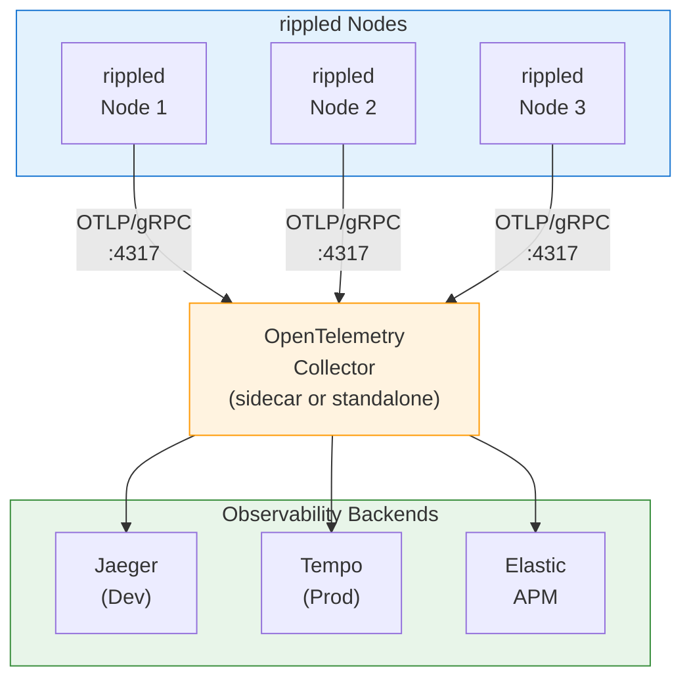
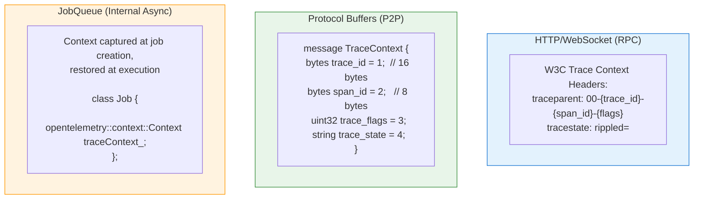
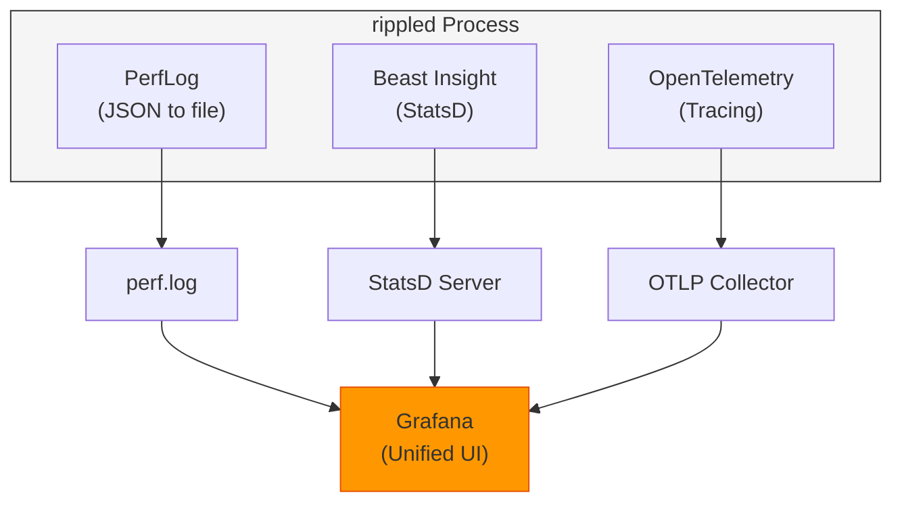

# Design Decisions

> **Parent Document**: [OpenTelemetryPlan.md](./OpenTelemetryPlan.md)
> **Related**: [Architecture Analysis](./01-architecture-analysis.md) | [Code Samples](./04-code-samples.md)

---

## 2.1 OpenTelemetry Components

### 2.1.1 SDK Selection

**Primary Choice**: OpenTelemetry C++ SDK (`opentelemetry-cpp`)

| Component                               | Purpose                | Required    |
| --------------------------------------- | ---------------------- | ----------- |
| `opentelemetry-cpp::api`                | Tracing API headers    | Yes         |
| `opentelemetry-cpp::sdk`                | SDK implementation     | Yes         |
| `opentelemetry-cpp::ext`                | Extensions (exporters) | Yes         |
| `opentelemetry-cpp::otlp_grpc_exporter` | OTLP/gRPC export       | Recommended |
| `opentelemetry-cpp::otlp_http_exporter` | OTLP/HTTP export       | Alternative |

### 2.1.2 Instrumentation Strategy

**Manual Instrumentation** (recommended):

| Approach   | Pros                                                              | Cons                                                    |
| ---------- | ----------------------------------------------------------------- | ------------------------------------------------------- |
| **Manual** | Precise control, optimized placement, rippled-specific attributes | More development effort                                 |
| **Auto**   | Less code, automatic coverage                                     | Less control, potential overhead, limited customization |

---

## 2.2 Exporter Configuration



### 2.2.1 OTLP/gRPC (Recommended)

```cpp
// Configuration for OTLP over gRPC
namespace otlp = opentelemetry::exporter::otlp;

otlp::OtlpGrpcExporterOptions opts;
opts.endpoint = "localhost:4317";
opts.use_ssl_credentials = true;
opts.ssl_credentials_cacert_path = "/path/to/ca.crt";
```

### 2.2.2 OTLP/HTTP (Alternative)

```cpp
// Configuration for OTLP over HTTP
namespace otlp = opentelemetry::exporter::otlp;

otlp::OtlpHttpExporterOptions opts;
opts.url = "http://localhost:4318/v1/traces";
opts.content_type = otlp::HttpRequestContentType::kJson;  // or kBinary
```

---

## 2.3 Span Naming Conventions

### 2.3.1 Naming Schema

```
<component>.<operation>[.<sub-operation>]
```

**Examples**:
- `tx.receive` - Transaction received from peer
- `consensus.phase.establish` - Consensus establish phase
- `rpc.command.server_info` - server_info RPC command

### 2.3.2 Complete Span Catalog

```yaml
# Transaction Spans
tx:
  receive:     "Transaction received from network"
  validate:    "Transaction signature/format validation"
  process:     "Full transaction processing"
  relay:       "Transaction relay to peers"
  apply:       "Apply transaction to ledger"

# Consensus Spans
consensus:
  round:       "Complete consensus round"
  phase:
    open:      "Open phase - collecting transactions"
    establish: "Establish phase - reaching agreement"
    accept:    "Accept phase - applying consensus"
  proposal:
    receive:   "Receive peer proposal"
    send:      "Send our proposal"
  validation:
    receive:   "Receive peer validation"
    send:      "Send our validation"

# RPC Spans
rpc:
  request:     "HTTP/WebSocket request handling"
  command:
    "*":       "Specific RPC command (dynamic)"

# Peer Spans
peer:
  connect:     "Peer connection establishment"
  disconnect:  "Peer disconnection"
  message:
    send:      "Send protocol message"
    receive:   "Receive protocol message"

# Ledger Spans
ledger:
  acquire:     "Ledger acquisition from network"
  build:       "Build new ledger"
  validate:    "Ledger validation"
  close:       "Close ledger"

# Job Spans
job:
  enqueue:     "Job added to queue"
  execute:     "Job execution"
```

---

## 2.4 Attribute Schema

### 2.4.1 Resource Attributes (Set Once at Startup)

```cpp
// Standard OpenTelemetry semantic conventions
resource::SemanticConventions::SERVICE_NAME        = "rippled"
resource::SemanticConventions::SERVICE_VERSION     = BuildInfo::getVersionString()
resource::SemanticConventions::SERVICE_INSTANCE_ID = <node_public_key_base58>

// Custom rippled attributes
"xrpl.network.id"      = <network_id>           // e.g., 0 for mainnet
"xrpl.network.type"    = "mainnet" | "testnet" | "devnet" | "standalone"
"xrpl.node.type"       = "validator" | "stock" | "reporting"
"xrpl.node.cluster"    = <cluster_name>         // If clustered
```

### 2.4.2 Span Attributes by Category

#### Transaction Attributes
```cpp
"xrpl.tx.hash"         = string   // Transaction hash (hex)
"xrpl.tx.type"         = string   // "Payment", "OfferCreate", etc.
"xrpl.tx.account"      = string   // Source account (redacted in prod)
"xrpl.tx.sequence"     = int64    // Account sequence number
"xrpl.tx.fee"          = int64    // Fee in drops
"xrpl.tx.result"       = string   // "tesSUCCESS", "tecPATH_DRY", etc.
"xrpl.tx.ledger_index" = int64    // Ledger containing transaction
```

#### Consensus Attributes
```cpp
"xrpl.consensus.round"          = int64    // Round number
"xrpl.consensus.phase"          = string   // "open", "establish", "accept"
"xrpl.consensus.mode"           = string   // "proposing", "observing", etc.
"xrpl.consensus.proposers"      = int64    // Number of proposers
"xrpl.consensus.ledger.prev"    = string   // Previous ledger hash
"xrpl.consensus.ledger.seq"     = int64    // Ledger sequence
"xrpl.consensus.tx_count"       = int64    // Transactions in consensus set
"xrpl.consensus.duration_ms"    = float64  // Round duration
```

#### RPC Attributes
```cpp
"xrpl.rpc.command"     = string   // Command name
"xrpl.rpc.version"     = int64    // API version
"xrpl.rpc.role"        = string   // "admin" or "user"
"xrpl.rpc.params"      = string   // Sanitized parameters (optional)
```

#### Peer & Message Attributes
```cpp
"xrpl.peer.id"            = string   // Peer public key (base58)
"xrpl.peer.address"       = string   // IP:port
"xrpl.peer.latency_ms"    = float64  // Measured latency
"xrpl.peer.cluster"       = string   // Cluster name if clustered
"xrpl.message.type"       = string   // Protocol message type name
"xrpl.message.size_bytes" = int64    // Message size
"xrpl.message.compressed" = bool     // Whether compressed
```

#### Ledger & Job Attributes
```cpp
"xrpl.ledger.hash"       = string   // Ledger hash
"xrpl.ledger.index"      = int64    // Ledger sequence/index
"xrpl.ledger.close_time" = int64    // Close time (epoch)
"xrpl.ledger.tx_count"   = int64    // Transaction count
"xrpl.job.type"          = string   // Job type name
"xrpl.job.queue_ms"      = float64  // Time spent in queue
"xrpl.job.worker"        = int64    // Worker thread ID
```

---

## 2.5 Context Propagation Design

### 2.5.1 Propagation Boundaries



---

## 2.6 Integration with Existing Observability

### 2.6.1 Coexistence Strategy



### 2.6.2 Correlation with PerfLog

Trace IDs can be correlated with existing PerfLog entries for comprehensive debugging:

```cpp
// In RPCHandler.cpp - correlate trace with PerfLog
Status doCommand(RPC::JsonContext& context, Json::Value& result)
{
    // Start OpenTelemetry span
    auto span = context.app.getTelemetry().startSpan(
        "rpc.command." + context.method);

    // Get trace ID for correlation
    auto traceId = span->GetContext().trace_id().IsValid()
        ? toHex(span->GetContext().trace_id())
        : "";

    // Use existing PerfLog with trace correlation
    auto const curId = context.app.getPerfLog().currentId();
    context.app.getPerfLog().rpcStart(context.method, curId);

    // Future: Add trace ID to PerfLog entry
    // context.app.getPerfLog().setTraceId(curId, traceId);

    try {
        auto ret = handler(context, result);
        context.app.getPerfLog().rpcFinish(context.method, curId);
        span->SetStatus(opentelemetry::trace::StatusCode::kOk);
        return ret;
    } catch (std::exception const& e) {
        context.app.getPerfLog().rpcError(context.method, curId);
        span->RecordException(e);
        span->SetStatus(opentelemetry::trace::StatusCode::kError, e.what());
        throw;
    }
}
```

---

*Previous: [Architecture Analysis](./01-architecture-analysis.md)* | *Next: [Implementation Strategy](./03-implementation-strategy.md)* | *Back to: [Overview](./OpenTelemetryPlan.md)*
