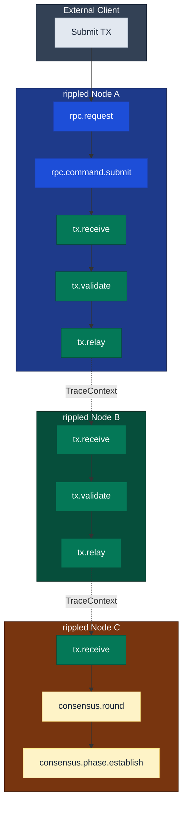

# Code Samples

> **Parent Document**: [OpenTelemetryPlan.md](./OpenTelemetryPlan.md)
> **Related**: [Implementation Strategy](./03-implementation-strategy.md) | [Configuration Reference](./05-configuration-reference.md)

---

## 4.1 Core Interfaces

### 4.1.1 Main Telemetry Interface

```cpp
// include/xrpl/telemetry/Telemetry.h
#pragma once

#include <xrpl/telemetry/TelemetryConfig.h>
#include <opentelemetry/trace/tracer.h>
#include <opentelemetry/trace/span.h>
#include <opentelemetry/context/context.h>

#include <memory>
#include <string>
#include <string_view>

namespace xrpl {
namespace telemetry {

/**
 * Main telemetry interface for OpenTelemetry integration.
 *
 * This class provides the primary API for distributed tracing in rippled.
 * It manages the OpenTelemetry SDK lifecycle and provides convenience
 * methods for creating spans and propagating context.
 */
class Telemetry
{
public:
    /**
     * Configuration for the telemetry system.
     */
    struct Setup
    {
        bool enabled = false;
        std::string serviceName = "rippled";
        std::string serviceVersion;
        std::string serviceInstanceId;  // Node public key

        // Exporter configuration
        std::string exporterType = "otlp_grpc";  // "otlp_grpc", "otlp_http", "none"
        std::string exporterEndpoint = "localhost:4317";
        bool useTls = false;
        std::string tlsCertPath;

        // Sampling configuration
        double samplingRatio = 1.0;  // 1.0 = 100% sampling

        // Batch processor settings
        std::uint32_t batchSize = 512;
        std::chrono::milliseconds batchDelay{5000};
        std::uint32_t maxQueueSize = 2048;

        // Network attributes
        std::uint32_t networkId = 0;
        std::string networkType = "mainnet";

        // Component filtering
        bool traceTransactions = true;
        bool traceConsensus = true;
        bool traceRpc = true;
        bool tracePeer = false;  // High volume, disabled by default
        bool traceLedger = true;
    };

    virtual ~Telemetry() = default;

    // ═══════════════════════════════════════════════════════════════════════
    // LIFECYCLE
    // ═══════════════════════════════════════════════════════════════════════

    /** Start the telemetry system (call after configuration) */
    virtual void start() = 0;

    /** Stop the telemetry system (flushes pending spans) */
    virtual void stop() = 0;

    /** Check if telemetry is enabled */
    virtual bool isEnabled() const = 0;

    // ═══════════════════════════════════════════════════════════════════════
    // TRACER ACCESS
    // ═══════════════════════════════════════════════════════════════════════

    /** Get the tracer for creating spans */
    virtual opentelemetry::nostd::shared_ptr<opentelemetry::trace::Tracer>
    getTracer(std::string_view name = "rippled") = 0;

    // ═══════════════════════════════════════════════════════════════════════
    // SPAN CREATION (Convenience Methods)
    // ═══════════════════════════════════════════════════════════════════════

    /** Start a new span with default options */
    virtual opentelemetry::nostd::shared_ptr<opentelemetry::trace::Span>
    startSpan(
        std::string_view name,
        opentelemetry::trace::SpanKind kind =
            opentelemetry::trace::SpanKind::kInternal) = 0;

    /** Start a span as child of given context */
    virtual opentelemetry::nostd::shared_ptr<opentelemetry::trace::Span>
    startSpan(
        std::string_view name,
        opentelemetry::context::Context const& parentContext,
        opentelemetry::trace::SpanKind kind =
            opentelemetry::trace::SpanKind::kInternal) = 0;

    // ═══════════════════════════════════════════════════════════════════════
    // CONTEXT PROPAGATION
    // ═══════════════════════════════════════════════════════════════════════

    /** Serialize context for network transmission */
    virtual std::string serializeContext(
        opentelemetry::context::Context const& ctx) = 0;

    /** Deserialize context from network data */
    virtual opentelemetry::context::Context deserializeContext(
        std::string const& serialized) = 0;

    // ═══════════════════════════════════════════════════════════════════════
    // COMPONENT FILTERING
    // ═══════════════════════════════════════════════════════════════════════

    /** Check if transaction tracing is enabled */
    virtual bool shouldTraceTransactions() const = 0;

    /** Check if consensus tracing is enabled */
    virtual bool shouldTraceConsensus() const = 0;

    /** Check if RPC tracing is enabled */
    virtual bool shouldTraceRpc() const = 0;

    /** Check if peer message tracing is enabled */
    virtual bool shouldTracePeer() const = 0;
};

// Factory functions
std::unique_ptr<Telemetry>
make_Telemetry(
    Telemetry::Setup const& setup,
    beast::Journal journal);

Telemetry::Setup
setup_Telemetry(
    Section const& section,
    std::string const& nodePublicKey,
    std::string const& version);

} // namespace telemetry
} // namespace xrpl
```

---

## 4.2 RAII Span Guard

```cpp
// include/xrpl/telemetry/SpanGuard.h
#pragma once

#include <opentelemetry/trace/span.h>
#include <opentelemetry/trace/scope.h>
#include <opentelemetry/trace/status.h>

#include <string_view>
#include <exception>

namespace xrpl {
namespace telemetry {

/**
 * RAII guard for OpenTelemetry spans.
 *
 * Automatically ends the span on destruction and makes it the current
 * span in the thread-local context.
 */
class SpanGuard
{
    opentelemetry::nostd::shared_ptr<opentelemetry::trace::Span> span_;
    opentelemetry::trace::Scope scope_;

public:
    /**
     * Construct guard with span.
     * The span becomes the current span in thread-local context.
     */
    explicit SpanGuard(
        opentelemetry::nostd::shared_ptr<opentelemetry::trace::Span> span)
        : span_(std::move(span))
        , scope_(span_)
    {
    }

    // Non-copyable, non-movable
    SpanGuard(SpanGuard const&) = delete;
    SpanGuard& operator=(SpanGuard const&) = delete;
    SpanGuard(SpanGuard&&) = delete;
    SpanGuard& operator=(SpanGuard&&) = delete;

    ~SpanGuard()
    {
        if (span_)
            span_->End();
    }

    /** Access the underlying span */
    opentelemetry::trace::Span& span() { return *span_; }
    opentelemetry::trace::Span const& span() const { return *span_; }

    /** Set span status to OK */
    void setOk()
    {
        span_->SetStatus(opentelemetry::trace::StatusCode::kOk);
    }

    /** Set span status with code and description */
    void setStatus(
        opentelemetry::trace::StatusCode code,
        std::string_view description = "")
    {
        span_->SetStatus(code, std::string(description));
    }

    /** Set an attribute on the span */
    template<typename T>
    void setAttribute(std::string_view key, T&& value)
    {
        span_->SetAttribute(
            opentelemetry::nostd::string_view(key.data(), key.size()),
            std::forward<T>(value));
    }

    /** Add an event to the span */
    void addEvent(std::string_view name)
    {
        span_->AddEvent(std::string(name));
    }

    /** Record an exception on the span */
    void recordException(std::exception const& e)
    {
        span_->RecordException(e);
        span_->SetStatus(
            opentelemetry::trace::StatusCode::kError,
            e.what());
    }

    /** Get the current trace context */
    opentelemetry::context::Context context() const
    {
        return opentelemetry::context::RuntimeContext::GetCurrent();
    }
};

/**
 * No-op span guard for when tracing is disabled.
 * Provides the same interface but does nothing.
 */
class NullSpanGuard
{
public:
    NullSpanGuard() = default;

    void setOk() {}
    void setStatus(opentelemetry::trace::StatusCode, std::string_view = "") {}

    template<typename T>
    void setAttribute(std::string_view, T&&) {}

    void addEvent(std::string_view) {}
    void recordException(std::exception const&) {}
};

} // namespace telemetry
} // namespace xrpl
```

---

## 4.3 Instrumentation Macros

```cpp
// src/xrpld/telemetry/TracingInstrumentation.h
#pragma once

#include <xrpl/telemetry/Telemetry.h>
#include <xrpl/telemetry/SpanGuard.h>

namespace xrpl {
namespace telemetry {

// ═══════════════════════════════════════════════════════════════════════════
// INSTRUMENTATION MACROS
// ═══════════════════════════════════════════════════════════════════════════

#ifdef XRPL_ENABLE_TELEMETRY

// Start a span that is automatically ended when guard goes out of scope
#define XRPL_TRACE_SPAN(telemetry, name) \
    auto _xrpl_span_ = (telemetry).startSpan(name); \
    ::xrpl::telemetry::SpanGuard _xrpl_guard_(_xrpl_span_)

// Start a span with specific kind
#define XRPL_TRACE_SPAN_KIND(telemetry, name, kind) \
    auto _xrpl_span_ = (telemetry).startSpan(name, kind); \
    ::xrpl::telemetry::SpanGuard _xrpl_guard_(_xrpl_span_)

// Conditional span based on component
#define XRPL_TRACE_TX(telemetry, name) \
    std::optional<::xrpl::telemetry::SpanGuard> _xrpl_guard_; \
    if ((telemetry).shouldTraceTransactions()) { \
        _xrpl_guard_.emplace((telemetry).startSpan(name)); \
    }

#define XRPL_TRACE_CONSENSUS(telemetry, name) \
    std::optional<::xrpl::telemetry::SpanGuard> _xrpl_guard_; \
    if ((telemetry).shouldTraceConsensus()) { \
        _xrpl_guard_.emplace((telemetry).startSpan(name)); \
    }

#define XRPL_TRACE_RPC(telemetry, name) \
    std::optional<::xrpl::telemetry::SpanGuard> _xrpl_guard_; \
    if ((telemetry).shouldTraceRpc()) { \
        _xrpl_guard_.emplace((telemetry).startSpan(name)); \
    }

// Set attribute on current span (if exists)
#define XRPL_TRACE_SET_ATTR(key, value) \
    if (_xrpl_guard_.has_value()) { \
        _xrpl_guard_->setAttribute(key, value); \
    }

// Record exception on current span
#define XRPL_TRACE_EXCEPTION(e) \
    if (_xrpl_guard_.has_value()) { \
        _xrpl_guard_->recordException(e); \
    }

#else  // XRPL_ENABLE_TELEMETRY not defined

#define XRPL_TRACE_SPAN(telemetry, name) ((void)0)
#define XRPL_TRACE_SPAN_KIND(telemetry, name, kind) ((void)0)
#define XRPL_TRACE_TX(telemetry, name) ((void)0)
#define XRPL_TRACE_CONSENSUS(telemetry, name) ((void)0)
#define XRPL_TRACE_RPC(telemetry, name) ((void)0)
#define XRPL_TRACE_SET_ATTR(key, value) ((void)0)
#define XRPL_TRACE_EXCEPTION(e) ((void)0)

#endif  // XRPL_ENABLE_TELEMETRY

} // namespace telemetry
} // namespace xrpl
```

---

## 4.4 Protocol Buffer Extensions

### 4.4.1 TraceContext Message Definition

Add to `src/xrpld/overlay/detail/ripple.proto`:

```protobuf
// Trace context for distributed tracing across nodes
// Uses W3C Trace Context format internally
message TraceContext {
    // 16-byte trace identifier (required for valid context)
    bytes trace_id = 1;

    // 8-byte span identifier of parent span
    bytes span_id = 2;

    // Trace flags (bit 0 = sampled)
    uint32 trace_flags = 3;

    // W3C tracestate header value for vendor-specific data
    string trace_state = 4;
}

// Extend existing messages with optional trace context
// High field numbers (1000+) to avoid conflicts

message TMTransaction {
    // ... existing fields ...

    // Optional trace context for distributed tracing
    optional TraceContext trace_context = 1001;
}

message TMProposeSet {
    // ... existing fields ...
    optional TraceContext trace_context = 1001;
}

message TMValidation {
    // ... existing fields ...
    optional TraceContext trace_context = 1001;
}

message TMGetLedger {
    // ... existing fields ...
    optional TraceContext trace_context = 1001;
}

message TMLedgerData {
    // ... existing fields ...
    optional TraceContext trace_context = 1001;
}
```

### 4.4.2 Context Serialization/Deserialization

```cpp
// include/xrpl/telemetry/TraceContext.h
#pragma once

#include <opentelemetry/context/context.h>
#include <opentelemetry/trace/span_context.h>
#include <protocol/messages.h>  // Generated protobuf

#include <optional>
#include <string>

namespace xrpl {
namespace telemetry {

/**
 * Utilities for trace context serialization and propagation.
 */
class TraceContextPropagator
{
public:
    /**
     * Extract trace context from Protocol Buffer message.
     * Returns empty context if no trace info present.
     */
    static opentelemetry::context::Context
    extract(protocol::TraceContext const& proto);

    /**
     * Inject current trace context into Protocol Buffer message.
     */
    static void
    inject(
        opentelemetry::context::Context const& ctx,
        protocol::TraceContext& proto);

    /**
     * Extract trace context from HTTP headers (for RPC).
     * Supports W3C Trace Context (traceparent, tracestate).
     */
    static opentelemetry::context::Context
    extractFromHeaders(
        std::function<std::optional<std::string>(std::string_view)> headerGetter);

    /**
     * Inject trace context into HTTP headers (for RPC responses).
     */
    static void
    injectToHeaders(
        opentelemetry::context::Context const& ctx,
        std::function<void(std::string_view, std::string_view)> headerSetter);
};

// ═══════════════════════════════════════════════════════════════════════════
// IMPLEMENTATION
// ═══════════════════════════════════════════════════════════════════════════

inline opentelemetry::context::Context
TraceContextPropagator::extract(protocol::TraceContext const& proto)
{
    using namespace opentelemetry::trace;

    if (proto.trace_id().size() != 16 || proto.span_id().size() != 8)
        return opentelemetry::context::Context{};  // Invalid, return empty

    // Construct TraceId and SpanId from bytes
    TraceId traceId(reinterpret_cast<uint8_t const*>(proto.trace_id().data()));
    SpanId spanId(reinterpret_cast<uint8_t const*>(proto.span_id().data()));
    TraceFlags flags(static_cast<uint8_t>(proto.trace_flags()));

    // Create SpanContext from extracted data
    SpanContext spanContext(traceId, spanId, flags, /* remote = */ true);

    // Create context with extracted span as parent
    return opentelemetry::context::Context{}.SetValue(
        opentelemetry::trace::kSpanKey,
        opentelemetry::nostd::shared_ptr<Span>(
            new DefaultSpan(spanContext)));
}

inline void
TraceContextPropagator::inject(
    opentelemetry::context::Context const& ctx,
    protocol::TraceContext& proto)
{
    using namespace opentelemetry::trace;

    // Get current span from context
    auto span = GetSpan(ctx);
    if (!span)
        return;

    auto const& spanCtx = span->GetContext();
    if (!spanCtx.IsValid())
        return;

    // Serialize trace_id (16 bytes)
    auto const& traceId = spanCtx.trace_id();
    proto.set_trace_id(traceId.Id().data(), TraceId::kSize);

    // Serialize span_id (8 bytes)
    auto const& spanId = spanCtx.span_id();
    proto.set_span_id(spanId.Id().data(), SpanId::kSize);

    // Serialize flags
    proto.set_trace_flags(spanCtx.trace_flags().flags());

    // Note: tracestate not implemented yet
}

} // namespace telemetry
} // namespace xrpl
```

---

## 4.5 Module-Specific Instrumentation

### 4.5.1 Transaction Relay Instrumentation

```cpp
// src/xrpld/overlay/detail/PeerImp.cpp (modified)

#include <xrpl/telemetry/TracingInstrumentation.h>

void
PeerImp::handleTransaction(
    std::shared_ptr<protocol::TMTransaction> const& m)
{
    // Extract trace context from incoming message
    opentelemetry::context::Context parentCtx;
    if (m->has_trace_context())
    {
        parentCtx = telemetry::TraceContextPropagator::extract(
            m->trace_context());
    }

    // Start span as child of remote span (cross-node link)
    auto span = app_.getTelemetry().startSpan(
        "tx.receive",
        parentCtx,
        opentelemetry::trace::SpanKind::kServer);
    telemetry::SpanGuard guard(span);

    try
    {
        // Parse and validate transaction
        SerialIter sit(makeSlice(m->rawtransaction()));
        auto stx = std::make_shared<STTx const>(sit);

        // Add transaction attributes
        guard.setAttribute("xrpl.tx.hash", to_string(stx->getTransactionID()));
        guard.setAttribute("xrpl.tx.type", stx->getTxnType());
        guard.setAttribute("xrpl.peer.id", remote_address_.to_string());

        // Check if we've seen this transaction (HashRouter)
        auto const [flags, suppressed] =
            app_.getHashRouter().addSuppressionPeer(
                stx->getTransactionID(),
                id_);

        if (suppressed)
        {
            guard.setAttribute("xrpl.tx.suppressed", true);
            guard.addEvent("tx.duplicate");
            return;  // Already processing this transaction
        }

        // Create child span for validation
        {
            auto validateSpan = app_.getTelemetry().startSpan("tx.validate");
            telemetry::SpanGuard validateGuard(validateSpan);

            auto [validity, reason] = checkTransaction(stx);
            validateGuard.setAttribute("xrpl.tx.validity",
                validity == Validity::Valid ? "valid" : "invalid");

            if (validity != Validity::Valid)
            {
                validateGuard.setStatus(
                    opentelemetry::trace::StatusCode::kError,
                    reason);
                return;
            }
        }

        // Relay to other peers (capture context for propagation)
        auto ctx = guard.context();

        // Create child span for relay
        auto relaySpan = app_.getTelemetry().startSpan(
            "tx.relay",
            ctx,
            opentelemetry::trace::SpanKind::kClient);
        {
            telemetry::SpanGuard relayGuard(relaySpan);

            // Inject context into outgoing message
            protocol::TraceContext protoCtx;
            telemetry::TraceContextPropagator::inject(
                relayGuard.context(), protoCtx);

            // Relay to other peers
            app_.overlay().relay(
                stx->getTransactionID(),
                *m,
                protoCtx,  // Pass trace context
                exclusions);

            relayGuard.setAttribute("xrpl.tx.relay_count",
                static_cast<int64_t>(relayCount));
        }

        guard.setOk();
    }
    catch (std::exception const& e)
    {
        guard.recordException(e);
        JLOG(journal_.warn()) << "Transaction handling failed: " << e.what();
    }
}
```

### 4.5.2 Consensus Instrumentation

```cpp
// src/xrpld/app/consensus/RCLConsensus.cpp (modified)

#include <xrpl/telemetry/TracingInstrumentation.h>

void
RCLConsensusAdaptor::startRound(
    NetClock::time_point const& now,
    RCLCxLedger::ID const& prevLedgerHash,
    RCLCxLedger const& prevLedger,
    hash_set<NodeID> const& peers,
    bool proposing)
{
    XRPL_TRACE_CONSENSUS(app_.getTelemetry(), "consensus.round");

    XRPL_TRACE_SET_ATTR("xrpl.consensus.ledger.prev", to_string(prevLedgerHash));
    XRPL_TRACE_SET_ATTR("xrpl.consensus.ledger.seq",
        static_cast<int64_t>(prevLedger.seq() + 1));
    XRPL_TRACE_SET_ATTR("xrpl.consensus.proposers",
        static_cast<int64_t>(peers.size()));
    XRPL_TRACE_SET_ATTR("xrpl.consensus.mode",
        proposing ? "proposing" : "observing");

    // Store trace context for use in phase transitions
    currentRoundContext_ = _xrpl_guard_.has_value()
        ? _xrpl_guard_->context()
        : opentelemetry::context::Context{};

    // ... existing implementation ...
}

ConsensusPhase
RCLConsensusAdaptor::phaseTransition(ConsensusPhase newPhase)
{
    // Create span for phase transition
    auto span = app_.getTelemetry().startSpan(
        "consensus.phase." + to_string(newPhase),
        currentRoundContext_);
    telemetry::SpanGuard guard(span);

    guard.setAttribute("xrpl.consensus.phase", to_string(newPhase));
    guard.addEvent("phase.enter");

    auto const startTime = std::chrono::steady_clock::now();

    try
    {
        auto result = doPhaseTransition(newPhase);

        auto const duration = std::chrono::steady_clock::now() - startTime;
        guard.setAttribute("xrpl.consensus.phase_duration_ms",
            std::chrono::duration<double, std::milli>(duration).count());

        guard.setOk();
        return result;
    }
    catch (std::exception const& e)
    {
        guard.recordException(e);
        throw;
    }
}

void
RCLConsensusAdaptor::peerProposal(
    NetClock::time_point const& now,
    RCLCxPeerPos const& proposal)
{
    // Extract trace context from proposal message
    opentelemetry::context::Context parentCtx;
    if (proposal.hasTraceContext())
    {
        parentCtx = telemetry::TraceContextPropagator::extract(
            proposal.traceContext());
    }

    auto span = app_.getTelemetry().startSpan(
        "consensus.proposal.receive",
        parentCtx,
        opentelemetry::trace::SpanKind::kServer);
    telemetry::SpanGuard guard(span);

    guard.setAttribute("xrpl.consensus.proposer",
        toBase58(TokenType::NodePublic, proposal.nodeId()));
    guard.setAttribute("xrpl.consensus.round",
        static_cast<int64_t>(proposal.proposal().proposeSeq()));

    // ... existing implementation ...

    guard.setOk();
}
```

### 4.5.3 RPC Handler Instrumentation

```cpp
// src/xrpld/rpc/detail/ServerHandler.cpp (modified)

#include <xrpl/telemetry/TracingInstrumentation.h>

void
ServerHandler::onRequest(
    http_request_type&& req,
    std::function<void(http_response_type&&)>&& send)
{
    // Extract trace context from HTTP headers (W3C Trace Context)
    auto parentCtx = telemetry::TraceContextPropagator::extractFromHeaders(
        [&req](std::string_view name) -> std::optional<std::string> {
            auto it = req.find(boost::beast::http::field{
                std::string(name)});
            if (it != req.end())
                return std::string(it->value());
            return std::nullopt;
        });

    // Start request span
    auto span = app_.getTelemetry().startSpan(
        "rpc.request",
        parentCtx,
        opentelemetry::trace::SpanKind::kServer);
    telemetry::SpanGuard guard(span);

    // Add HTTP attributes
    guard.setAttribute("http.method", std::string(req.method_string()));
    guard.setAttribute("http.target", std::string(req.target()));
    guard.setAttribute("http.user_agent",
        std::string(req[boost::beast::http::field::user_agent]));

    auto const startTime = std::chrono::steady_clock::now();

    try
    {
        // Parse and process request
        auto const& body = req.body();
        Json::Value jv;
        Json::Reader reader;

        if (!reader.parse(body, jv))
        {
            guard.setStatus(
                opentelemetry::trace::StatusCode::kError,
                "Invalid JSON");
            sendError(send, "Invalid JSON");
            return;
        }

        // Extract command name
        std::string command = jv.isMember("command")
            ? jv["command"].asString()
            : jv.isMember("method")
                ? jv["method"].asString()
                : "unknown";

        guard.setAttribute("xrpl.rpc.command", command);

        // Create child span for command execution
        auto cmdSpan = app_.getTelemetry().startSpan(
            "rpc.command." + command);
        {
            telemetry::SpanGuard cmdGuard(cmdSpan);

            // Execute RPC command
            auto result = processRequest(jv);

            // Record result attributes
            if (result.isMember("status"))
            {
                cmdGuard.setAttribute("xrpl.rpc.status",
                    result["status"].asString());
            }

            if (result["status"].asString() == "error")
            {
                cmdGuard.setStatus(
                    opentelemetry::trace::StatusCode::kError,
                    result.isMember("error_message")
                        ? result["error_message"].asString()
                        : "RPC error");
            }
            else
            {
                cmdGuard.setOk();
            }
        }

        auto const duration = std::chrono::steady_clock::now() - startTime;
        guard.setAttribute("http.duration_ms",
            std::chrono::duration<double, std::milli>(duration).count());

        // Inject trace context into response headers
        http_response_type resp;
        telemetry::TraceContextPropagator::injectToHeaders(
            guard.context(),
            [&resp](std::string_view name, std::string_view value) {
                resp.set(std::string(name), std::string(value));
            });

        guard.setOk();
        send(std::move(resp));
    }
    catch (std::exception const& e)
    {
        guard.recordException(e);
        JLOG(journal_.error()) << "RPC request failed: " << e.what();
        sendError(send, e.what());
    }
}
```

### 4.5.4 JobQueue Context Propagation

```cpp
// src/xrpld/core/JobQueue.h (modified)

#include <opentelemetry/context/context.h>

class Job
{
    // ... existing members ...

    // Captured trace context at job creation
    opentelemetry::context::Context traceContext_;

public:
    // Constructor captures current trace context
    Job(JobType type, std::function<void()> func, ...)
        : type_(type)
        , func_(std::move(func))
        , traceContext_(opentelemetry::context::RuntimeContext::GetCurrent())
        // ... other initializations ...
    {
    }

    // Get trace context for restoration during execution
    opentelemetry::context::Context const&
    traceContext() const { return traceContext_; }
};

// src/xrpld/core/JobQueue.cpp (modified)

void
Worker::run()
{
    while (auto job = getJob())
    {
        // Restore trace context from job creation
        auto token = opentelemetry::context::RuntimeContext::Attach(
            job->traceContext());

        // Start execution span
        auto span = app_.getTelemetry().startSpan("job.execute");
        telemetry::SpanGuard guard(span);

        guard.setAttribute("xrpl.job.type", to_string(job->type()));
        guard.setAttribute("xrpl.job.queue_ms", job->queueTimeMs());
        guard.setAttribute("xrpl.job.worker", workerId_);

        try
        {
            job->execute();
            guard.setOk();
        }
        catch (std::exception const& e)
        {
            guard.recordException(e);
            JLOG(journal_.error()) << "Job execution failed: " << e.what();
        }
    }
}
```

---

## 4.6 Span Flow Visualization

<div align="center">



</div>

---

*Previous: [Implementation Strategy](./03-implementation-strategy.md)* | *Next: [Configuration Reference](./05-configuration-reference.md)* | *Back to: [Overview](./OpenTelemetryPlan.md)*
