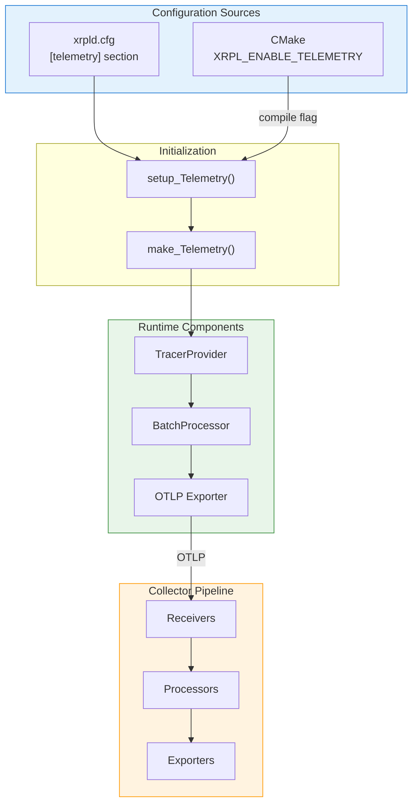

# Configuration Reference

> **Parent Document**: [OpenTelemetryPlan.md](./OpenTelemetryPlan.md)
> **Related**: [Code Samples](./04-code-samples.md) | [Implementation Phases](./06-implementation-phases.md)

---

## 5.1 rippled Configuration

### 5.1.1 Configuration File Section

Add to `cfg/xrpld-example.cfg`:

```ini
# ═══════════════════════════════════════════════════════════════════════════════
# TELEMETRY (OpenTelemetry Distributed Tracing)
# ═══════════════════════════════════════════════════════════════════════════════
#
# Enables distributed tracing for transaction flow, consensus, and RPC calls.
# Traces are exported to an OpenTelemetry Collector using OTLP protocol.
#
# [telemetry]
#
# # Enable/disable telemetry (default: 0 = disabled)
# enabled=1
#
# # Exporter type: "otlp_grpc" (default), "otlp_http", or "none"
# exporter=otlp_grpc
#
# # OTLP endpoint (default: localhost:4317 for gRPC, localhost:4318 for HTTP)
# endpoint=localhost:4317
#
# # Use TLS for exporter connection (default: 0)
# use_tls=0
#
# # Path to CA certificate for TLS (optional)
# # tls_ca_cert=/path/to/ca.crt
#
# # Sampling ratio: 0.0-1.0 (default: 1.0 = 100% sampling)
# # Use lower values in production to reduce overhead
# sampling_ratio=0.1
#
# # Batch processor settings
# batch_size=512           # Spans per batch (default: 512)
# batch_delay_ms=5000      # Max delay before sending batch (default: 5000)
# max_queue_size=2048      # Max queued spans (default: 2048)
#
# # Component-specific tracing (default: all enabled except peer)
# trace_transactions=1     # Transaction relay and processing
# trace_consensus=1        # Consensus rounds and proposals
# trace_rpc=1              # RPC request handling
# trace_peer=0             # Peer messages (high volume, disabled by default)
# trace_ledger=1           # Ledger acquisition and building
#
# # Service identification (automatically detected if not specified)
# # service_name=rippled
# # service_instance_id=<node_public_key>

[telemetry]
enabled=0
```

### 5.1.2 Configuration Options Summary

| Option                | Type   | Default          | Description                               |
| --------------------- | ------ | ---------------- | ----------------------------------------- |
| `enabled`             | bool   | `false`          | Enable/disable telemetry                  |
| `exporter`            | string | `"otlp_grpc"`    | Exporter type: otlp_grpc, otlp_http, none |
| `endpoint`            | string | `localhost:4317` | OTLP collector endpoint                   |
| `use_tls`             | bool   | `false`          | Enable TLS for exporter connection        |
| `tls_ca_cert`         | string | `""`             | Path to CA certificate file               |
| `sampling_ratio`      | float  | `1.0`            | Sampling ratio (0.0-1.0)                  |
| `batch_size`          | uint   | `512`            | Spans per export batch                    |
| `batch_delay_ms`      | uint   | `5000`           | Max delay before sending batch (ms)       |
| `max_queue_size`      | uint   | `2048`           | Maximum queued spans                      |
| `trace_transactions`  | bool   | `true`           | Enable transaction tracing                |
| `trace_consensus`     | bool   | `true`           | Enable consensus tracing                  |
| `trace_rpc`           | bool   | `true`           | Enable RPC tracing                        |
| `trace_peer`          | bool   | `false`          | Enable peer message tracing (high volume) |
| `trace_ledger`        | bool   | `true`           | Enable ledger tracing                     |
| `service_name`        | string | `"rippled"`      | Service name for traces                   |
| `service_instance_id` | string | `<node_pubkey>`  | Instance identifier                       |

---

## 5.2 Configuration Parser

```cpp
// src/libxrpl/telemetry/TelemetryConfig.cpp

#include <xrpl/telemetry/Telemetry.h>
#include <xrpl/basics/Log.h>

namespace xrpl {
namespace telemetry {

Telemetry::Setup
setup_Telemetry(
    Section const& section,
    std::string const& nodePublicKey,
    std::string const& version)
{
    Telemetry::Setup setup;

    // Basic settings
    setup.enabled = section.value_or("enabled", false);
    setup.serviceName = section.value_or("service_name", "rippled");
    setup.serviceVersion = version;
    setup.serviceInstanceId = section.value_or(
        "service_instance_id", nodePublicKey);

    // Exporter settings
    setup.exporterType = section.value_or("exporter", "otlp_grpc");

    if (setup.exporterType == "otlp_grpc")
        setup.exporterEndpoint = section.value_or("endpoint", "localhost:4317");
    else if (setup.exporterType == "otlp_http")
        setup.exporterEndpoint = section.value_or("endpoint", "localhost:4318");

    setup.useTls = section.value_or("use_tls", false);
    setup.tlsCertPath = section.value_or("tls_ca_cert", "");

    // Sampling
    setup.samplingRatio = section.value_or("sampling_ratio", 1.0);
    if (setup.samplingRatio < 0.0 || setup.samplingRatio > 1.0)
    {
        Throw<std::runtime_error>(
            "telemetry.sampling_ratio must be between 0.0 and 1.0");
    }

    // Batch processor
    setup.batchSize = section.value_or("batch_size", 512u);
    setup.batchDelay = std::chrono::milliseconds{
        section.value_or("batch_delay_ms", 5000u)};
    setup.maxQueueSize = section.value_or("max_queue_size", 2048u);

    // Component filtering
    setup.traceTransactions = section.value_or("trace_transactions", true);
    setup.traceConsensus = section.value_or("trace_consensus", true);
    setup.traceRpc = section.value_or("trace_rpc", true);
    setup.tracePeer = section.value_or("trace_peer", false);
    setup.traceLedger = section.value_or("trace_ledger", true);

    return setup;
}

} // namespace telemetry
} // namespace xrpl
```

---

## 5.3 Application Integration

### 5.3.1 ApplicationImp Changes

```cpp
// src/xrpld/app/main/Application.cpp (modified)

#include <xrpl/telemetry/Telemetry.h>

class ApplicationImp : public Application
{
    // ... existing members ...

    // Telemetry (must be constructed early, destroyed late)
    std::unique_ptr<telemetry::Telemetry> telemetry_;

public:
    ApplicationImp(...)
    {
        // Initialize telemetry early (before other components)
        auto telemetrySection = config_->section("telemetry");
        auto telemetrySetup = telemetry::setup_Telemetry(
            telemetrySection,
            toBase58(TokenType::NodePublic, nodeIdentity_.publicKey()),
            BuildInfo::getVersionString());

        // Set network attributes
        telemetrySetup.networkId = config_->NETWORK_ID;
        telemetrySetup.networkType = [&]() {
            if (config_->NETWORK_ID == 0) return "mainnet";
            if (config_->NETWORK_ID == 1) return "testnet";
            if (config_->NETWORK_ID == 2) return "devnet";
            return "custom";
        }();

        telemetry_ = telemetry::make_Telemetry(
            telemetrySetup,
            logs_->journal("Telemetry"));

        // ... rest of initialization ...
    }

    void start() override
    {
        // Start telemetry first
        if (telemetry_)
            telemetry_->start();

        // ... existing start code ...
    }

    void stop() override
    {
        // ... existing stop code ...

        // Stop telemetry last (to capture shutdown spans)
        if (telemetry_)
            telemetry_->stop();
    }

    telemetry::Telemetry& getTelemetry() override
    {
        assert(telemetry_);
        return *telemetry_;
    }
};
```

### 5.3.2 Application Interface Addition

```cpp
// include/xrpl/app/main/Application.h (modified)

namespace telemetry { class Telemetry; }

class Application
{
public:
    // ... existing virtual methods ...

    /** Get the telemetry system for distributed tracing */
    virtual telemetry::Telemetry& getTelemetry() = 0;
};
```

---

## 5.4 CMake Integration

### 5.4.1 Find OpenTelemetry Module

```cmake
# cmake/FindOpenTelemetry.cmake

# Find OpenTelemetry C++ SDK
#
# This module defines:
#   OpenTelemetry_FOUND - System has OpenTelemetry
#   OpenTelemetry::api - API library target
#   OpenTelemetry::sdk - SDK library target
#   OpenTelemetry::otlp_grpc_exporter - OTLP gRPC exporter target
#   OpenTelemetry::otlp_http_exporter - OTLP HTTP exporter target

find_package(opentelemetry-cpp CONFIG QUIET)

if(opentelemetry-cpp_FOUND)
    set(OpenTelemetry_FOUND TRUE)

    # Create imported targets if not already created by config
    if(NOT TARGET OpenTelemetry::api)
        add_library(OpenTelemetry::api ALIAS opentelemetry-cpp::api)
    endif()
    if(NOT TARGET OpenTelemetry::sdk)
        add_library(OpenTelemetry::sdk ALIAS opentelemetry-cpp::sdk)
    endif()
    if(NOT TARGET OpenTelemetry::otlp_grpc_exporter)
        add_library(OpenTelemetry::otlp_grpc_exporter ALIAS
            opentelemetry-cpp::otlp_grpc_exporter)
    endif()
else()
    # Try pkg-config fallback
    find_package(PkgConfig QUIET)
    if(PKG_CONFIG_FOUND)
        pkg_check_modules(OTEL opentelemetry-cpp QUIET)
        if(OTEL_FOUND)
            set(OpenTelemetry_FOUND TRUE)
            # Create imported targets from pkg-config
            add_library(OpenTelemetry::api INTERFACE IMPORTED)
            target_include_directories(OpenTelemetry::api INTERFACE
                ${OTEL_INCLUDE_DIRS})
        endif()
    endif()
endif()

include(FindPackageHandleStandardArgs)
find_package_handle_standard_args(OpenTelemetry
    REQUIRED_VARS OpenTelemetry_FOUND)
```

### 5.4.2 CMakeLists.txt Changes

```cmake
# CMakeLists.txt (additions)

# ═══════════════════════════════════════════════════════════════════════════════
# TELEMETRY OPTIONS
# ═══════════════════════════════════════════════════════════════════════════════

option(XRPL_ENABLE_TELEMETRY
    "Enable OpenTelemetry distributed tracing support" OFF)

if(XRPL_ENABLE_TELEMETRY)
    find_package(OpenTelemetry REQUIRED)

    # Define compile-time flag
    add_compile_definitions(XRPL_ENABLE_TELEMETRY)

    message(STATUS "OpenTelemetry tracing: ENABLED")
else()
    message(STATUS "OpenTelemetry tracing: DISABLED")
endif()

# ═══════════════════════════════════════════════════════════════════════════════
# TELEMETRY LIBRARY
# ═══════════════════════════════════════════════════════════════════════════════

if(XRPL_ENABLE_TELEMETRY)
    add_library(xrpl_telemetry
        src/libxrpl/telemetry/Telemetry.cpp
        src/libxrpl/telemetry/TelemetryConfig.cpp
        src/libxrpl/telemetry/TraceContext.cpp
    )

    target_include_directories(xrpl_telemetry
        PUBLIC
            ${CMAKE_CURRENT_SOURCE_DIR}/include
    )

    target_link_libraries(xrpl_telemetry
        PUBLIC
            OpenTelemetry::api
            OpenTelemetry::sdk
            OpenTelemetry::otlp_grpc_exporter
        PRIVATE
            xrpl_basics
    )

    # Add to main library dependencies
    target_link_libraries(xrpld PRIVATE xrpl_telemetry)
else()
    # Create null implementation library
    add_library(xrpl_telemetry
        src/libxrpl/telemetry/NullTelemetry.cpp
    )
    target_include_directories(xrpl_telemetry
        PUBLIC ${CMAKE_CURRENT_SOURCE_DIR}/include
    )
endif()
```

---

## 5.5 OpenTelemetry Collector Configuration

### 5.5.1 Development Configuration

```yaml
# otel-collector-dev.yaml
# Minimal configuration for local development

receivers:
  otlp:
    protocols:
      grpc:
        endpoint: 0.0.0.0:4317
      http:
        endpoint: 0.0.0.0:4318

processors:
  batch:
    timeout: 1s
    send_batch_size: 100

exporters:
  # Console output for debugging
  logging:
    verbosity: detailed
    sampling_initial: 5
    sampling_thereafter: 200

  # Jaeger for trace visualization
  jaeger:
    endpoint: jaeger:14250
    tls:
      insecure: true

service:
  pipelines:
    traces:
      receivers: [otlp]
      processors: [batch]
      exporters: [logging, jaeger]
```

### 5.5.2 Production Configuration

```yaml
# otel-collector-prod.yaml
# Production configuration with filtering, sampling, and multiple backends

receivers:
  otlp:
    protocols:
      grpc:
        endpoint: 0.0.0.0:4317
        tls:
          cert_file: /etc/otel/server.crt
          key_file: /etc/otel/server.key
          ca_file: /etc/otel/ca.crt

processors:
  # Memory limiter to prevent OOM
  memory_limiter:
    check_interval: 1s
    limit_mib: 1000
    spike_limit_mib: 200

  # Batch processing for efficiency
  batch:
    timeout: 5s
    send_batch_size: 512
    send_batch_max_size: 1024

  # Tail-based sampling (keep errors and slow traces)
  tail_sampling:
    decision_wait: 10s
    num_traces: 100000
    expected_new_traces_per_sec: 1000
    policies:
      # Always keep error traces
      - name: errors
        type: status_code
        status_code:
          status_codes: [ERROR]
      # Keep slow consensus rounds (>5s)
      - name: slow-consensus
        type: latency
        latency:
          threshold_ms: 5000
      # Keep slow RPC requests (>1s)
      - name: slow-rpc
        type: and
        and:
          and_sub_policy:
            - name: rpc-spans
              type: string_attribute
              string_attribute:
                key: xrpl.rpc.command
                values: [".*"]
                enabled_regex_matching: true
            - name: latency
              type: latency
              latency:
                threshold_ms: 1000
      # Probabilistic sampling for the rest
      - name: probabilistic
        type: probabilistic
        probabilistic:
          sampling_percentage: 10

  # Attribute processing
  attributes:
    actions:
      # Hash sensitive data
      - key: xrpl.tx.account
        action: hash
      # Add deployment info
      - key: deployment.environment
        value: production
        action: upsert

exporters:
  # Grafana Tempo for long-term storage
  otlp/tempo:
    endpoint: tempo.monitoring:4317
    tls:
      insecure: false
      ca_file: /etc/otel/tempo-ca.crt

  # Elastic APM for correlation with logs
  otlp/elastic:
    endpoint: apm.elastic:8200
    headers:
      Authorization: "Bearer ${ELASTIC_APM_TOKEN}"

extensions:
  health_check:
    endpoint: 0.0.0.0:13133
  zpages:
    endpoint: 0.0.0.0:55679

service:
  extensions: [health_check, zpages]
  pipelines:
    traces:
      receivers: [otlp]
      processors: [memory_limiter, tail_sampling, attributes, batch]
      exporters: [otlp/tempo, otlp/elastic]
```

---

## 5.6 Docker Compose Development Environment

```yaml
# docker-compose-telemetry.yaml
version: '3.8'

services:
  # OpenTelemetry Collector
  otel-collector:
    image: otel/opentelemetry-collector-contrib:0.92.0
    container_name: otel-collector
    command: ["--config=/etc/otel-collector-config.yaml"]
    volumes:
      - ./otel-collector-dev.yaml:/etc/otel-collector-config.yaml:ro
    ports:
      - "4317:4317"   # OTLP gRPC
      - "4318:4318"   # OTLP HTTP
      - "13133:13133" # Health check
    depends_on:
      - jaeger

  # Jaeger for trace visualization
  jaeger:
    image: jaegertracing/all-in-one:1.53
    container_name: jaeger
    environment:
      - COLLECTOR_OTLP_ENABLED=true
    ports:
      - "16686:16686" # UI
      - "14250:14250" # gRPC

  # Grafana for dashboards
  grafana:
    image: grafana/grafana:10.2.3
    container_name: grafana
    environment:
      - GF_AUTH_ANONYMOUS_ENABLED=true
      - GF_AUTH_ANONYMOUS_ORG_ROLE=Admin
    volumes:
      - ./grafana/provisioning:/etc/grafana/provisioning:ro
      - ./grafana/dashboards:/var/lib/grafana/dashboards:ro
    ports:
      - "3000:3000"
    depends_on:
      - jaeger

  # Prometheus for metrics (optional, for correlation)
  prometheus:
    image: prom/prometheus:v2.48.1
    container_name: prometheus
    volumes:
      - ./prometheus.yaml:/etc/prometheus/prometheus.yml:ro
    ports:
      - "9090:9090"

networks:
  default:
    name: rippled-telemetry
```

---

## 5.7 Configuration Architecture



---

## 5.8 Grafana Integration

Step-by-step instructions for integrating rippled traces with Grafana.

### 5.8.1 Data Source Configuration

#### Tempo (Recommended)

```yaml
# grafana/provisioning/datasources/tempo.yaml
apiVersion: 1

datasources:
  - name: Tempo
    type: tempo
    access: proxy
    url: http://tempo:3200
    jsonData:
      httpMethod: GET
      tracesToLogs:
        datasourceUid: loki
        tags: ['service.name', 'xrpl.tx.hash']
        mappedTags: [{ key: 'trace_id', value: 'traceID' }]
        mapTagNamesEnabled: true
        filterByTraceID: true
      serviceMap:
        datasourceUid: prometheus
      nodeGraph:
        enabled: true
      search:
        hide: false
      lokiSearch:
        datasourceUid: loki
```

#### Jaeger

```yaml
# grafana/provisioning/datasources/jaeger.yaml
apiVersion: 1

datasources:
  - name: Jaeger
    type: jaeger
    access: proxy
    url: http://jaeger:16686
    jsonData:
      tracesToLogs:
        datasourceUid: loki
        tags: ['service.name']
```

#### Elastic APM

```yaml
# grafana/provisioning/datasources/elastic-apm.yaml
apiVersion: 1

datasources:
  - name: Elasticsearch-APM
    type: elasticsearch
    access: proxy
    url: http://elasticsearch:9200
    database: "apm-*"
    jsonData:
      esVersion: "8.0.0"
      timeField: "@timestamp"
      logMessageField: message
      logLevelField: log.level
```

### 5.8.2 Dashboard Provisioning

```yaml
# grafana/provisioning/dashboards/dashboards.yaml
apiVersion: 1

providers:
  - name: 'rippled-dashboards'
    orgId: 1
    folder: 'rippled'
    folderUid: 'rippled'
    type: file
    disableDeletion: false
    updateIntervalSeconds: 30
    options:
      path: /var/lib/grafana/dashboards/rippled
```

### 5.8.3 Example Dashboard: RPC Performance

```json
{
  "title": "rippled RPC Performance",
  "uid": "rippled-rpc-performance",
  "panels": [
    {
      "title": "RPC Latency by Command",
      "type": "heatmap",
      "datasource": "Tempo",
      "targets": [
        {
          "queryType": "traceql",
          "query": "{resource.service.name=\"rippled\" && span.xrpl.rpc.command != \"\"} | histogram_over_time(duration) by (span.xrpl.rpc.command)"
        }
      ],
      "gridPos": { "h": 8, "w": 12, "x": 0, "y": 0 }
    },
    {
      "title": "RPC Error Rate",
      "type": "timeseries",
      "datasource": "Tempo",
      "targets": [
        {
          "queryType": "traceql",
          "query": "{resource.service.name=\"rippled\" && status.code=error} | rate() by (span.xrpl.rpc.command)"
        }
      ],
      "gridPos": { "h": 8, "w": 12, "x": 12, "y": 0 }
    },
    {
      "title": "Top 10 Slowest RPC Commands",
      "type": "table",
      "datasource": "Tempo",
      "targets": [
        {
          "queryType": "traceql",
          "query": "{resource.service.name=\"rippled\" && span.xrpl.rpc.command != \"\"} | avg(duration) by (span.xrpl.rpc.command) | topk(10)"
        }
      ],
      "gridPos": { "h": 8, "w": 24, "x": 0, "y": 8 }
    },
    {
      "title": "Recent Traces",
      "type": "table",
      "datasource": "Tempo",
      "targets": [
        {
          "queryType": "traceql",
          "query": "{resource.service.name=\"rippled\"}"
        }
      ],
      "gridPos": { "h": 8, "w": 24, "x": 0, "y": 16 }
    }
  ]
}
```

### 5.8.4 Example Dashboard: Transaction Tracing

```json
{
  "title": "rippled Transaction Tracing",
  "uid": "rippled-tx-tracing",
  "panels": [
    {
      "title": "Transaction Throughput",
      "type": "stat",
      "datasource": "Tempo",
      "targets": [
        {
          "queryType": "traceql",
          "query": "{resource.service.name=\"rippled\" && name=\"tx.receive\"} | rate()"
        }
      ],
      "gridPos": { "h": 4, "w": 6, "x": 0, "y": 0 }
    },
    {
      "title": "Cross-Node Relay Count",
      "type": "timeseries",
      "datasource": "Tempo",
      "targets": [
        {
          "queryType": "traceql",
          "query": "{resource.service.name=\"rippled\" && name=\"tx.relay\"} | avg(span.xrpl.tx.relay_count)"
        }
      ],
      "gridPos": { "h": 8, "w": 12, "x": 0, "y": 4 }
    },
    {
      "title": "Transaction Validation Errors",
      "type": "table",
      "datasource": "Tempo",
      "targets": [
        {
          "queryType": "traceql",
          "query": "{resource.service.name=\"rippled\" && name=\"tx.validate\" && status.code=error}"
        }
      ],
      "gridPos": { "h": 8, "w": 12, "x": 12, "y": 4 }
    }
  ]
}
```

### 5.8.5 TraceQL Query Examples

Common queries for rippled traces:

```
# Find all traces for a specific transaction hash
{resource.service.name="rippled" && span.xrpl.tx.hash="ABC123..."}

# Find slow RPC commands (>100ms)
{resource.service.name="rippled" && name=~"rpc.command.*"} | duration > 100ms

# Find consensus rounds taking >5 seconds
{resource.service.name="rippled" && name="consensus.round"} | duration > 5s

# Find failed transactions with error details
{resource.service.name="rippled" && name="tx.validate" && status.code=error}

# Find transactions relayed to many peers
{resource.service.name="rippled" && name="tx.relay"} | span.xrpl.tx.relay_count > 10

# Compare latency across nodes
{resource.service.name="rippled" && name="rpc.command.account_info"} | avg(duration) by (resource.service.instance.id)
```

### 5.8.6 Correlation with PerfLog

To correlate OpenTelemetry traces with existing PerfLog data:

**Step 1: Configure Loki to ingest PerfLog**

```yaml
# promtail-config.yaml
scrape_configs:
  - job_name: rippled-perflog
    static_configs:
      - targets:
          - localhost
        labels:
          job: rippled
          __path__: /var/log/rippled/perf*.log
    pipeline_stages:
      - json:
          expressions:
            trace_id: trace_id
            ledger_seq: ledger_seq
            tx_hash: tx_hash
      - labels:
          trace_id:
          ledger_seq:
          tx_hash:
```

**Step 2: Add trace_id to PerfLog entries**

Modify PerfLog to include trace_id when available:

```cpp
// In PerfLog output, add trace_id from current span context
void logPerf(Json::Value& entry) {
    auto span = opentelemetry::trace::GetSpan(
        opentelemetry::context::RuntimeContext::GetCurrent());
    if (span && span->GetContext().IsValid()) {
        char traceIdHex[33];
        span->GetContext().trace_id().ToLowerBase16(traceIdHex);
        entry["trace_id"] = std::string(traceIdHex, 32);
    }
    // ... existing logging
}
```

**Step 3: Configure Grafana trace-to-logs link**

In Tempo data source configuration, set up the derived field:

```yaml
jsonData:
  tracesToLogs:
    datasourceUid: loki
    tags: ['trace_id', 'xrpl.tx.hash']
    filterByTraceID: true
    filterBySpanID: false
```

### 5.8.7 Correlation with Insight/StatsD Metrics

To correlate traces with existing Beast Insight metrics:

**Step 1: Export Insight metrics to Prometheus**

```yaml
# prometheus.yaml
scrape_configs:
  - job_name: 'rippled-statsd'
    static_configs:
      - targets: ['statsd-exporter:9102']
```

**Step 2: Add exemplars to metrics**

OpenTelemetry SDK automatically adds exemplars (trace IDs) to metrics when using the Prometheus exporter. This links metrics spikes to specific traces.

**Step 3: Configure Grafana metric-to-trace link**

```yaml
# In Prometheus data source
jsonData:
  exemplarTraceIdDestinations:
    - name: trace_id
      datasourceUid: tempo
```

**Step 4: Dashboard panel with exemplars**

```json
{
  "title": "RPC Latency with Trace Links",
  "type": "timeseries",
  "datasource": "Prometheus",
  "targets": [
    {
      "expr": "histogram_quantile(0.99, rate(rippled_rpc_duration_seconds_bucket[5m]))",
      "exemplar": true
    }
  ]
}
```

This allows clicking on metric data points to jump directly to the related trace.

---

*Previous: [Code Samples](./04-code-samples.md)* | *Next: [Implementation Phases](./06-implementation-phases.md)* | *Back to: [Overview](./OpenTelemetryPlan.md)*
