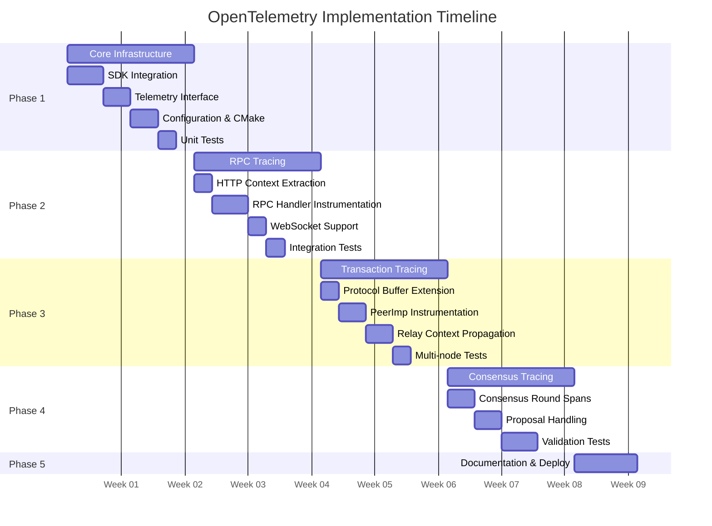
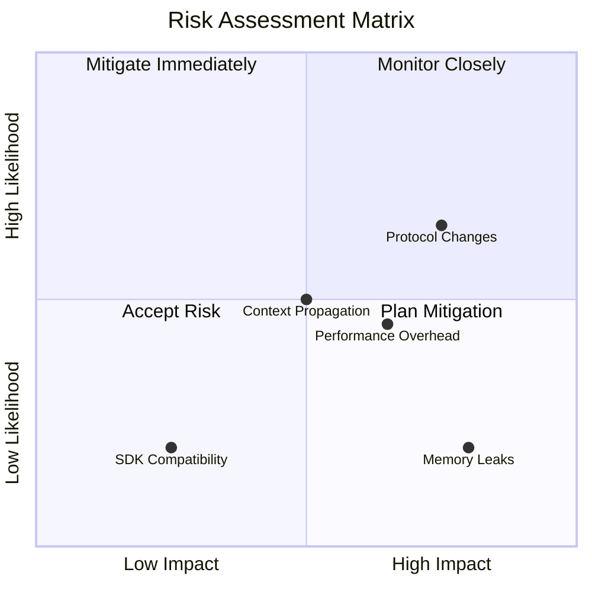
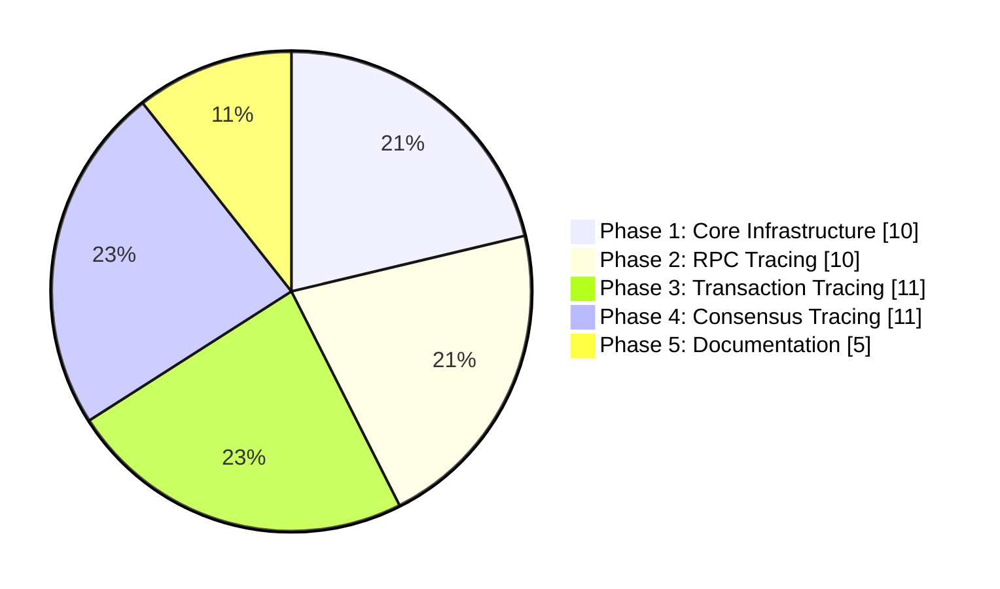
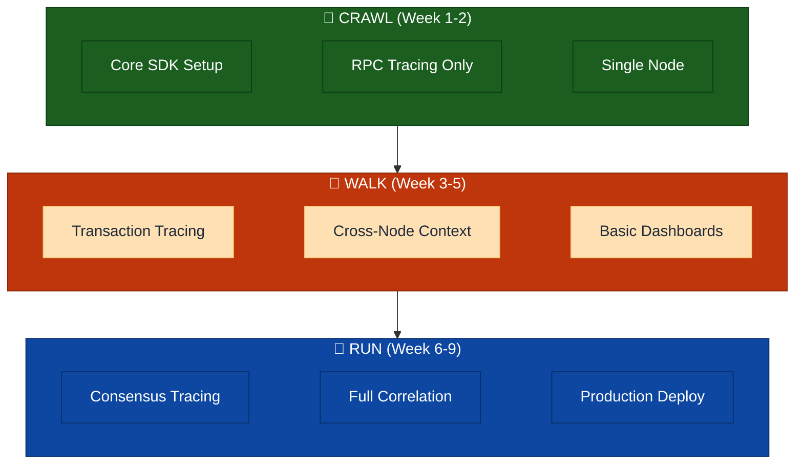
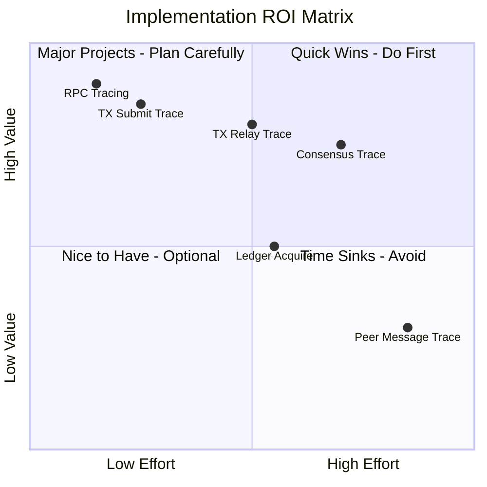

# Implementation Phases

> **Parent Document**: [OpenTelemetryPlan.md](./OpenTelemetryPlan.md)
> **Related**: [Configuration Reference](./05-configuration-reference.md) | [Observability Backends](./07-observability-backends.md)

---

## 6.1 Phase Overview

---

## 6.2 Phase 1: Core Infrastructure (Weeks 1-2)

**Objective**: Establish foundational telemetry infrastructure

### Tasks

| Task | Description                                           | Effort | Risk   |
| ---- | ----------------------------------------------------- | ------ | ------ |
| 1.1  | Add OpenTelemetry C++ SDK to Conan/CMake              | 2d     | Low    |
| 1.2  | Implement `Telemetry` interface and factory           | 2d     | Low    |
| 1.3  | Implement `SpanGuard` RAII wrapper                    | 1d     | Low    |
| 1.4  | Implement configuration parser                        | 1d     | Low    |
| 1.5  | Integrate into `ApplicationImp`                       | 1d     | Medium |
| 1.6  | Add conditional compilation (`XRPL_ENABLE_TELEMETRY`) | 1d     | Low    |
| 1.7  | Create `NullTelemetry` no-op implementation           | 0.5d   | Low    |
| 1.8  | Unit tests for core infrastructure                    | 1.5d   | Low    |

**Total Effort**: 10 days (2 developers)

### Exit Criteria

- [ ] OpenTelemetry SDK compiles and links
- [ ] Telemetry can be enabled/disabled via config
- [ ] Basic span creation works
- [ ] No performance regression when disabled
- [ ] Unit tests passing

---

## 6.3 Phase 2: RPC Tracing (Weeks 3-4)

**Objective**: Complete tracing for all RPC operations

### Tasks

| Task | Description                                        | Effort | Risk   |
| ---- | -------------------------------------------------- | ------ | ------ |
| 2.1  | Implement W3C Trace Context HTTP header extraction | 1d     | Low    |
| 2.2  | Instrument `ServerHandler::onRequest()`            | 1d     | Low    |
| 2.3  | Instrument `RPCHandler::doCommand()`               | 2d     | Medium |
| 2.4  | Add RPC-specific attributes                        | 1d     | Low    |
| 2.5  | Instrument WebSocket handler                       | 1d     | Medium |
| 2.6  | Integration tests for RPC tracing                  | 2d     | Low    |
| 2.7  | Performance benchmarks                             | 1d     | Low    |
| 2.8  | Documentation                                      | 1d     | Low    |

**Total Effort**: 10 days

### Exit Criteria

- [ ] All RPC commands traced
- [ ] Trace context propagates from HTTP headers
- [ ] WebSocket and HTTP both instrumented
- [ ] <1ms overhead per RPC call
- [ ] Integration tests passing

---

## 6.4 Phase 3: Transaction Tracing (Weeks 5-6)

**Objective**: Trace transaction lifecycle across network

### Tasks

| Task | Description                                   | Effort | Risk   |
| ---- | --------------------------------------------- | ------ | ------ |
| 3.1  | Define `TraceContext` Protocol Buffer message | 1d     | Low    |
| 3.2  | Implement protobuf context serialization      | 1d     | Low    |
| 3.3  | Instrument `PeerImp::handleTransaction()`     | 2d     | Medium |
| 3.4  | Instrument `NetworkOPs::submitTransaction()`  | 1d     | Medium |
| 3.5  | Instrument HashRouter integration             | 1d     | Medium |
| 3.6  | Implement relay context propagation           | 2d     | High   |
| 3.7  | Integration tests (multi-node)                | 2d     | Medium |
| 3.8  | Performance benchmarks                        | 1d     | Low    |

**Total Effort**: 11 days

### Exit Criteria

- [ ] Transaction traces span across nodes
- [ ] Trace context in Protocol Buffer messages
- [ ] HashRouter deduplication visible in traces
- [ ] Multi-node integration tests passing
- [ ] <5% overhead on transaction throughput

---

## 6.5 Phase 4: Consensus Tracing (Weeks 7-8)

**Objective**: Full observability into consensus rounds

### Tasks

| Task | Description                                    | Effort | Risk   |
| ---- | ---------------------------------------------- | ------ | ------ |
| 4.1  | Instrument `RCLConsensusAdaptor::startRound()` | 1d     | Medium |
| 4.2  | Instrument phase transitions                   | 2d     | Medium |
| 4.3  | Instrument proposal handling                   | 2d     | High   |
| 4.4  | Instrument validation handling                 | 1d     | Medium |
| 4.5  | Add consensus-specific attributes              | 1d     | Low    |
| 4.6  | Correlate with transaction traces              | 1d     | Medium |
| 4.7  | Multi-validator integration tests              | 2d     | High   |
| 4.8  | Performance validation                         | 1d     | Medium |

**Total Effort**: 11 days

### Exit Criteria

- [ ] Complete consensus round traces
- [ ] Phase transitions visible
- [ ] Proposals and validations traced
- [ ] No impact on consensus timing
- [ ] Multi-validator test network validated

---

## 6.6 Phase 5: Documentation & Deployment (Week 9)

**Objective**: Production readiness

### Tasks

| Task | Description                   | Effort | Risk |
| ---- | ----------------------------- | ------ | ---- |
| 5.1  | Operator runbook              | 1d     | Low  |
| 5.2  | Grafana dashboards            | 1d     | Low  |
| 5.3  | Alert definitions             | 0.5d   | Low  |
| 5.4  | Collector deployment examples | 0.5d   | Low  |
| 5.5  | Developer documentation       | 1d     | Low  |
| 5.6  | Training materials            | 0.5d   | Low  |
| 5.7  | Final integration testing     | 0.5d   | Low  |

**Total Effort**: 5 days

---

## 6.7 Phase 6: StatsD Metrics Integration (Week 10)

**Objective**: Bridge rippled's existing `beast::insight` StatsD metrics into the OpenTelemetry collection pipeline, exposing 300+ pre-existing metrics alongside span-derived RED metrics in Prometheus/Grafana.

### Background

rippled has a mature metrics framework (`beast::insight`) that emits StatsD-format metrics over UDP. These metrics cover node health, peer networking, RPC performance, job queue, and overlay traffic — data that **does not** overlap with the span-based instrumentation from Phases 1-5. By adding a StatsD receiver to the OTel Collector, both metric sources converge in Prometheus.

### Metric Inventory

| Category        | Group              | Type          | Count      | Key Metrics                                            |
| --------------- | ------------------ | ------------- | ---------- | ------------------------------------------------------ |
| Node State      | `State_Accounting` | Gauge         | 10         | `*_duration`, `*_transitions` per operating mode       |
| Ledger          | `LedgerMaster`     | Gauge         | 2          | `Validated_Ledger_Age`, `Published_Ledger_Age`         |
| Ledger Fetch    | —                  | Counter       | 1          | `ledger_fetches`                                       |
| Ledger History  | `ledger.history`   | Counter       | 1          | `mismatch`                                             |
| RPC             | `rpc`              | Counter+Event | 3          | `requests`, `time` (histogram), `size` (histogram)     |
| Job Queue       | —                  | Gauge+Event   | 1 + 2×N    | `job_count`, per-job `{name}` and `{name}_q`           |
| Peer Finder     | `Peer_Finder`      | Gauge         | 2          | `Active_Inbound_Peers`, `Active_Outbound_Peers`        |
| Overlay         | `Overlay`          | Gauge         | 1          | `Peer_Disconnects`                                     |
| Overlay Traffic | per-category       | Gauge         | 4×57 = 228 | `Bytes_In/Out`, `Messages_In/Out` per traffic category |
| Pathfinding     | —                  | Event         | 2          | `pathfind_fast`, `pathfind_full` (histograms)          |
| I/O             | —                  | Event         | 1          | `ios_latency` (histogram)                              |
| Resource Mgr    | —                  | Meter         | 2          | `warn`, `drop` (rate counters)                         |
| Caches          | per-cache          | Gauge         | 2×N        | `{cache}.size`, `{cache}.hit_rate`                     |

**Total**: ~255+ unique metrics (plus dynamic job-type and cache metrics)

### Tasks

| Task | Description                                                                                                     | Effort | Risk |
| ---- | --------------------------------------------------------------------------------------------------------------- | ------ | ---- |
| 6.1  | **DEFERRED** Fix Meter wire format (`\|m` → `\|c`) in StatsDCollector.cpp — breaking change, tracked separately | 0.5d   | Low  |
| 6.2  | Add `statsd` receiver to OTel Collector config                                                                  | 0.5d   | Low  |
| 6.3  | Expose UDP port 8125 in docker-compose.yml                                                                      | 0.1d   | Low  |
| 6.4  | Add `[insight]` config to integration test node configs                                                         | 0.5d   | Low  |
| 6.5  | Create "Node Health" Grafana dashboard (8 panels)                                                               | 1d     | Low  |
| 6.6  | Create "Network Traffic" Grafana dashboard (8 panels)                                                           | 1d     | Low  |
| 6.7  | Create "RPC & Pathfinding (StatsD)" Grafana dashboard (8 panels)                                                | 1d     | Low  |
| 6.8  | Update integration test to verify StatsD metrics in Prometheus                                                  | 0.5d   | Low  |
| 6.9  | Update TESTING.md and telemetry-runbook.md                                                                      | 0.5d   | Low  |

**Total Effort**: 5.6 days

### Wire Format Fix (Task 6.1) — DEFERRED

The `StatsDMeterImpl` in `StatsDCollector.cpp:706` sends metrics with `|m` suffix, which is non-standard StatsD. The OTel StatsD receiver silently drops these. Fix: change `|m` to `|c` (counter), which is semantically correct since meters are increment-only counters. Only 2 metrics are affected (`warn`, `drop` in Resource Manager).

**Status**: Deferred as a separate change — this is a breaking change for any StatsD backend that previously consumed the custom `|m` type. The Resource Warnings and Resource Drops dashboard panels will show no data until this fix is applied.

### New Grafana Dashboards

**Node Health** (`statsd-node-health.json`, uid: `rippled-statsd-node-health`):

- Validated/Published Ledger Age, Operating Mode Duration/Transitions, I/O Latency, Job Queue Depth, Ledger Fetch Rate, Ledger History Mismatches

**Network Traffic** (`statsd-network-traffic.json`, uid: `rippled-statsd-network`):

- Active Inbound/Outbound Peers, Peer Disconnects, Total Bytes/Messages In/Out, Transaction/Proposal/Validation Traffic, Top Traffic Categories

**RPC & Pathfinding (StatsD)** (`statsd-rpc-pathfinding.json`, uid: `rippled-statsd-rpc`):

- RPC Request Rate, Response Time p95/p50, Response Size p95/p50, Pathfinding Fast/Full Duration, Resource Warnings/Drops, Response Time Heatmap

### Exit Criteria

- [ ] StatsD metrics visible in Prometheus (`curl localhost:9090/api/v1/query?query=rippled_LedgerMaster_Validated_Ledger_Age`)
- [ ] All 3 new Grafana dashboards load without errors
- [ ] Integration test verifies at least core StatsD metrics (ledger age, peer counts, RPC requests)
- [ ] ~~Meter metrics (`warn`, `drop`) flow correctly after `|m` → `|c` fix~~ — DEFERRED (breaking change, tracked separately)

---

## 6.9 Risk Assessment

### Risk Details

| Risk                                 | Likelihood | Impact | Mitigation                              |
| ------------------------------------ | ---------- | ------ | --------------------------------------- |
| Protocol changes break compatibility | Medium     | High   | Use high field numbers, optional fields |
| Performance overhead unacceptable    | Medium     | Medium | Sampling, conditional compilation       |
| Context propagation complexity       | Medium     | Medium | Phased rollout, extensive testing       |
| SDK compatibility issues             | Low        | Medium | Pin SDK version, fallback to no-op      |
| Memory leaks in long-running nodes   | Low        | High   | Memory profiling, bounded queues        |

---

## 6.10 Success Metrics

| Metric                   | Target                         | Measurement           |
| ------------------------ | ------------------------------ | --------------------- |
| Trace coverage           | >95% of transactions           | Sampling verification |
| CPU overhead             | <3%                            | Benchmark tests       |
| Memory overhead          | <5 MB                          | Memory profiling      |
| Latency impact (p99)     | <2%                            | Performance tests     |
| Trace completeness       | >99% spans with required attrs | Validation script     |
| Cross-node trace linkage | >90% of multi-hop transactions | Integration tests     |

---

## 6.11 Effort Summary

**Total Effort Distribution (47 developer-days)**

### Resource Requirements

| Phase     | Developers | Duration    | Total Effort |
| --------- | ---------- | ----------- | ------------ |
| 1         | 2          | 2 weeks     | 10 days      |
| 2         | 1-2        | 2 weeks     | 10 days      |
| 3         | 2          | 2 weeks     | 11 days      |
| 4         | 2          | 2 weeks     | 11 days      |
| 5         | 1          | 1 week      | 5 days       |
| **Total** | **2**      | **9 weeks** | **47 days**  |

---

## 6.12 Quick Wins and Crawl-Walk-Run Strategy

This section outlines a prioritized approach to maximize ROI with minimal initial investment.

### 6.12.1 Crawl-Walk-Run Overview

### 6.12.2 Quick Wins (Immediate Value)

| Quick Win                      | Effort   | Value  | When to Deploy |
| ------------------------------ | -------- | ------ | -------------- |
| **RPC Command Tracing**        | 2 days   | High   | Week 2         |
| **RPC Latency Histograms**     | 0.5 days | High   | Week 2         |
| **Error Rate Dashboard**       | 0.5 days | Medium | Week 2         |
| **Transaction Submit Tracing** | 1 day    | High   | Week 3         |
| **Consensus Round Duration**   | 1 day    | Medium | Week 6         |

### 6.12.3 CRAWL Phase (Weeks 1-2)

**Goal**: Get basic tracing working with minimal code changes.

**What You Get**:

- RPC request/response traces for all commands
- Latency breakdown per RPC command
- Error visibility with stack traces
- Basic Grafana dashboard

**Code Changes**: ~15 lines in `ServerHandler.cpp`, ~40 lines in new telemetry module

**Why Start Here**:

- RPC is the lowest-risk, highest-visibility component
- Immediate value for debugging client issues
- No cross-node complexity
- Single file modification to existing code

### 6.12.4 WALK Phase (Weeks 3-5)

**Goal**: Add transaction lifecycle tracing across nodes.

**What You Get**:

- End-to-end transaction traces from submit to relay
- Cross-node correlation (see transaction path)
- HashRouter deduplication visibility
- Relay latency metrics

**Code Changes**: ~120 lines across 4 files, plus protobuf extension

**Why Do This Second**:

- Builds on RPC tracing (transactions submitted via RPC)
- Moderate complexity (requires context propagation)
- High value for debugging transaction issues

### 6.12.5 RUN Phase (Weeks 6-9)

**Goal**: Full observability including consensus.

**What You Get**:

- Complete consensus round visibility
- Phase transition timing
- Validator proposal tracking
- Full end-to-end traces (client → RPC → TX → consensus → ledger)

**Code Changes**: ~100 lines across 3 consensus files

**Why Do This Last**:

- Highest complexity (consensus is critical path)
- Requires thorough testing
- Lower relative value (consensus issues are rarer)

### 6.12.6 ROI Prioritization Matrix

---

## 6.13 Definition of Done

Clear, measurable criteria for each phase.

### 6.13.1 Phase 1: Core Infrastructure

| Criterion       | Measurement                                                | Target                       |
| --------------- | ---------------------------------------------------------- | ---------------------------- |
| SDK Integration | `cmake --build` succeeds with `-DXRPL_ENABLE_TELEMETRY=ON` | ✅ Compiles                  |
| Runtime Toggle  | `enabled=0` produces zero overhead                         | <0.1% CPU difference         |
| Span Creation   | Unit test creates and exports span                         | Span appears in Jaeger       |
| Configuration   | All config options parsed correctly                        | Config validation tests pass |
| Documentation   | Developer guide exists                                     | PR approved                  |

**Definition of Done**: All criteria met, PR merged, no regressions in CI.

### 6.13.2 Phase 2: RPC Tracing

| Criterion          | Measurement                        | Target                     |
| ------------------ | ---------------------------------- | -------------------------- |
| Coverage           | All RPC commands instrumented      | 100% of commands           |
| Context Extraction | traceparent header propagates      | Integration test passes    |
| Attributes         | Command, status, duration recorded | Validation script confirms |
| Performance        | RPC latency overhead               | <1ms p99                   |
| Dashboard          | Grafana dashboard deployed         | Screenshot in docs         |

**Definition of Done**: RPC traces visible in Jaeger/Tempo for all commands, dashboard shows latency distribution.

### 6.13.3 Phase 3: Transaction Tracing

| Criterion        | Measurement                     | Target                             |
| ---------------- | ------------------------------- | ---------------------------------- |
| Local Trace      | Submit → validate → TxQ traced  | Single-node test passes            |
| Cross-Node       | Context propagates via protobuf | Multi-node test passes             |
| Relay Visibility | relay_count attribute correct   | Spot check 100 txs                 |
| HashRouter       | Deduplication visible in trace  | Duplicate txs show suppressed=true |
| Performance      | TX throughput overhead          | <5% degradation                    |

**Definition of Done**: Transaction traces span 3+ nodes in test network, performance within bounds.

### 6.13.4 Phase 4: Consensus Tracing

| Criterion            | Measurement                   | Target                    |
| -------------------- | ----------------------------- | ------------------------- |
| Round Tracing        | startRound creates root span  | Unit test passes          |
| Phase Visibility     | All phases have child spans   | Integration test confirms |
| Proposer Attribution | Proposer ID in attributes     | Spot check 50 rounds      |
| Timing Accuracy      | Phase durations match PerfLog | <5% variance              |
| No Consensus Impact  | Round timing unchanged        | Performance test passes   |

**Definition of Done**: Consensus rounds fully traceable, no impact on consensus timing.

### 6.13.5 Phase 5: Production Deployment

| Criterion    | Measurement                  | Target                     |
| ------------ | ---------------------------- | -------------------------- |
| Collector HA | Multiple collectors deployed | No single point of failure |
| Sampling     | Tail sampling configured     | 10% base + errors + slow   |
| Retention    | Data retained per policy     | 7 days hot, 30 days warm   |
| Alerting     | Alerts configured            | Error spike, high latency  |
| Runbook      | Operator documentation       | Approved by ops team       |
| Training     | Team trained                 | Session completed          |

**Definition of Done**: Telemetry running in production, operators trained, alerts active.

### 6.13.6 Success Metrics Summary

| Phase   | Primary Metric         | Secondary Metric            | Deadline      |
| ------- | ---------------------- | --------------------------- | ------------- |
| Phase 1 | SDK compiles and runs  | Zero overhead when disabled | End of Week 2 |
| Phase 2 | 100% RPC coverage      | <1ms latency overhead       | End of Week 4 |
| Phase 3 | Cross-node traces work | <5% throughput impact       | End of Week 6 |
| Phase 4 | Consensus fully traced | No consensus timing impact  | End of Week 8 |
| Phase 5 | Production deployment  | Operators trained           | End of Week 9 |

---

## 6.14 Recommended Implementation Order

Based on ROI analysis, implement in this exact order:

```mermaid
flowchart TB
    subgraph week1["Week 1"]
        t1[1. OpenTelemetry SDK<br/>Conan/CMake integration]
        t2[2. Telemetry interface<br/>SpanGuard, config]
    end

    subgraph week2["Week 2"]
        t3[3. RPC ServerHandler<br/>instrumentation]
        t4[4. Basic Jaeger setup<br/>for testing]
    end

    subgraph week3["Week 3"]
        t5[5. Transaction submit<br/>tracing]
        t6[6. Grafana dashboard<br/>v1]
    end

    subgraph week4["Week 4"]
        t7[7. Protobuf context<br/>extension]
        t8[8. PeerImp tx.relay<br/>instrumentation]
    end

    subgraph week5["Week 5"]
        t9[9. Multi-node<br/>integration tests]
        t10[10. Performance<br/>benchmarks]
    end

    subgraph week6_8["Weeks 6-8"]
        t11[11. Consensus<br/>instrumentation]
        t12[12. Full integration<br/>testing]
    end

    subgraph week9["Week 9"]
        t13[13. Production<br/>deployment]
        t14[14. Documentation<br/>& training]
    end

    t1 --> t2 --> t3 --> t4
    t4 --> t5 --> t6
    t6 --> t7 --> t8
    t8 --> t9 --> t10
    t10 --> t11 --> t12
    t12 --> t13 --> t14

    style week1 fill:#1b5e20,stroke:#0d3d14,color:#fff
    style week2 fill:#1b5e20,stroke:#0d3d14,color:#fff
    style week3 fill:#bf360c,stroke:#8c2809,color:#fff
    style week4 fill:#bf360c,stroke:#8c2809,color:#fff
    style week5 fill:#bf360c,stroke:#8c2809,color:#fff
    style week6_8 fill:#0d47a1,stroke:#082f6a,color:#fff
    style week9 fill:#4a148c,stroke:#2e0d57,color:#fff
    style t1 fill:#1b5e20,stroke:#0d3d14,color:#fff
    style t2 fill:#1b5e20,stroke:#0d3d14,color:#fff
    style t3 fill:#1b5e20,stroke:#0d3d14,color:#fff
    style t4 fill:#1b5e20,stroke:#0d3d14,color:#fff
    style t5 fill:#ffe0b2,stroke:#ffcc80,color:#1e293b
    style t6 fill:#ffe0b2,stroke:#ffcc80,color:#1e293b
    style t7 fill:#ffe0b2,stroke:#ffcc80,color:#1e293b
    style t8 fill:#ffe0b2,stroke:#ffcc80,color:#1e293b
    style t9 fill:#ffe0b2,stroke:#ffcc80,color:#1e293b
    style t10 fill:#ffe0b2,stroke:#ffcc80,color:#1e293b
    style t11 fill:#0d47a1,stroke:#082f6a,color:#fff
    style t12 fill:#0d47a1,stroke:#082f6a,color:#fff
    style t13 fill:#4a148c,stroke:#2e0d57,color:#fff
    style t14 fill:#4a148c,stroke:#2e0d57,color:#fff
```

---

_Previous: [Configuration Reference](./05-configuration-reference.md)_ | _Next: [Observability Backends](./07-observability-backends.md)_ | _Back to: [Overview](./OpenTelemetryPlan.md)_
