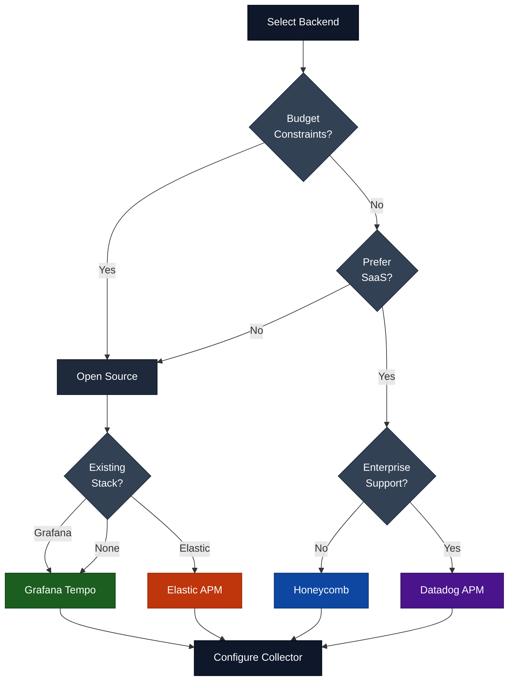
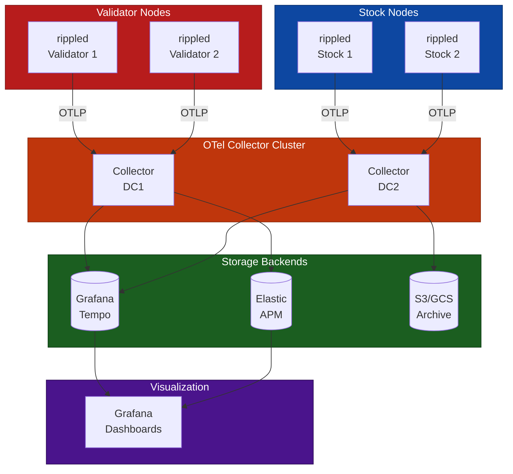
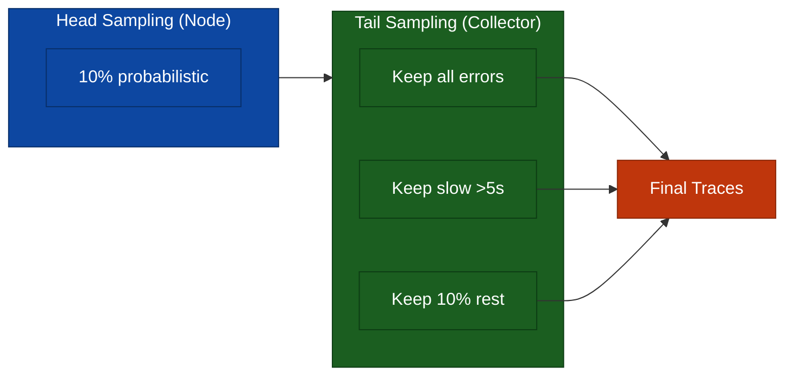
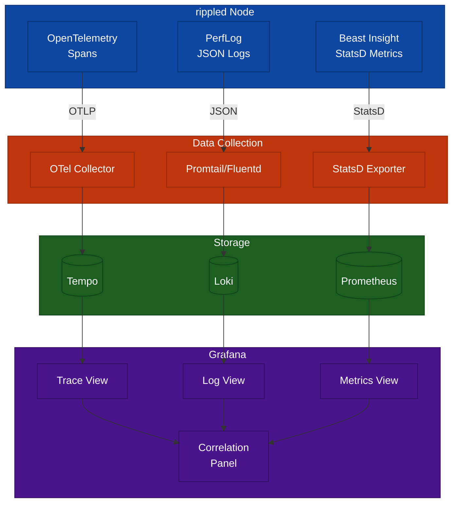

# Observability Backend Recommendations

> **Parent Document**: [OpenTelemetryPlan.md](./OpenTelemetryPlan.md)
> **Related**: [Implementation Phases](./06-implementation-phases.md) | [Appendix](./08-appendix.md)

---

## 7.1 Development/Testing Backends

| Backend    | Pros                | Cons              | Use Case          |
| ---------- | ------------------- | ----------------- | ----------------- |
| **Jaeger** | Easy setup, good UI | Limited retention | Local dev, CI     |
| **Zipkin** | Simple, lightweight | Basic features    | Quick prototyping |

### Quick Start with Jaeger

```bash
# Start Jaeger with OTLP support
docker run -d --name jaeger \
  -e COLLECTOR_OTLP_ENABLED=true \
  -p 16686:16686 \
  -p 4317:4317 \
  -p 4318:4318 \
  jaegertracing/all-in-one:latest
```

---

## 7.2 Production Backends

| Backend           | Pros                                      | Cons               | Use Case                    |
| ----------------- | ----------------------------------------- | ------------------ | --------------------------- |
| **Grafana Tempo** | Cost-effective, Grafana integration       | Newer project      | Most production deployments |
| **Elastic APM**   | Full observability stack, log correlation | Resource intensive | Existing Elastic users      |
| **Honeycomb**     | Excellent query, high cardinality         | SaaS cost          | Deep debugging needs        |
| **Datadog APM**   | Full platform, easy setup                 | SaaS cost          | Enterprise with budget      |

### Backend Selection Flowchart



---

## 7.3 Recommended Production Architecture



---

## 7.4 Architecture Considerations

### 7.4.1 Collector Placement

| Strategy      | Description          | Pros                     | Cons                    |
| ------------- | -------------------- | ------------------------ | ----------------------- |
| **Sidecar**   | Collector per node   | Isolation, simple config | Resource overhead       |
| **DaemonSet** | Collector per host   | Shared resources         | Complexity              |
| **Gateway**   | Central collector(s) | Centralized processing   | Single point of failure |

**Recommendation**: Use **Gateway** pattern with regional collectors for rippled networks:
- One collector cluster per datacenter/region
- Tail-based sampling at collector level
- Multiple export destinations for redundancy

### 7.4.2 Sampling Strategy



### 7.4.3 Data Retention

| Environment | Hot Storage | Warm Storage | Cold Archive |
| ----------- | ----------- | ------------ | ------------ |
| Development | 24 hours    | N/A          | N/A          |
| Staging     | 7 days      | N/A          | N/A          |
| Production  | 7 days      | 30 days      | many years   |

---

## 7.5 Integration Checklist

- [ ] Choose primary backend (Tempo recommended for cost/features)
- [ ] Deploy collector cluster with high availability
- [ ] Configure tail-based sampling for error/latency traces
- [ ] Set up Grafana dashboards for trace visualization
- [ ] Configure alerts for trace anomalies
- [ ] Establish data retention policies
- [ ] Test trace correlation with logs and metrics

---

## 7.6 Grafana Dashboard Examples

Pre-built dashboards for rippled observability.

### 7.6.1 Consensus Health Dashboard

```json
{
  "title": "rippled Consensus Health",
  "uid": "rippled-consensus-health",
  "tags": ["rippled", "consensus", "tracing"],
  "panels": [
    {
      "title": "Consensus Round Duration",
      "type": "timeseries",
      "datasource": "Tempo",
      "targets": [
        {
          "queryType": "traceql",
          "query": "{resource.service.name=\"rippled\" && name=\"consensus.round\"} | avg(duration) by (resource.service.instance.id)"
        }
      ],
      "fieldConfig": {
        "defaults": {
          "unit": "ms",
          "thresholds": {
            "steps": [
              { "color": "green", "value": null },
              { "color": "yellow", "value": 4000 },
              { "color": "red", "value": 5000 }
            ]
          }
        }
      },
      "gridPos": { "h": 8, "w": 12, "x": 0, "y": 0 }
    },
    {
      "title": "Phase Duration Breakdown",
      "type": "barchart",
      "datasource": "Tempo",
      "targets": [
        {
          "queryType": "traceql",
          "query": "{resource.service.name=\"rippled\" && name=~\"consensus.phase.*\"} | avg(duration) by (name)"
        }
      ],
      "gridPos": { "h": 8, "w": 12, "x": 12, "y": 0 }
    },
    {
      "title": "Proposers per Round",
      "type": "stat",
      "datasource": "Tempo",
      "targets": [
        {
          "queryType": "traceql",
          "query": "{resource.service.name=\"rippled\" && name=\"consensus.round\"} | avg(span.xrpl.consensus.proposers)"
        }
      ],
      "gridPos": { "h": 4, "w": 6, "x": 0, "y": 8 }
    },
    {
      "title": "Recent Slow Rounds (>5s)",
      "type": "table",
      "datasource": "Tempo",
      "targets": [
        {
          "queryType": "traceql",
          "query": "{resource.service.name=\"rippled\" && name=\"consensus.round\"} | duration > 5s"
        }
      ],
      "gridPos": { "h": 8, "w": 24, "x": 0, "y": 12 }
    }
  ]
}
```

### 7.6.2 Node Overview Dashboard

```json
{
  "title": "rippled Node Overview",
  "uid": "rippled-node-overview",
  "panels": [
    {
      "title": "Active Nodes",
      "type": "stat",
      "datasource": "Tempo",
      "targets": [
        {
          "queryType": "traceql",
          "query": "{resource.service.name=\"rippled\"} | count_over_time() by (resource.service.instance.id) | count()"
        }
      ],
      "gridPos": { "h": 4, "w": 4, "x": 0, "y": 0 }
    },
    {
      "title": "Total Transactions (1h)",
      "type": "stat",
      "datasource": "Tempo",
      "targets": [
        {
          "queryType": "traceql",
          "query": "{resource.service.name=\"rippled\" && name=\"tx.receive\"} | count()"
        }
      ],
      "gridPos": { "h": 4, "w": 4, "x": 4, "y": 0 }
    },
    {
      "title": "Error Rate",
      "type": "gauge",
      "datasource": "Tempo",
      "targets": [
        {
          "queryType": "traceql",
          "query": "{resource.service.name=\"rippled\" && status.code=error} | rate() / {resource.service.name=\"rippled\"} | rate() * 100"
        }
      ],
      "fieldConfig": {
        "defaults": {
          "unit": "percent",
          "max": 10,
          "thresholds": {
            "steps": [
              { "color": "green", "value": null },
              { "color": "yellow", "value": 1 },
              { "color": "red", "value": 5 }
            ]
          }
        }
      },
      "gridPos": { "h": 4, "w": 4, "x": 8, "y": 0 }
    },
    {
      "title": "Service Map",
      "type": "nodeGraph",
      "datasource": "Tempo",
      "gridPos": { "h": 12, "w": 12, "x": 12, "y": 0 }
    }
  ]
}
```

### 7.6.3 Alert Rules

```yaml
# grafana/provisioning/alerting/rippled-alerts.yaml
apiVersion: 1

groups:
  - name: rippled-tracing-alerts
    folder: rippled
    interval: 1m
    rules:
      - uid: consensus-slow
        title: Consensus Round Slow
        condition: A
        data:
          - refId: A
            datasourceUid: tempo
            model:
              queryType: traceql
              query: '{resource.service.name="rippled" && name="consensus.round"} | avg(duration) > 5s'
        for: 5m
        annotations:
          summary: Consensus rounds taking >5 seconds
          description: "Consensus duration: {{ $value }}ms"
        labels:
          severity: warning

      - uid: rpc-error-spike
        title: RPC Error Rate Spike
        condition: B
        data:
          - refId: B
            datasourceUid: tempo
            model:
              queryType: traceql
              query: '{resource.service.name="rippled" && name=~"rpc.command.*" && status.code=error} | rate() > 0.05'
        for: 2m
        annotations:
          summary: RPC error rate >5%
        labels:
          severity: critical

      - uid: tx-throughput-drop
        title: Transaction Throughput Drop
        condition: C
        data:
          - refId: C
            datasourceUid: tempo
            model:
              queryType: traceql
              query: '{resource.service.name="rippled" && name="tx.receive"} | rate() < 10'
        for: 10m
        annotations:
          summary: Transaction throughput below threshold
        labels:
          severity: warning
```

---

## 7.7 PerfLog and Insight Correlation

How to correlate OpenTelemetry traces with existing rippled observability.

### 7.7.1 Correlation Architecture



### 7.7.2 Correlation Fields

| Source      | Field                       | Link To       | Purpose                    |
| ----------- | --------------------------- | ------------- | -------------------------- |
| **Trace**   | `trace_id`                  | Logs          | Find log entries for trace |
| **Trace**   | `xrpl.tx.hash`              | Logs, Metrics | Find TX-related data       |
| **Trace**   | `xrpl.consensus.ledger.seq` | Logs          | Find ledger-related logs   |
| **PerfLog** | `trace_id` (new)            | Traces        | Jump to trace from log     |
| **PerfLog** | `ledger_seq`                | Traces        | Find consensus trace       |
| **Insight** | `exemplar.trace_id`         | Traces        | Jump from metric spike     |

### 7.7.3 Example: Debugging a Slow Transaction

**Step 1: Find the trace**
```
# In Grafana Explore with Tempo
{resource.service.name="rippled" && span.xrpl.tx.hash="ABC123..."}
```

**Step 2: Get the trace_id from the trace view**
```
Trace ID: 4bf92f3577b34da6a3ce929d0e0e4736
```

**Step 3: Find related PerfLog entries**
```
# In Grafana Explore with Loki
{job="rippled"} |= "4bf92f3577b34da6a3ce929d0e0e4736"
```

**Step 4: Check Insight metrics for the time window**
```
# In Grafana with Prometheus
rate(rippled_tx_applied_total[1m])
  @ timestamp_from_trace
```

### 7.7.4 Unified Dashboard Example

```json
{
  "title": "rippled Unified Observability",
  "uid": "rippled-unified",
  "panels": [
    {
      "title": "Transaction Latency (Traces)",
      "type": "timeseries",
      "datasource": "Tempo",
      "targets": [
        {
          "queryType": "traceql",
          "query": "{resource.service.name=\"rippled\" && name=\"tx.receive\"} | histogram_over_time(duration)"
        }
      ],
      "gridPos": { "h": 6, "w": 8, "x": 0, "y": 0 }
    },
    {
      "title": "Transaction Rate (Metrics)",
      "type": "timeseries",
      "datasource": "Prometheus",
      "targets": [
        {
          "expr": "rate(rippled_tx_received_total[5m])",
          "legendFormat": "{{ instance }}"
        }
      ],
      "fieldConfig": {
        "defaults": {
          "links": [
            {
              "title": "View traces",
              "url": "/explore?left={\"datasource\":\"Tempo\",\"query\":\"{resource.service.name=\\\"rippled\\\" && name=\\\"tx.receive\\\"}\"}"
            }
          ]
        }
      },
      "gridPos": { "h": 6, "w": 8, "x": 8, "y": 0 }
    },
    {
      "title": "Recent Logs",
      "type": "logs",
      "datasource": "Loki",
      "targets": [
        {
          "expr": "{job=\"rippled\"} | json"
        }
      ],
      "gridPos": { "h": 6, "w": 8, "x": 16, "y": 0 }
    },
    {
      "title": "Trace Search",
      "type": "table",
      "datasource": "Tempo",
      "targets": [
        {
          "queryType": "traceql",
          "query": "{resource.service.name=\"rippled\"}"
        }
      ],
      "fieldConfig": {
        "overrides": [
          {
            "matcher": { "id": "byName", "options": "traceID" },
            "properties": [
              {
                "id": "links",
                "value": [
                  {
                    "title": "View trace",
                    "url": "/explore?left={\"datasource\":\"Tempo\",\"query\":\"${__value.raw}\"}"
                  },
                  {
                    "title": "View logs",
                    "url": "/explore?left={\"datasource\":\"Loki\",\"query\":\"{job=\\\"rippled\\\"} |= \\\"${__value.raw}\\\"\"}"
                  }
                ]
              }
            ]
          }
        ]
      },
      "gridPos": { "h": 12, "w": 24, "x": 0, "y": 6 }
    }
  ]
}
```

---

*Previous: [Implementation Phases](./06-implementation-phases.md)* | *Next: [Appendix](./08-appendix.md)* | *Back to: [Overview](./OpenTelemetryPlan.md)*
