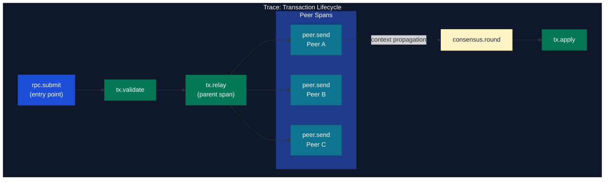

# Appendix

> **Parent Document**: [OpenTelemetryPlan.md](./OpenTelemetryPlan.md)
> **Related**: [Observability Backends](./07-observability-backends.md)

---

## 8.1 Glossary

| Term                  | Definition                                                 |
| --------------------- | ---------------------------------------------------------- |
| **Span**              | A unit of work with start/end time, name, and attributes   |
| **Trace**             | A collection of spans representing a complete request flow |
| **Trace ID**          | 128-bit unique identifier for a trace                      |
| **Span ID**           | 64-bit unique identifier for a span within a trace         |
| **Context**           | Carrier for trace/span IDs across boundaries               |
| **Propagator**        | Component that injects/extracts context                    |
| **Sampler**           | Decides which traces to record                             |
| **Exporter**          | Sends spans to backend                                     |
| **Collector**         | Receives, processes, and forwards telemetry                |
| **OTLP**              | OpenTelemetry Protocol (wire format)                       |
| **W3C Trace Context** | Standard HTTP headers for trace propagation                |
| **Baggage**           | Key-value pairs propagated across service boundaries       |
| **Resource**          | Entity producing telemetry (service, host, etc.)           |
| **Instrumentation**   | Code that creates telemetry data                           |

### rippled-Specific Terms

| Term              | Definition                                         |
| ----------------- | -------------------------------------------------- |
| **Overlay**       | P2P network layer managing peer connections        |
| **Consensus**     | XRP Ledger consensus algorithm (RCL)               |
| **Proposal**      | Validator's suggested transaction set for a ledger |
| **Validation**    | Validator's signature on a closed ledger           |
| **HashRouter**    | Component for transaction deduplication            |
| **JobQueue**      | Thread pool for asynchronous task execution        |
| **PerfLog**       | Existing performance logging system in rippled     |
| **Beast Insight** | Existing metrics framework in rippled              |

---

## 8.2 Span Hierarchy Visualization

---

## 8.3 References

### OpenTelemetry Resources

1. [OpenTelemetry C++ SDK](https://github.com/open-telemetry/opentelemetry-cpp)
2. [OpenTelemetry Specification](https://opentelemetry.io/docs/specs/otel/)
3. [OpenTelemetry Collector](https://opentelemetry.io/docs/collector/)
4. [OTLP Protocol Specification](https://opentelemetry.io/docs/specs/otlp/)

### Standards

5. [W3C Trace Context](https://www.w3.org/TR/trace-context/)
6. [W3C Baggage](https://www.w3.org/TR/baggage/)
7. [Protocol Buffers](https://protobuf.dev/)

### rippled Resources

8. [rippled Source Code](https://github.com/XRPLF/rippled)
9. [XRP Ledger Documentation](https://xrpl.org/docs/)
10. [rippled Overlay README](https://github.com/XRPLF/rippled/blob/develop/src/xrpld/overlay/README.md)
11. [rippled RPC README](https://github.com/XRPLF/rippled/blob/develop/src/xrpld/rpc/README.md)
12. [rippled Consensus README](https://github.com/XRPLF/rippled/blob/develop/src/xrpld/app/consensus/README.md)

---

## 8.4 Version History

| Version | Date       | Author | Changes                           |
| ------- | ---------- | ------ | --------------------------------- |
| 1.0     | 2026-02-12 | -      | Initial implementation plan       |
| 1.1     | 2026-02-13 | -      | Refactored into modular documents |

---

## 8.5 Document Index

| Document                                                         | Description                                |
| ---------------------------------------------------------------- | ------------------------------------------ |
| [OpenTelemetryPlan.md](./OpenTelemetryPlan.md)                   | Master overview and executive summary      |
| [01-architecture-analysis.md](./01-architecture-analysis.md)     | rippled architecture and trace points      |
| [02-design-decisions.md](./02-design-decisions.md)               | SDK selection, exporters, span conventions |
| [03-implementation-strategy.md](./03-implementation-strategy.md) | Directory structure, performance analysis  |
| [04-code-samples.md](./04-code-samples.md)                       | C++ code examples for all components       |
| [05-configuration-reference.md](./05-configuration-reference.md) | rippled config, CMake, Collector configs   |
| [06-implementation-phases.md](./06-implementation-phases.md)     | Timeline, tasks, risks, success metrics    |
| [07-observability-backends.md](./07-observability-backends.md)   | Backend selection and architecture         |
| [08-appendix.md](./08-appendix.md)                               | Glossary, references, version history      |

---

_Previous: [Observability Backends](./07-observability-backends.md)_ | _Back to: [Overview](./OpenTelemetryPlan.md)_
