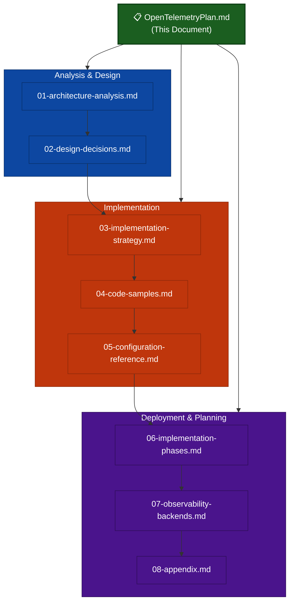

# [OpenTelemetry](00-tracing-fundamentals.md) Distributed Tracing Implementation Plan for rippled (xrpld)

## Executive Summary

This document provides a comprehensive implementation plan for integrating OpenTelemetry distributed tracing into the rippled XRP Ledger node software. The plan addresses the unique challenges of a decentralized peer-to-peer system where trace context must propagate across network boundaries between independent nodes.

### Key Benefits

- **End-to-end transaction visibility**: Track transactions from submission through consensus to ledger inclusion
- **Consensus round analysis**: Understand timing and behavior of consensus phases across validators
- **RPC performance insights**: Identify slow handlers and optimize response times
- **Network topology understanding**: Visualize message propagation patterns between peers
- **Incident debugging**: Correlate events across distributed nodes during issues

### Estimated Performance Overhead

| Metric        | Overhead   | Notes                               |
| ------------- | ---------- | ----------------------------------- |
| CPU           | 1-3%       | Span creation and attribute setting |
| Memory        | 2-5 MB     | Batch buffer for pending spans      |
| Network       | 10-50 KB/s | Compressed OTLP export to collector |
| Latency (p99) | <2%        | With proper sampling configuration  |

---

## Document Structure

This implementation plan is organized into modular documents for easier navigation:

---

## Table of Contents

| Section | Document                                                   | Description                                                            |
| ------- | ---------------------------------------------------------- | ---------------------------------------------------------------------- |
| **1**   | [Architecture Analysis](./01-architecture-analysis.md)     | rippled component analysis, trace points, instrumentation priorities   |
| **2**   | [Design Decisions](./02-design-decisions.md)               | SDK selection, exporters, span naming, attributes, context propagation |
| **3**   | [Implementation Strategy](./03-implementation-strategy.md) | Directory structure, key principles, performance optimization          |
| **4**   | [Code Samples](./04-code-samples.md)                       | Complete C++ implementation examples for all components                |
| **5**   | [Configuration Reference](./05-configuration-reference.md) | rippled config, CMake integration, Collector configurations            |
| **6**   | [Implementation Phases](./06-implementation-phases.md)     | 5-phase timeline, tasks, risks, success metrics                        |
| **7**   | [Observability Backends](./07-observability-backends.md)   | Backend selection guide and production architecture                    |
| **8**   | [Appendix](./08-appendix.md)                               | Glossary, references, version history                                  |

---

## 1. Architecture Analysis

The rippled node consists of several key components that require instrumentation for comprehensive distributed tracing. The main areas include the RPC server (HTTP/WebSocket), Overlay P2P network, Consensus mechanism (RCLConsensus), JobQueue for async task execution, and existing observability infrastructure (PerfLog, Insight/StatsD, Journal logging).

Key trace points span across transaction submission via RPC, peer-to-peer message propagation, consensus round execution, and ledger building. The implementation prioritizes high-value, low-risk components first: RPC handlers provide immediate value with minimal risk, while consensus tracing requires careful implementation to avoid timing impacts.

➡️ **[Read full Architecture Analysis](./01-architecture-analysis.md)**

---

## 2. Design Decisions

The OpenTelemetry C++ SDK is selected for its CNCF backing, active development, and native performance characteristics. Traces are exported via OTLP/gRPC (primary) or OTLP/HTTP (fallback) to an OpenTelemetry Collector, which provides flexible routing and sampling.

Span naming follows a hierarchical `<component>.<operation>` convention (e.g., `rpc.submit`, `tx.relay`, `consensus.round`). Context propagation uses W3C Trace Context headers for HTTP and embedded Protocol Buffer fields for P2P messages. The implementation coexists with existing PerfLog and Insight observability systems through correlation IDs.

**Data Collection & Privacy**: Telemetry collects only operational metadata (timing, counts, hashes) — never sensitive content (private keys, balances, amounts, raw payloads). Privacy protection includes account hashing, configurable redaction, sampling, and collector-level filtering. Node operators retain full control(not penned down in this document yet) over what data is exported.

➡️ **[Read full Design Decisions](./02-design-decisions.md)**

---

## 3. Implementation Strategy

The telemetry code is organized under `include/xrpl/telemetry/` for headers and `src/libxrpl/telemetry/` for implementation. Key principles include RAII-based span management via `SpanGuard`, conditional compilation with `XRPL_ENABLE_TELEMETRY`, and minimal runtime overhead through batch processing and efficient sampling.

Performance optimization strategies include probabilistic head sampling (10% default), tail-based sampling at the collector for errors and slow traces, batch export to reduce network overhead, and conditional instrumentation that compiles to no-ops when disabled.

➡️ **[Read full Implementation Strategy](./03-implementation-strategy.md)**

---

## 4. Code Samples

Complete C++ implementation examples are provided for all telemetry components:
- `Telemetry.h` - Core interface for tracer access and span creation
- `SpanGuard.h` - RAII wrapper for automatic span lifecycle management
- `TracingInstrumentation.h` - Macros for conditional instrumentation
- Protocol Buffer extensions for trace context propagation
- Module-specific instrumentation (RPC, Consensus, P2P, JobQueue)

➡️ **[View all Code Samples](./04-code-samples.md)**

---

## 5. Configuration Reference

Configuration is handled through the `[telemetry]` section in `xrpld.cfg` with options for enabling/disabling, exporter selection, endpoint configuration, sampling ratios, and component-level filtering. CMake integration includes a `XRPL_ENABLE_TELEMETRY` option for compile-time control.

OpenTelemetry Collector configurations are provided for development (with Jaeger) and production (with tail-based sampling, Tempo, and Elastic APM). Docker Compose examples enable quick local development environment setup.

➡️ **[View full Configuration Reference](./05-configuration-reference.md)**

---

## 6. Implementation Phases

The implementation spans 9 weeks across 5 phases:

| Phase | Duration  | Focus               | Key Deliverables                                    |
| ----- | --------- | ------------------- | --------------------------------------------------- |
| 1     | Weeks 1-2 | Core Infrastructure | SDK integration, Telemetry interface, Configuration |
| 2     | Weeks 3-4 | RPC Tracing         | HTTP context extraction, Handler instrumentation    |
| 3     | Weeks 5-6 | Transaction Tracing | Protocol Buffer context, Relay propagation          |
| 4     | Weeks 7-8 | Consensus Tracing   | Round spans, Proposal/validation tracing            |
| 5     | Week 9    | Documentation       | Runbook, Dashboards, Training                       |

**Total Effort**: 47 developer-days with 2 developers

➡️ **[View full Implementation Phases](./06-implementation-phases.md)**

---

## 7. Observability Backends

For development and testing, Jaeger provides easy setup with a good UI. For production deployments, Grafana Tempo is recommended for its cost-effectiveness and Grafana integration, while Elastic APM is ideal for organizations with existing Elastic infrastructure.

The recommended production architecture uses a gateway collector pattern with regional collectors performing tail-based sampling, routing traces to multiple backends (Tempo for primary storage, Elastic for log correlation, S3/GCS for long-term archive).

➡️ **[View Observability Backend Recommendations](./07-observability-backends.md)**

---

## 8. Appendix

The appendix contains a glossary of OpenTelemetry and rippled-specific terms, references to external documentation and specifications, version history for this implementation plan, and a complete document index.

➡️ **[View Appendix](./08-appendix.md)**

---

*This document provides a comprehensive implementation plan for integrating OpenTelemetry distributed tracing into the rippled XRP Ledger node software. For detailed information on any section, follow the links to the corresponding sub-documents.*
