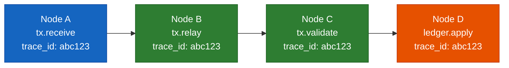
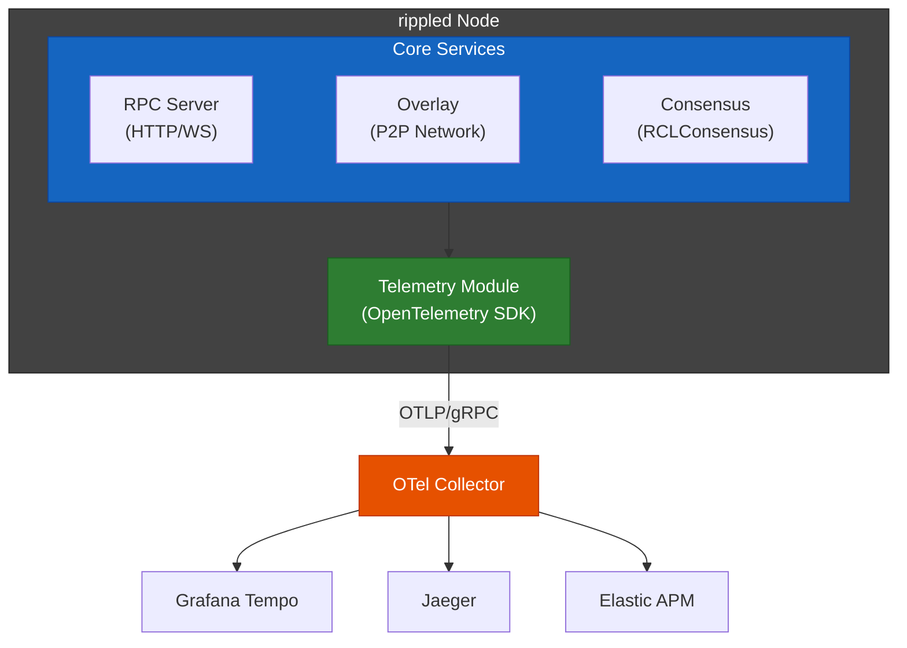
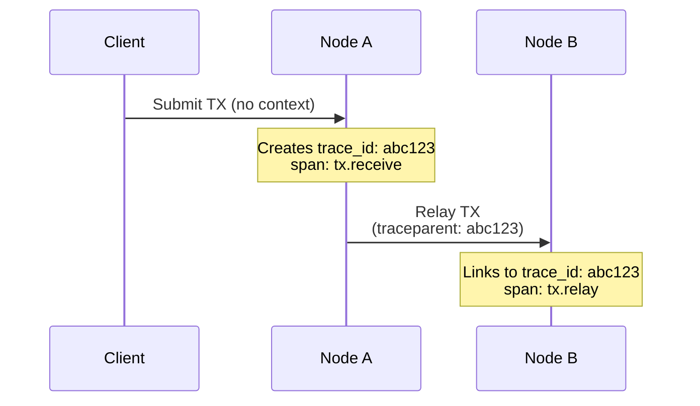
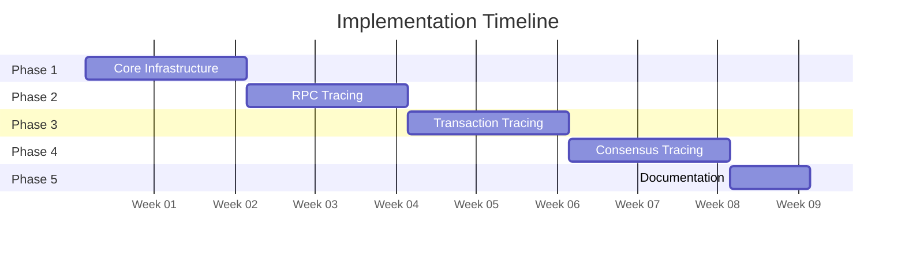
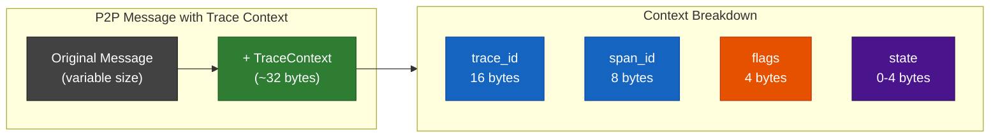
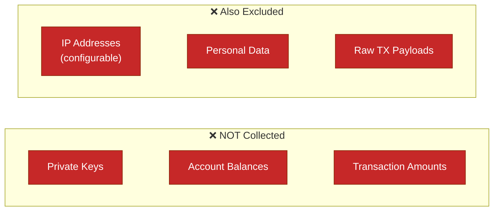

# OpenTelemetry Distributed Tracing for rippled

---

## Slide 1: Introduction

### What is OpenTelemetry?

OpenTelemetry is an open-source, CNCF-backed observability framework for distributed tracing, metrics, and logs.

### Why OpenTelemetry for rippled?

- **End-to-End Transaction Visibility**: Track transactions from submission → consensus → ledger inclusion
- **Cross-Node Correlation**: Follow requests across multiple independent nodes using a unique `trace_id`
- **Consensus Round Analysis**: Understand timing and behavior across validators
- **Incident Debugging**: Correlate events across distributed nodes during issues

> **Trace ID: abc123** — All nodes share the same trace, enabling cross-node correlation.

---

## Slide 2: Comparison with Existing Solutions

### Current Observability Stack

| Aspect                | PerfLog (JSON)        | StatsD (Metrics)      | OpenTelemetry (NEW)         |
| --------------------- | --------------------- | --------------------- | --------------------------- |
| **Type**              | Logging               | Metrics               | Distributed Tracing         |
| **Scope**             | Single node           | Single node           | **Cross-node**              |
| **Data**              | JSON log entries      | Counters, gauges      | Spans with context          |
| **Correlation**       | By timestamp          | By metric name        | By `trace_id`               |
| **Overhead**          | Low (file I/O)        | Low (UDP)             | Low-Medium (configurable)   |
| **Question Answered** | "What happened here?" | "How many? How fast?" | **"What was the journey?"** |

### Use Case Matrix

| Scenario                         | PerfLog | StatsD | OpenTelemetry |
| -------------------------------- | ------- | ------ | ------------- |
| "How many TXs per second?"       | ❌       | ✅      | ❌             |
| "Why was this specific TX slow?" | ⚠️       | ❌      | ✅             |
| "Which node delayed consensus?"  | ❌       | ❌      | ✅             |
| "Show TX journey across 5 nodes" | ❌       | ❌      | ✅             |

> **Key Insight**: OpenTelemetry **complements** (not replaces) existing systems.

---

## Slide 3: Architecture

### High-Level Integration Architecture

### Context Propagation

- **HTTP/RPC**: W3C Trace Context headers (`traceparent`)
- **P2P Messages**: Protocol Buffer extension fields

---

## Slide 4: Implementation Plan

### 5-Phase Rollout (9 Weeks)

### Phase Details

| Phase | Focus               | Key Deliverables                             | Effort  |
| ----- | ------------------- | -------------------------------------------- | ------- |
| 1     | Core Infrastructure | SDK integration, Telemetry interface, Config | 10 days |
| 2     | RPC Tracing         | HTTP context extraction, Handler spans       | 10 days |
| 3     | Transaction Tracing | Protobuf context, P2P relay propagation      | 10 days |
| 4     | Consensus Tracing   | Round spans, Proposal/validation tracing     | 10 days |
| 5     | Documentation       | Runbook, Dashboards, Training                | 7 days  |

**Total Effort**: ~47 developer-days (2 developers)

---

## Slide 5: Performance Overhead

### Estimated System Impact

| Metric            | Overhead   | Notes                               |
| ----------------- | ---------- | ----------------------------------- |
| **CPU**           | 1-3%       | Span creation and attribute setting |
| **Memory**        | 2-5 MB     | Batch buffer for pending spans      |
| **Network**       | 10-50 KB/s | Compressed OTLP export to collector |
| **Latency (p99)** | <2%        | With proper sampling configuration  |

### Per-Message Overhead (Context Propagation)

Each P2P message carries trace context with the following overhead:

| Field         | Size          | Description                               |
| ------------- | ------------- | ----------------------------------------- |
| `trace_id`    | 16 bytes      | Unique identifier for the entire trace    |
| `span_id`     | 8 bytes       | Current span (becomes parent on receiver) |
| `trace_flags` | 4 bytes       | Sampling decision flags                   |
| `trace_state` | 0-4 bytes     | Optional vendor-specific data             |
| **Total**     | **~32 bytes** | **Added per traced P2P message**          |

> **Note**: 32 bytes is negligible compared to typical transaction messages (hundreds to thousands of bytes)

### Mitigation Strategies

### Kill Switches (Rollback Options)

1. **Config Disable**: Set `enabled=0` in config → instant disable, no restart needed for sampling
2. **Rebuild**: Compile with `XRPL_ENABLE_TELEMETRY=OFF` → zero overhead (no-op)
3. **Full Revert**: Clean separation allows easy commit reversion

---

## Slide 6: Data Collection & Privacy

### What Data is Collected

| Category        | Attributes Collected                                                               | Purpose                     |
| --------------- | ---------------------------------------------------------------------------------- | --------------------------- |
| **Transaction** | `tx.hash`, `tx.type`, `tx.result`, `tx.fee`, `ledger_index`                        | Trace transaction lifecycle |
| **Consensus**   | `round`, `phase`, `mode`, `proposers`(public key or public node id), `duration_ms` | Analyze consensus timing    |
| **RPC**         | `command`, `version`, `status`, `duration_ms`                                      | Monitor RPC performance     |
| **Peer**        | `peer.id`(public key), `latency_ms`, `message.type`, `message.size`                | Network topology analysis   |
| **Ledger**      | `ledger.hash`, `ledger.index`, `close_time`, `tx_count`                            | Ledger progression tracking |
| **Job**         | `job.type`, `queue_ms`, `worker`                                                   | JobQueue performance        |

### What is NOT Collected (Privacy Guarantees)

### Privacy Protection Mechanisms

| Mechanism                  | Description                                                   |
| -------------------------- | ------------------------------------------------------------- |
| **Account Hashing**        | `xrpl.tx.account` is hashed at collector level before storage |
| **Configurable Redaction** | Sensitive fields can be excluded via config                   |
| **Sampling**               | Only 10% of traces recorded by default (reduces exposure)     |
| **Local Control**          | Node operators control what gets exported                     |
| **No Raw Payloads**        | Transaction content is never recorded, only metadata          |

> **Key Principle**: Telemetry collects **operational metadata** (timing, counts, hashes) — never **sensitive content** (keys, balances, amounts).

---

*End of Presentation*
